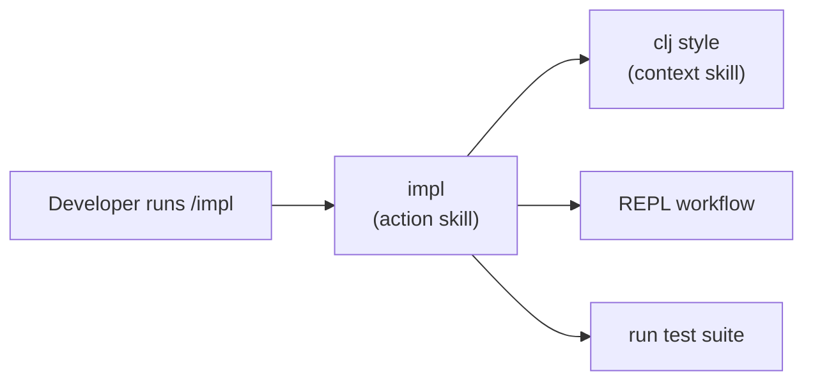
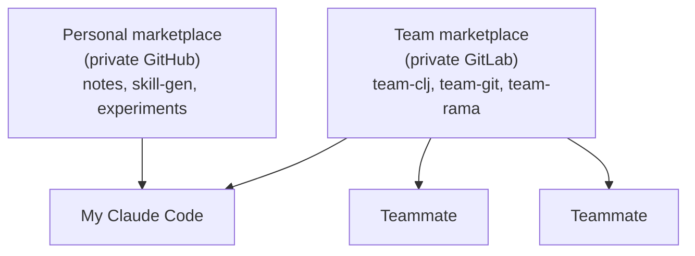

---
tags:
  - llm
  - cli
  - clojure
date: 2026-02-19
rss-feeds:
  - all
---
## TLDR

Claude Code wrote working Clojure that did not look like ours. So I encoded our conventions, REPL workflow, and git practices into Claude Code skills, bundled them into plugins, and published them as a marketplace the whole team installs from our private GitLab. I keep a second, personal marketplace on a private GitHub repo for the workflows that are only mine. This is how the two fit together, and what changed once the team adopted them.

## The problem

I lead a small engineering team and our stack is mostly Clojure.

In late 2025 I started using Claude Code on a Max plan, after [Bruce Hauman](https://github.com/bhauman) recommended it in the README of [clojure-mcp](https://github.com/bhauman/clojure-mcp), his REPL tooling for Clojure. It was good at general programming, but it kept writing Clojure that did not look like our Clojure. The code ran and the tests passed, yet every diff needed the same corrections: `if` where we use `when`, `deftest` where we use rich comment tests, namespaces exposing more vars than our rules allow. Working code in the wrong dialect is still a review cost, and it recurs on every change.

The fix was obvious to me right away: stop correcting Claude by hand and hand it our conventions up front, encoded as skills. And because making the whole team faster is my job as a staff engineer, not just speeding up my own work, I built those skills as a shared marketplace from the start, not as a personal tool I might get around to sharing later. What follows is how it works, plus the second marketplace I keep for my own workflows.

## REPL integration

Clojure development is REPL-driven: you evaluate expressions in a running process as you write, instead of rebuilding and rerunning from scratch. Out of the box Claude Code cannot do that, so it was writing code blind and checking it by rerunning whole files.

I started with clojure-mcp itself, Bruce's full MCP server that gives Claude REPL evaluation. (An MCP server is a separate process that exposes extra tools to the model over a standard protocol.) It worked, but it ate a lot of context tokens and replaced Claude Code's native file tools with its own.

So I switched to Bruce's [clojure-mcp-light](https://github.com/bhauman/clojure-mcp-light), which is not a server at all but two small CLI tools:

- **`clj-nrepl-eval`** evaluates an expression against a running nREPL from the command line.
- **`clj-paren-repair-claude-hook`** is a hook that fixes mismatched parentheses before the edit lands on disk, at zero token cost.

That second one solves what Bruce calls the "Paren Edit Death Loop": the model notices an unbalanced delimiter, tries to fix it, miscounts, and spirals through edit after edit. The hook repairs the delimiters silently, before Claude ever sees a problem.

```json
{
  "hooks": {
    "PreToolUse": [
      {
        "matcher": "Write|Edit",
        "hooks": [
          { "type": "command", "command": "clj-paren-repair-claude-hook --cljfmt" }
        ]
      }
    ]
  }
}
```

## Rolling it out to the team

The gains were obvious enough that I suggested our CEO move us to the Anthropic Team plan. I now manage the seats, and I wrote internal onboarding guidelines covering security practices, Claude Code setup for Clojure, and what to watch for in LLM-generated code.

I set up the rest of the team with Claude Code and the REPL tools. The impact was immediate, especially for those already fluent in our stack.

Across a team the dialect problem multiplies: without explicit convention context, Claude defaults to generic Clojure for everyone. Pasting the same rules into a `CLAUDE.md` in every repo does not scale, and each copy drifts. Shared conventions belong in one versioned source the whole team installs, so I encoded ours as reusable skills.

## Skills as encoded knowledge

A Claude Code skill is a markdown file that hands Claude context or a workflow on demand. There are two kinds, and what separates them is how they fire:

| Type | Fires when | Use for |
|------|------------|---------|
| **Context** | Auto-loaded when the description matches the work | Style guides, framework patterns |
| **Action** | The user invokes it via `/plugin:skill` | Workflows: implement, review, commit |

### Context skills load themselves

The Clojure style skill loads automatically whenever Claude detects Clojure work, because its frontmatter says so:

```yaml
---
name: clj
description: Clojure code patterns, style conventions, RCT formatting,
  namespaces, and scoping rules. Use when writing or reviewing
  .clj/.cljc files.
user-invocable: false
---
```

It covers our conditional preferences, threading rules, the rich comment test format, and namespace scoping (a public surface of three vars or fewer). Because `user-invocable` is `false`, it loads silently. Nobody has to remember to switch it on.

### The description decides whether it fires

Claude reads the `description` field to decide whether to auto-load a skill, so a vague description rarely triggers. The pattern that works is the **decision tree**, shared widely among Claude Code users: a capability sentence followed by the trigger words people actually type.

```yaml
# Bad
description: Helps with code review

# Good
description: Reviews Clojure code changes as a senior engineer,
  checking style, correctness, and design. Use when asked to review
  code, check a PR, review MR, look at changes, or give feedback
  on Clojure code.
```

### Action skills chain the whole stack

Even with a sharp description, a context skill can still be skipped. So for the workflows that must apply our conventions, I wrote action skills (`impl` and `review`) that reference the other skills explicitly. When a developer runs `/impl`, Claude pulls in the Clojure style context, follows the REPL workflow, and runs the test suite, in that order. The diagram below shows the chain.



This is far more reliable than hoping a context skill auto-loads on its own.

## Hooks as guardrails

Skills add knowledge; hooks enforce it. A hook runs on a tool-use event, before or after the model writes. The paren repair hook runs on both, and it only touches `.clj`, `.cljs`, `.cljc`, and `.edn` files, so it is safe to enable everywhere. Hooks can also enforce discipline a skill only suggests, for example blocking `git` commands in a project that uses a different version control system like `jj` for instance.

## Plugins, and two marketplaces

Skills are grouped into plugins, and plugins are published through a **marketplace**: a git repo Claude Code installs from and updates against.

```
plugins-repo/
├── .claude-plugin/
│   └── marketplace.json
└── plugins/
    ├── team-clj/      # Clojure: impl, review, repl, style, cljs
    ├── team-git/      # Git: conventional commits, MR creation
    └── team-rama/     # Rama: dataflow patterns and constraints
```

Teammates add it once with `/plugin marketplace add <git-url>` and the plugins update themselves from then on. Plugins can be scoped per user (Clojure style, git workflow), per project (Rama dataflow), or kept local and gitignored for one-off overrides.

Not everything I build belongs to the team. The conventions do, so the team marketplace lives on our private GitLab and everyone installs it. The rest is only mine: note-taking and article writing in my Obsidian vault, a skill that generates new skills, and experiments with languages we do not use at work. Those started as plugins sitting on my laptop, until I pushed them to their own private GitHub repo so they would persist and have proper versioning. Same plugin mechanism, two marketplaces, two audiences. The diagram below shows the split.



Keeping them apart matters. The team marketplace stays focused on shared conventions, with nothing personal to wade through, and my own tooling can change as often as I like without forcing a version bump on everyone else.

## Shared context with PROJECT_SUMMARY.md

[clojure-mcp](https://github.com/bhauman/clojure-mcp) introduced `PROJECT_SUMMARY.md`, an LLM-friendly file documenting a project's architecture, key files, and patterns. I adapted it as a plugin skill.

After finishing a feature or a bug fix, the developer updates the project summary. That gives the next session immediate context, and it doubles as a seed for the MR description.

The key property is that `PROJECT_SUMMARY.md` is **LLM-agnostic and shared**. Any developer benefits from it regardless of which model they use. Combined with plugin skills for conventions and `CLAUDE.md` for project instructions, no single person ends up as the knowledge bottleneck.

| Context layer | Scope | Who benefits |
|---------------|-------|--------------|
| **Plugin skills** | Team conventions | Every developer using the plugins |
| **PROJECT_SUMMARY.md** | Project state | Every developer on the project |
| **CLAUDE.md** | Project instructions | Every developer on the project |
| **Personal vault** | Broader knowledge | My own recall across projects |

## Results

Everyone on my team uses the plugins daily, and other developers on our shared account install them too. What changed:

**I shipped it early.** The marketplace's first commit and a teammate's first merge request are only days apart.

**It is a shared repo.** Any teammate can open a merge request to fix or extend a skill, and they do.

**Conventions stay consistent.** Everyone runs the same plugins, so our Clojure looks the same from one repo to the next: no ad-hoc `CLAUDE.md` drift, no sloppy one-off configs.

**Onboarding got faster.** New teammates have the conventions from day one instead of discovering them through review feedback.

## Conclusion

What started as my own Claude Code setup is now how the whole team writes Clojure. The conventions live in one place, they load themselves, and anyone can open a merge request to improve them. My own workflows stay in a separate marketplace on a private GitHub repo, so my tooling and the team's never get in each other's way. The corrections I used to repeat on every diff are gone, new teammates are productive from day one.