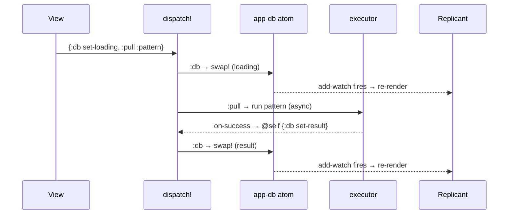
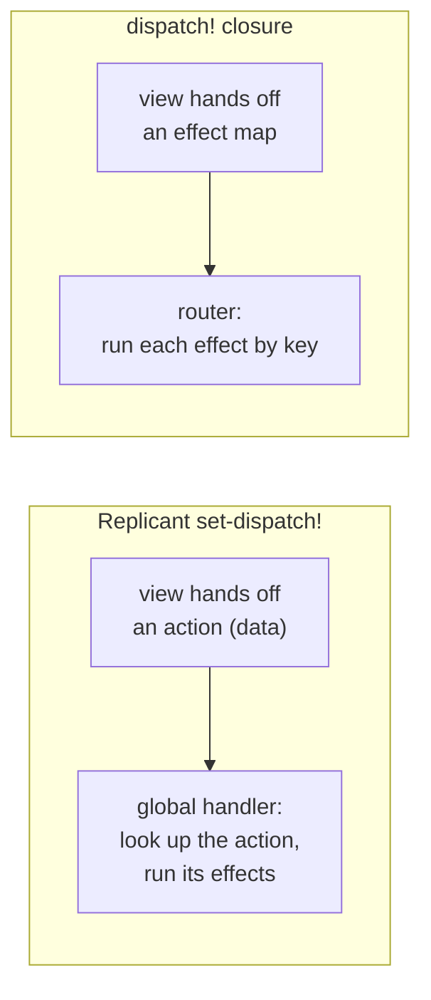

---
tags:
  - clojure
  - clojurescript
  - architecture
  - replicant
  - web
  - lasagna-pattern
date: 2026-02-17
repos:
  - [lasagna-pattern, "https://github.com/flybot-sg/lasagna-pattern"]
rss-feeds:
  - all
---
## TLDR

A small architecture for ClojureScript single-page apps that diverges from [Replicant](https://github.com/cjohansen/replicant)'s recommended data-events dispatch: effects are plain maps, `dispatch!` is a single closure components call directly, and the state layer is pure `.cljc` you can test on the JVM. It runs the [flybot.sg](https://www.flybot.sg) site, the interactive [pull-playground](https://pattern.flybot.sg), and the site you are reading this on [loicb.dev](https://loicb.dev).

## The problem

[Replicant](https://github.com/cjohansen/replicant) is a small ClojureScript library that renders the UI as a pure function from state to hiccup. It also ships an event system, and the shape its author recommends is elegant: the event handlers in your hiccup are plain **data**, and one global handler, registered with `replicant.dom/set-dispatch!`, reads that data and decides what to do.

```clojure
;; Replicant's recommended way: handlers are data, one global dispatch
[:button {:on {:click [:save-post {:id 1}]}}]

(require '[replicant.dom :as r])

(r/set-dispatch!
  (fn [_ [action data]]            ; the data you put in :on {:click ...}
    (case action
      :save-post (swap! store save-post data))))
```

Views stay pure data, so you can test them without a DOM, and there are no closures hiding in the markup. It is a clean model, and for a lot of apps it is the right one.

The catch shows up once the app does real work. A single interaction is rarely one thing: a click might set a loading flag, fire a request, and change the URL all at once, and a later effect often needs the state an earlier one just set. Data actions make you name each such bundle as its own keyword that the central handler expands into those steps, in order, so the handler grows a branch for every combination. On top of that, the action data is frozen when the view renders, so the moment a handler needs the current state, it has to look it up in `app-db` and work it out there. Both pressures pull logic that belongs with the interaction into one central place.

[Robert Luo](https://github.com/robertluo) suggested a different shape, and it is what we built on. Instead of dispatching data that *describes* an action, a component closes over a `dispatch!` function and calls it directly with a map of **effects**:

```clojure
;; Our way: a function handler that calls dispatch! with an effect map
[:button {:on {:click #(dispatch! {:db   db/set-loading
                                    :pull :pattern})}}]
```

The map is the action. There is no global registry and no action keywords to keep in sync. Replicant lets an event handler be a plain function as well as data, so the handler just calls `dispatch!` directly, and the router behind it is about forty lines. [Andrean](https://github.com/chickendreanso) and I first iterated on the idea in an internal project, and it now runs [flybot-site](https://github.com/flybot-sg/lasagna-pattern/tree/main/examples/flybot-site), the [pull-playground](https://github.com/flybot-sg/lasagna-pattern/tree/main/examples/pull-playground), and [loicb.dev](https://loicb.dev).

## Effects are maps

Each key in the dispatched map is an independent effect, and one click can fire several at once: update state, kick off an API call, and change the URL, all in a single dispatch.

The effect set is per-app. The playground needs three. flybot-site, which has logins and a real backend, adds a few more.

| Effect      | Value                             | What it does                              | Used in     |
| ----------- | --------------------------------- | ----------------------------------------- | ----------- |
| `:db`       | `(fn [db] db')`                   | pure update of the in-browser state atom  | both        |
| `:pull`     | keyword or `{:pattern … :then …}` | run a pull pattern: read or mutate data   | both        |
| `:nav`      | keyword                           | `pushState` URL navigation                | playground  |
| `:confirm`  | `{…}`                             | confirmation dialog, may sub-dispatch     | flybot-site |
| `:history`  | `:push` (marker)                  | `pushState`, URL derived from current state | flybot-site |
| `:toast`    | `{…}`                             | auto-dismissing notification              | flybot-site |
| `:logout`   | `"/url"`                          | POST `/logout`, then redirect (CSRF-safe) | flybot-site |
| `:navigate` | `"/url"`                          | hard browser redirect                     | flybot-site |

One name collision is worth flagging: the `:db` effect updates the in-browser `app-db` atom, not the server. Writes to the backend go through `:pull`, since a [pull pattern](https://www.loicb.dev/blog/building-a-pure-data-api-with-lasagna-pattern) both reads and writes depending on its shape. So saving a post is a `:pull`, not a separate effect, and its `:then` folds the response back into the local `:db`.

This composes with no extra wiring. Adding an effect type is one new key and one new branch in the router, not a registration step somewhere else.

## The dispatch cycle

Before the code, here is the shape of one round trip. A click dispatches an effect map. The effects run in a fixed order. The `:db` update fires a re-render through a watcher, and a moment later the async `:pull` calls back into the same `dispatch!`, which updates state again and re-renders. The diagram below shows it for the Execute button.



The loop is the point. The executor's callback has no update path of its own; it dispatches a new effect map back through the same `dispatch!`. State only ever changes through one door.

## dispatch-of: the router

`dispatch-of` builds the `dispatch!` closure. Two details carry the whole design.

First, **effects run in a fixed order**, not map iteration order. `:db` runs before `:pull` so a request reads the state the same click just set, and navigation runs last so the URL reflects the final state. The mode toggle shows why this matters:

```clojure
{:db   #(db/set-mode % :remote)   ; runs first
 :pull :init                       ; reads :mode → fetches from the remote server, not the sandbox
 :nav  :remote}                    ; runs last → URL ends at /remote
```

`:pull :init` resolves against the `:mode` that `:db` just set, so the same map switches the data source and the URL together, in one dispatch.

Second, a `volatile!` holds a **self-reference**. Async callbacks (a pull response, a toast timer) need to dispatch again, so they deref `@self` instead of taking `dispatch!` as an argument. The closure is created once and never rebuilt.

Here is the playground's version:

```clojure
(def ^:private effect-order [:db :pull :nav])

(defn dispatch-of [app-db root-key]
  (let [self      (volatile! nil)                 ; stable self-reference
        dispatch! (fn [effects]
                    (doseq [type  effect-order     ; fixed order, not map order
                            :let  [effect-def (get effects type)]
                            :when (some? effect-def)]
                      (case type
                        :db   (swap! app-db update root-key effect-def)
                        :pull ...   ; resolve a spec, run it, @self the result back (next section)
                        :nav  (.pushState js/history nil "" (str "/" (name effect-def))))))]
    (vreset! self dispatch!)                       ; now callbacks can @self back in
    dispatch!))
```

The `@self` deref is what makes chaining work. A pull's `:then` can return `{:db … :pull :another-op}`, and that map flows straight back into the same loop. flybot-site uses the exact same shape with a longer `effect-order`, `[:db :confirm :pull :history :toast :logout :navigate]`, and one branch per extra effect.

The `root-key` is a small scoping detail: every `:db` update is `(swap! app-db update root-key f)`, so an effect only ever touches this app's slice of the atom, never the whole thing. With one app per page that is mostly a guardrail; it is what would let several apps share a single atom without colliding.

`dispatch!` is created once as a top-level `def` and threaded everywhere from there:

```clojure
(def dispatch! (dispatch-of app-db root-key))

(add-watch app-db :render
  (fn [_ _ _ state]
    (when-let [el (js/document.getElementById "app")]
      (r/render el (views/app-view {::views/db        (root-key state)
                                    ::views/dispatch! dispatch!})))))

(defn ^:export init! []
  (init-theme!)
  (dispatch! {:db db/set-loading :pull :init}))
```

The watcher is the only thing that renders, and it always reads the stable `dispatch!`. Because the closure is never recreated on a render, there is no risk of rebuilding it on every cycle, a common pitfall when the dispatch function is defined inside the render path.

## Pull specs are data

`:pull` does no I/O itself. It hands its keyword to `resolve-pull`, a pure function that returns a data spec, `{:pattern … :then …}`:

```clojure
(defn resolve-pull [op db]
  (case op
    :pattern {:pattern (read-pattern (:pattern-text db))
              :then    (fn [r] {:db #(db/set-result % r)})}
    ...))
```

The router runs the pattern, then feeds the `:then` result back through `@self`. That is how one operation chains into the next: a `:then` can return `{:db … :pull :another-op}`, and the map flows straight back into the loop. Because `resolve-pull` returns plain data and touches nothing, it tests on the JVM with no browser.

How the playground actually runs that pattern, in-browser through SCI or over HTTP to a server, is its own topic. See [Pull Playground - Interactive Pattern Learning](https://www.loicb.dev/blog/pull-playground-interactive-pattern-learning).

## The pure state layer

Every state transition is a plain `db -> db` function in a `.cljc` namespace:

```clojure
;; db.cljc: pure, runs on the JVM with no browser
(defn set-loading [db]
  (assoc db :loading? true :error nil :result nil))

(defn set-result [db result]
  (assoc db :loading? false :result result :error nil))

(defn set-mode [db mode]
  (-> db
      (assoc :mode mode)
      (assoc :result nil :error nil :selected-example nil)))
```

Views pass these functions straight in as the `:db` effect value. Because they are pure and platform-neutral, they run as Rich Comment Tests (tests written inside `(comment ...)` blocks) on the JVM, with no browser and no ClojureScript compile in the loop.

## The view layer

Components are `defalias` definitions (Replicant's macro for a reusable component) that take namespaced props, with `dispatch!` threaded in explicitly:

```clojure
(defalias pattern-results-panel [{::keys [db dispatch!]}]
  [:div.pattern-results-panel
   [:button.execute-btn
    {:on {:click #(dispatch! {:db db/set-loading :pull :pattern})}
     :disabled (:loading? db)}
    (if (:loading? db) "Executing..." "Execute")]
   ;; results section reads (:result db) / (:error db) ...
   ])
```

Every component needs `dispatch!` in its props, the cost of not routing through a global dispatch. The upside is that you can read one component and see exactly what it is allowed to do, with no hidden global to chase.

The view is no longer pure data, the handler is a closure, but it stays easy to exercise: call a `defalias` with a `db` map and a stub `dispatch!`, then assert on the hiccup it returns, or on the effect maps the stub captured. The same handle works in [Portfolio](https://github.com/cjohansen/portfolio), the Replicant author's component workbench: pass a no-op `dispatch!` to a `defscene` and you can preview every state of a component without a running app.

## The trade-off

Both approaches keep a single source of truth and a one-way flow. The difference is what a component hands off, and where the side effects live, shown below:



In both, the side effects live downstream of the view, never in it. What changes is the hand-off: `set-dispatch!` hands an action that a global handler must interpret, while the closure hands the effects themselves to a router that just runs them.

| | `set-dispatch!` (data events) | `dispatch!` closure (effect maps) |
|---|---|---|
| Handler in hiccup | pure data: `[:save-post {:id 1}]` | function: `#(dispatch! {…})` |
| Routing | one global handler, `case` on the action | component holds `dispatch!`, router runs effects by key |
| What a component can do | emit any action the handler knows | only what its props allow |
| One interaction, many effects | central handler expands one verb into the steps | effects listed in one map, run in order |
| Reading live state | dispatch fn digs into the global store | component holds `db`; effect fns get it |
| Views | pure data, trivially testable | hold a `dispatch!` closure; test by injecting a stub |

The trade is real: you give up pure-data views (the handler is a closure, not a serializable vector) and you thread `dispatch!` through props. Testability survives, you inject a stub `dispatch!`, but serializability does not.

The advantages are why we keep it. A component can only do what its props allow: with no `dispatch!` it cannot change state or fire an effect, and with one, its whole effect surface sits in the body instead of in a global handler you have to grep. Effects compose in a single map and read live state directly, and `:db` updates are scoped to `root-key`, so an effect cannot reach outside this app's slice of the atom. You read one component and know exactly what it can touch.

For these apps, that locality is worth more than serializable views.

If Re-frame is your reference point: the effect map is what a `reg-event-fx` handler returns, but the component dispatches it directly, with no event id, no handler registry, and no subscription graph.

## What you get

State changes through one door: an effect map. The router is about forty lines and you read all of it. The state layer is pure and tests on the JVM. Adding an effect is one key and one branch.

The shape holds across sizes. loicb.dev routes `[:db :history]`. The playground routes `[:db :pull :nav]`. flybot-site routes seven effects, adding confirm dialogs, toasts, and a logout flow. Same router, same effect map, more keys. Less to build, and less to hold in your head.