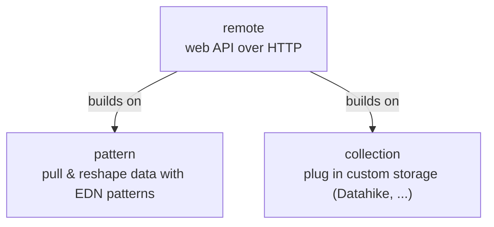
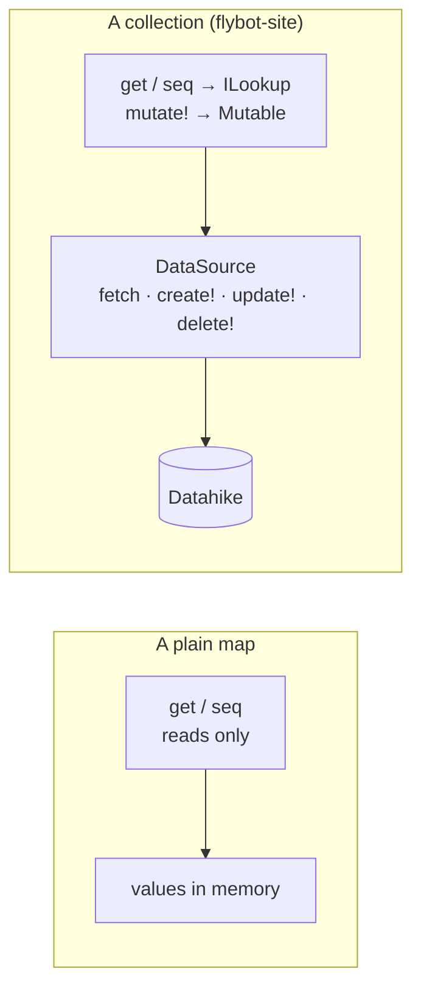
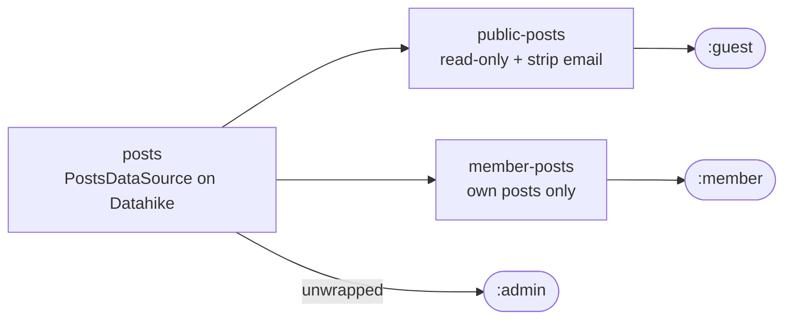
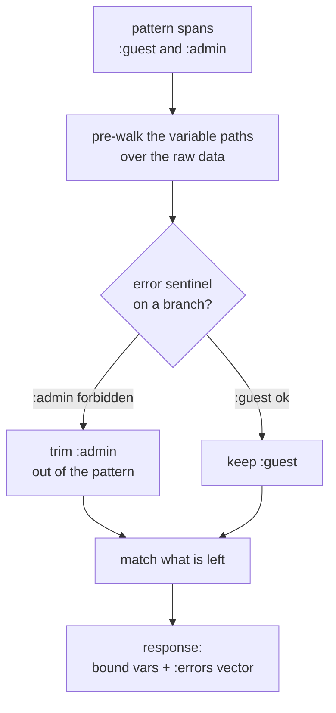
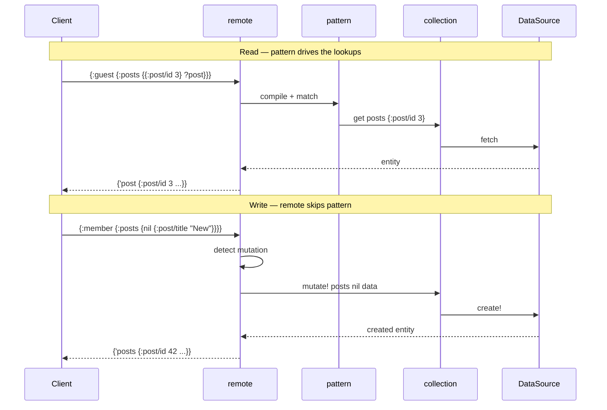

---
tags:
  - clojure
  - architecture
  - web
  - lasagna-pattern
date: 2026-02-17
repos:
  - [lasagna-pattern, "https://github.com/flybot-sg/lasagna-pattern"]
rss-feeds:
  - all
  - clojure
---
## TLDR

How [flybot.sg](https://www.flybot.sg) replaces REST routes and controller functions with a single pull-based API: collections are nouns, EDN patterns say what the client wants, and the shape of the data decides who can see what. It is built on three small Clojure libraries, `pattern`, `collection`, and `remote`, from the [lasagna-pattern](https://github.com/flybot-sg/lasagna-pattern) monorepo.

## The problem with one handler per endpoint

In a typical Clojure web app, every API endpoint is a function that does the same five things: parse the parameters, check authorization, call the database, transform the result, and build a response. Those concerns are tangled inside every handler. Add a field, and you touch the handler. Change who can read it, and you touch the handler. Let the client ask for only some keys, and you write another handler variant or bolt on query parameters.

We wanted a different model. Define the data as nouns, let a pattern express what the client wants, and let the shape of the data structure enforce authorization. No route table, no controller layer, no resolver functions.

This is the **pull** idea: the client sends a pattern that mirrors the shape of the data it needs, and the server returns exactly that shape. It is the same idea behind [Datomic pull](https://docs.datomic.com/query/query-pull.html), applied to a whole API. The [lasagna-pattern](https://github.com/flybot-sg/lasagna-pattern) monorepo, designed by [Robert Luo](https://github.com/robertluo), packages it into three composable libraries. They are the latest generation of a decade of pull work at Flybot, succeeding [lasagna-pull](https://github.com/flybot-sg/lasagna-pull) and its HTTP companion [remote-pull](https://github.com/robertluo/remote-pull). This article is about how they fit together in [flybot-site](https://github.com/flybot-sg/lasagna-pattern/tree/main/examples/flybot-site), the full-stack Clojure blog that runs flybot.sg.

## Three layers, hence the name

The three libraries stack the way your needs grow, and that is where the name comes from.

Start with **`pattern`**. It is the core: you pull data out of plain Clojure maps with an EDN pattern, binding the pieces you name, and you can reshape data with rewrite rules. No database, no HTTP, just data in and data out. On its own it is already a small, expressive query language.

When the data lives in a real backend, you reach for **`collection`**. You write the read and write logic once behind a `DataSource` protocol, and collection makes that backend, a [Datahike](https://github.com/replikativ/datahike) database or an in-memory map, behave like a Clojure map: `ILookup` for reads, a `Mutable` protocol for writes. The same patterns now pull from your database and `mutate!` into it.

And when you want all of this exposed as a web API, **`remote`** is the convenient top layer. It takes a pattern sent over HTTP, decides whether it is a read or a write, and routes it: a Ring handler at a single `POST /api` endpoint. The wire format is negotiated by content type, [Transit](https://github.com/cognitect/transit-clj) JSON by default, with Transit msgpack and plain EDN as the other options. remote is the only one of the three that depends on the others, it builds on both pattern and collection.



The dependency points one way only, remote onto the two beneath it. pattern and collection depend on nothing else here, so each stands alone, which is why all three ship separately on Clojars. Take just `pattern` for matching, add `collection` when you need custom storage, add `remote` when you need HTTP.

## Collections: CRUD behind two protocols

The `collection` library defines a `DataSource` protocol with five methods, `fetch`, `list-all`, `create!`, `update!`, and `delete!`. You implement those for your backend, wrap the result with `coll/collection`, and you get `ILookup`, `Seqable`, `Counted`, `Mutable`, and `Wireable` for free.

Two of those protocols carry the whole design. `ILookup` lets pattern matching read from a collection with plain `get`. `Mutable` lets `remote` route writes through it with `mutate!`. Everything else is plumbing. The diagram below shows what that buys you.



A plain map answers `get` and `seq` straight from memory. A collection answers the same calls through `ILookup`, and adds `mutate!` through `Mutable`, by delegating to a `DataSource` that talks to a real backend. The pattern engine only ever calls `ILookup`, so it never knows the difference.

```clojure
;; Read via ILookup, the same interface as a Clojure map
(get posts {:post/id 3})   ;; fetch by query
(seq posts)                ;; list all

;; Write via the Mutable protocol
(coll/mutate! posts nil data)           ;; CREATE  (nil query)
(coll/mutate! posts {:post/id 3} data)  ;; UPDATE  (query + value)
(coll/mutate! posts {:post/id 3} nil)   ;; DELETE  (nil value)
```

The mutation arguments are the key trick: a `nil` query means create, a `nil` value means delete, and a query paired with a value means update. The collection itself knows nothing about patterns or HTTP. It just implements the protocols, and the other two layers compose on top.

For simple cases the library ships `atom-source`, a complete in-memory `DataSource` with auto-incrementing IDs and atomic transactions. The [pull playground](https://pattern.flybot.sg) uses `atom-source` exclusively, on both the browser and the server side, and it covers everything a sandbox needs with no custom `DataSource`.

flybot-site needs persistent storage, so it uses `collection` to wrap its storage logic in a `DataSource`. We use Datahike here, but it could be any backend:

```clojure
(defrecord PostsDataSource [conn]
  coll/DataSource
  (fetch [_ query]
    (normalize-post (find-by conn query)))

  (list-all [_]
    (->> (d/q '[:find [(pull ?e [* {:post/author [*]}]) ...]
                :where [?e :post/id _]] @conn)
         (map normalize-post)
         (sort-by :post/created-at #(compare %2 %1))))

  (create! [_ data]
    (let [ts     (now)
          entity (merge (prepare-post-for-db (markdown/extract-frontmatter data))
                        {:post/id (next-id conn) :post/created-at ts :post/updated-at ts})]
      (d/transact conn [entity])
      (when (:post/featured? entity)
        (unfeature-siblings! conn (:post/id entity) (:post/pages entity)))
      (normalize-post (find-by conn {:post/id (:post/id entity)}))))

  (update! [this query data] ...)
  (delete! [this query] ...))
```

`PostsDataSource` already carries real domain logic: it enforces at most one featured post per page (`unfeature-siblings!`), retracts old values for cardinality-many attributes so an update replaces rather than accumulates, pulls fields out of markdown frontmatter, and expands the author reference. flybot-site defines two more of the same shape. `UsersDataSource` generates slugs with Chinese pinyin support and claims placeholder accounts when their real owner first signs in, and `UserRolesDataSource` stores role grants as component entities with timestamps. It all lives in the data-source code, because every read and write already passes through it.

## Patterns as the query language

The client sends EDN patterns that describe what it wants. The same syntax covers reads and writes, with a `?`-prefixed symbol marking a variable to bind:

```clojure
;; READ: list all posts, bind them to ?all
'{:guest {:posts ?all}}

;; READ: fetch one post by id
'{:guest {:posts {{:post/id 3} ?post}}}

;; CREATE: nil query key
{:member {:posts {nil {:post/title "New Post" :post/content "..."}}}}

;; UPDATE: query key + data value
{:member {:posts {{:post/id 3} {:post/title "Updated"}}}}

;; DELETE: query key + nil value
{:admin {:posts {{:post/id 3} nil}}}
```

There is one endpoint for data, `POST /api`. No route table, no path matching. The pattern carries the intent: which resource, which operation, what parameters. The one companion route is `GET /api/_schema`, which hands back the Malli schema so a client can validate patterns and drive autocomplete before it sends any; that is what feeds the [pull playground](https://pattern.flybot.sg)'s tooltips when it points at the live site. Note also `{{:post/id 3} ?post}`: a non-keyword map used as a key is an indexed lookup, "find me the entity matching `{:post/id 3}`", which is how a single pattern can fetch by query.

`remote` decides read versus write from the innermost key/value pair. A variable at the leaf (`?post`) is a read: match and bind whatever is found. A concrete value under a `nil` or entity-query key (the `{nil ...}` and `{{:post/id 3} ...}` shapes above) is a write, and that pair says which one. A plain keyword key still reads, so the discriminator is the query key, not just the leaf. This is how the same syntax does both, with nothing GraphQL-style to flip between a query and a mutation.

### Compared to GraphQL

| | Pull pattern | GraphQL |
|--|--|--|
| Query syntax | EDN patterns | GraphQL SDL |
| Schema | [Malli](https://github.com/metosin/malli), optional | SDL types, required |
| Resolvers | None, collections are the API | One function per field |
| Reads and writes | Same pattern syntax | `query` vs `mutation` |
| Local and remote | Same patterns in-process and over HTTP | Server required |
| Transport | Transit/EDN over HTTP | JSON over HTTP |

The core difference is that **verbs become nouns**. Instead of a resolver function per field, you define lazy data structures, and accessing a key in a pattern triggers the collection's `ILookup` to do the work. And because reads and writes are both just patterns, the very same query runs in-process (`remote/execute`) or over HTTP, against the same code.

## Authorization is the shape of the data

The API is a nested map whose top-level keys are roles. Authorization lives in that shape, not in a middleware chain.

```clojure
(defn make-api [{:keys [conn]}]
  (let [posts       (db/posts conn)
        guest-posts (public-posts posts)
        history     (public-history (db/post-history-lookup conn))
        users       (coll/read-only (db/users conn))
        roles       (roles-lookup conn)]
    (fn [ring-request]
      (let [ident   (oie/get-identity ring-request)
            user-id (:user-id ident)]
        {:data
         {:guest  {:posts guest-posts}
          :member (with-role ident :member
                    {:posts       (member-posts posts user-id (:user-email ident))
                     :posts/history history
                     :me          (me-lookup conn ident)
                     :me/profile  (profile-lookup conn user-id)})
          :admin  (with-role ident :admin
                    {:posts posts})
          :owner  (with-role ident :owner
                    {:users       users
                     :users/roles roles})}
         ;; the same map also carries :schema (Malli) and :errors (status-code config)
         }))))
```

The `ident` comes from [oie](https://github.com/flybot-sg/oie), Flybot's Ring auth library: it handles login and hands you an identity map carrying the user's roles. The data API does not care how that map was produced. From there, `with-role` returns the data map when the identity has the role, and an error map otherwise:

```clojure
(defn- with-role [ident role data]
  (if (oie-authz/has-role? ident role)
    data
    {:error {:type :forbidden :message (str "Role " role " required")}}))
```

That is the honest version of "structural authorization". The check is still a conditional, it has not vanished. What changed is *where* it lives: instead of a guard that intercepts the request, it is a function that returns either data or an `{:error ...}` map, sitting inline in the tree. That one move is what later buys partial success, which middleware cannot do.

Each role's branch is a different slice of the same data. Read this table straight off the map above: the middle column is the keys that role's branch exposes, the right column is what it can do with them.

| Role | Keys in its branch | What it can do |
|--|--|--|
| `:guest` | `:posts` | read posts, author email stripped out |
| `:member` | `:posts`, `:posts/history`, `:me`, `:me/profile` | read every post but write only its own; read post history; read its own identity and profile |
| `:admin` | `:posts` | create, update, delete any post |
| `:owner` | `:users`, `:users/roles` | read the user list; grant and revoke roles |

Two things worth calling out. `:me` and `:me/profile` are the member's *own* identity and profile, not the user directory: the actual list of users only appears under `:owner`, as `:users`. And post history is members-only, which is why `:posts/history` sits under `:member` and never under `:guest`.

## One base collection, wrapped per role

Those different views are not different collections. They are the same base `posts` collection wrapped with thin decorators, one concern each.



For the common cases the library gives you the wrapper. When a case falls outside what it covers, you implement the protocols yourself with `reify`.

### Library wrappers

`coll/wrap-mutable` intercepts writes and delegates reads to the inner collection. Members can read every post but only edit or delete their own:

```clojure
(defn- member-posts [posts user-id user-email]
  (coll/wrap-mutable posts
    (fn [posts query value]
      (cond
        ;; CREATE: stamp the author
        (and (nil? query) (some? value))
        (coll/mutate! posts nil (assoc value :post/author user-id))

        ;; DELETE: only your own
        (and (some? query) (nil? value))
        (if (owns-post? posts user-email query)
          (coll/mutate! posts query nil)
          {:error {:type :forbidden :message "You don't own this post"}})

        ;; UPDATE: only your own
        (and (some? query) (some? value))
        (if (owns-post? posts user-email query)
          (coll/mutate! posts query value)
          {:error {:type :forbidden :message "You don't own this post"}})

        :else
        {:error {:type :invalid-mutation}}))))
```

`coll/read-only` drops the `Mutable` protocol entirely, so the admin users collection cannot be written. `coll/lookup` builds a non-enumerable `ILookup` from a keyword map, with `delay` support for lazy fields (more on that below).

### Reify, the escape hatch

The library covers restricting writes (`read-only`) and intercepting them (`wrap-mutable`), but it has no built-in way to **transform read results**. Guests need every post returned with the author's email stripped out. That means implementing the read protocols by hand:

```clojure
(defn- public-posts [posts]
  (let [inner (coll/read-only posts)]
    (reify
      clojure.lang.ILookup
      (valAt [_ query]
        (when-let [post (.valAt inner query)]
          (strip-author-email post)))
      (valAt [this query nf]
        (or (.valAt this query) nf))

      clojure.lang.Seqable
      (seq [_] (map strip-author-email (seq inner)))

      clojure.lang.Counted
      (count [_] (count inner))

      coll/Wireable
      (->wire [this] (some-> (seq this) vec)))))
```

That is four protocols to re-implement just to change what comes out of a read, so it is worth doing only when you have to. `public-history` does the same for post history, with two protocols instead of four: history is looked up by key and never enumerated, so it skips `Seqable` and `Counted`. The third `reify`, `roles-lookup`, is a composite router that dispatches to a per-user roles sub-collection based on the `:user/id` in the query. The convenience functions handle single collections; routing across many needs the protocols directly.

Here is the whole spectrum, from least to most effort:

| Approach | Use it for | Example |
|--|--|--|
| `atom-source` | simple in-memory CRUD | pull playground |
| custom `DataSource` | database-backed with domain logic | `PostsDataSource` (Datahike) |
| `coll/read-only` | disable writes | admin users collection |
| `coll/wrap-mutable` | intercept writes, delegate reads | `member-posts` (ownership) |
| `coll/lookup` | non-enumerable keyword fields | `me-lookup`, `profile-lookup` |
| `reify` | the cases above don't cover it | `public-posts` / `public-history` (read transforms), `roles-lookup` (routing) |

## Errors as data

Collections return errors as plain maps instead of throwing:

```clojure
{:error {:type :forbidden :message "You don't own this post"}}
{:error {:type :not-found}}
{:error {:type :invalid-mutation}}
```

flybot-site declares one config that maps error types to HTTP status codes, and hands it to `remote` in the same map that defines the data:

```clojure
(def error-config
  {:detect :error
   :codes {:forbidden        403
           :not-found        404
           :invalid-mutation 422
           :already-granted  422}})
```

`remote` merges this with its own built-in codes for protocol-level errors (a malformed request, a match failure) and uses it to turn an `{:error {:type :forbidden}}` map, found anywhere in the result, into a 403. Collections stay pure: they describe what happened, and the transport decides how to put it on the wire.

### Partial success on reads

Because each role guard produces a value, either its collections or an error map, a single request can span several roles and have only some of them fail. Before matching, `remote` walks the variable paths over the raw data, finds any `{:error ...}` sentinel, trims that branch out of the pattern, and matches what is left. The diagram below traces that for a request touching two roles.



So a guest who asks for both public and admin data:

```clojure
'{:guest {:posts ?public}
  :admin {:posts ?all}}
```

gets `?public` bound and the `:admin` denial reported back in a top-level `:errors` vector, in one round trip. This is partial success in the spirit of [GraphQL](https://graphql.org/learn/response/) and [Pathom3](https://pathom3.wsscode.com/docs/error-handling/)'s lenient mode. The payload itself is just the bindings map (variables come back under symbol keys, so you read them with `(get response 'public)`), not wrapped in a `:data` key. flybot-site round-trips all of this as Transit JSON, the default format, which carries those symbols and keywords between ClojureScript and the server without a custom reader.

One rule makes this work: the error has to live in plain data. An error returned from inside an `ILookup`'s `valAt` is invisible to the pre-walk, which deliberately skips `ILookup` so it never fires a lazy query, so that error surfaces as a match failure instead.

## Lazy fields and on-demand work

Not everything is a collection. Some fields are computed values that should only run when the client asks for them. `coll/lookup` builds an `ILookup` from a map whose values can be `delay`s:

```clojure
(defn- me-lookup [conn ident]
  (let [user-id (:user-id ident)]
    (coll/lookup {:email   (:user-email ident)
                  :name    (or (:user-name ident) (:user-email ident))
                  :picture (:user-picture ident)
                  :slug    (delay (:user/slug (db/get-user conn user-id)))
                  :roles   (or (:roles ident) #{})})))

(defn- profile-lookup [conn user-id]
  (coll/lookup {:post-count     (delay (db/count-user-posts conn user-id))
                :revision-count (delay (db/count-user-revisions conn user-id))
                :roles          (delay (db/get-user-roles-detailed conn user-id))}))
```

The `:slug` and `:post-count` fields hit the database only when the pattern reaches them. Ask for `'{:member {:me {:email ?e :name ?n}}}` and you get the session fields straight back, the `:slug` delay never derefs, and no extra query runs. Add `:slug ?s` to the pattern and only then does it touch the database.

## How a request actually flows

The single endpoint splits cleanly into two paths, and the split is the whole mechanic worth holding in your head. Reads go through `pattern`. Writes skip it.



On a read, pattern matching drives `ILookup` calls on the collections, which delegate to the `DataSource`. On a write, `remote` detects the mutation, walks straight to the right collection, and calls `mutate!`, the matcher is never involved. And the mutation response is the full created entity, so the client merges it into local state instead of re-fetching. The role layer in front of both paths is just data walking: `remote` steps into `:guest` or `:member`, gets a data map or an error, and proceeds.

## What we ended up with

- **Nouns, not verbs.** The API is a data structure, not a set of handler functions. Collections implement `ILookup` and `Mutable`, so the same patterns drive reads and writes.
- **Authorization as shape.** Role-as-top-level-key means the data tree carries the access rules. The guard still exists, but it returns data, which is what makes partial success possible.
- **Decorators, not conditionals.** Each role is a thin wrapper around one base collection: `public-posts` strips PII, `member-posts` enforces ownership, `read-only` blocks writes. One concern each.
- **Errors as data.** Collections return `{:error {...}}` maps and `remote` maps them to status codes. No exceptions for expected failures.
- **Lazy by default.** `ILookup` plus `delay` means a database query fires only when a pattern reaches the field that needs it.
- **Three libraries.** `collection`, `pattern`, and `remote` each do one job and ship independently. You can adopt them one at a time.