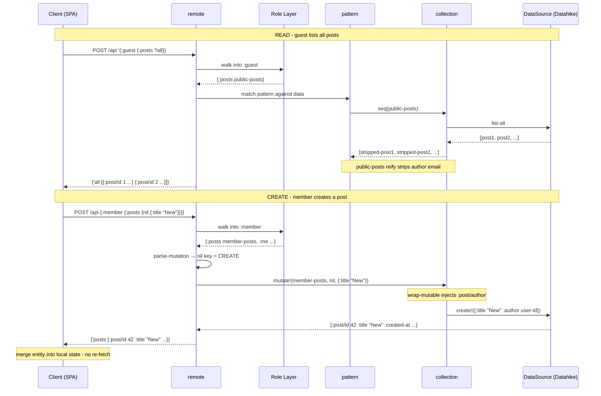

---
tags:
  - clojure
  - architecture
  - web
date: 2026-02-17
repos:
  - [lasagna-pattern, "https://github.com/flybot-sg/lasagna-pattern"]
rss-feeds:
  - all
  - clojure
---
## TLDR

How we replaced REST routes and controller functions with a pull-pattern API where collections are nouns, patterns express intent, and authorization is structural, all built on three composable libraries from the [lasagna-pattern](https://github.com/flybot-sg/lasagna-pattern) monorepo.

## Context

In a typical Clojure web app, each API endpoint is a function that parses parameters, checks authorization, calls the database, transforms the result, and builds a response. These concerns are tangled inside every handler. Add a new field? Touch the handler. Change who can access it? Touch the handler. Want the client to request only certain keys? Write another handler variant or add query parameters.

We wanted a different model: **define the data as nouns, let patterns express what the client wants, and let the shape of the data structure enforce authorization.** No route table, no controller layer, no resolver functions.

The [lasagna-pattern](https://github.com/flybot-sg/lasagna-pattern) monorepo, designed by [@Robert Luo](https://github.com/robertluo), provides three composable libraries that make this work. The core components (`pattern`, `collection`, `remote`) implement an architecture Robert had been thinking about for years, evolving from an earlier pull-pattern library. This article covers how they are applied in [flybot-site](https://github.com/flybot-sg/lasagna-pattern/tree/main/examples/flybot-site), a full-stack Clojure blog platform. For background on the pattern-matching DSL itself, see the [lasagna-pull README](https://github.com/flybot-sg/lasagna-pull).

## The three layers

```
┌─────────────────────────────────────┐
│         Role-Based Layer            │  ← Authorization (guest/member/admin/owner)
├─────────────────────────────────────┤
│            remote/                  │  ← HTTP transport + wire protocol
├─────────────────────────────────────┤
│           pattern/                  │  ← Pattern matching DSL
├─────────────────────────────────────┤
│          collection/                │  ← CRUD abstraction (ILookup + Mutable)
└─────────────────────────────────────┘
```

Each layer has a single responsibility and can be used independently:

- **collection/** wraps data sources (Datahike, in-memory maps) with Clojure's `ILookup` protocol for reads and a `Mutable` protocol for writes
- **pattern/** matches EDN patterns against any `ILookup`-compatible data and binds variables
- **remote/** provides HTTP transport: a Ring handler at `POST /api`, Transit encoding, mutation detection, and error mapping

## Collections: CRUD as protocols

The `collection` library defines a `DataSource` protocol for backend operations and wraps it in a `Collection` type that implements `ILookup`, `Seqable`, and `Mutable`:

```clojure
;; Read via ILookup - same interface as Clojure maps
(get posts {:post/id 3})          ;; fetch by query
(seq posts)                        ;; list all

;; Write via Mutable protocol
(coll/mutate! posts nil data)           ;; CREATE (nil query)
(coll/mutate! posts {:post/id 3} data)  ;; UPDATE
(coll/mutate! posts {:post/id 3} nil)   ;; DELETE (nil value)
```

This is the key abstraction. Because collections implement `ILookup`, pattern matching can `get` from them. Because they implement `Mutable`, the remote layer can route mutations through them. The collection does not know about patterns or HTTP; it just implements two protocols.

For simple cases, the library provides `atom-source`, a complete in-memory DataSource with auto-incrementing IDs and atomic transactions. The [pull playground](https://pattern.flybot.sg) uses `atom-source` exclusively and it covers everything needed for browser-side CRUD. No custom code required.

For flybot-site, each domain entity needs a custom `DataSource` backed by Datahike because of domain-specific logic that `atom-source` cannot cover:

```clojure
(defrecord PostsDataSource [conn]
  coll/DataSource
  (fetch [_ query]
    (normalize-post (find-by conn query)))
  (list-all [_]
    (->> (d/q '[:find [(pull ?e [* {:post/author [*]}]) ...]
                :where [?e :post/id _]] @conn)
         (map normalize-post)
         (sort-by :post/created-at #(compare %2 %1))))
  (create! [_ data]
    (let [entity (merge (prepare-post-for-db data)
                        {:post/id (next-id conn)
                         :post/created-at (now)
                         :post/updated-at (now)})]
      (d/transact conn [entity])
      (when (:post/featured? entity)
        (unfeature-siblings! conn (:post/id entity) (:post/pages entity)))
      (normalize-post (find-by conn {:post/id (:post/id entity)}))))
  (update! [this query data] ...)
  (delete! [this query] ...))
```

`PostsDataSource` handles featured post logic (at most one hero per page), Datahike-specific retraction for cardinality-many attributes, frontmatter extraction, and author reference expansion. `UsersDataSource` handles slug generation with Chinese pinyin support and placeholder user claiming. `UserRolesDataSource` manages role grants as component entities with timestamps. These are the kinds of domain concerns that justify a custom `DataSource` over `atom-source`.

## Patterns as API queries

The client sends EDN patterns that describe what it wants. The same pattern syntax handles both reads and writes:

```clojure
;; READ: list all posts
'{:guest {:posts ?all}}

;; READ: fetch a specific post
'{:guest {:posts {{:post/id 3} ?post}}}

;; CREATE: nil query key means "create"
{:member {:posts {nil {:post/title "New Post" :post/content "..."}}}}

;; UPDATE: query key + data value
{:member {:posts {{:post/id 3} {:post/title "Updated"}}}}

;; DELETE: query key + nil value
{:admin {:posts {{:post/id 3} nil}}}
```

There is a single endpoint (`POST /api`). No route table, no path matching. The pattern itself carries the intent: which resource, what operation, what parameters.

The `remote/` layer detects whether a pattern is a read or a mutation by inspecting the syntax. A `?`-prefixed symbol is a variable binding (read). A `nil` key or `nil` value signals a mutation (create or delete). A map key with a map value signals an update.

### Compared to GraphQL

| Aspect | Pull Pattern | GraphQL |
|--------|-------------|---------|
| Query syntax | EDN patterns | GraphQL SDL |
| Schema | Clojure maps | SDL types |
| Resolvers | Lazy data structures (nouns) | Resolver functions (verbs) |
| Mutations | Same syntax as reads | Explicit `mutation` keyword |
| Transport | Transit over HTTP | JSON over HTTP |

The fundamental difference is **verbs become nouns**. Instead of defining resolver functions that fetch data, you define lazy data structures. When a pattern accesses a key, the collection's `ILookup` implementation triggers the query.

## Role-based authorization

Authorization is structural, not imperative. The API is a nested map where top-level keys are roles:

```clojure
(defn make-api [{:keys [conn]}]
  (let [posts       (db/posts conn)
        guest-posts (public-posts posts)
        history     (public-history (db/post-history-lookup conn))
        users       (coll/read-only (db/users conn))
        roles       (roles-lookup conn)]
    (fn [ring-request]
      (let [session (:session ring-request)
            user-id (:user-id session)]
        {:data
         {:guest   {:posts guest-posts
                    :posts/history history}
          :member  (with-role session :member
                     {:posts (member-posts posts user-id (:user-email session))
                      :posts/history history
                      :me (me-lookup conn session)
                      :me/profile (profile-lookup conn user-id)})
          :admin   (with-role session :admin
                     {:posts posts})
          :owner   (with-role session :owner
                     {:users users
                      :users/roles roles})}}))))
```

The `with-role` function returns the data map if the session has the required role, empty `{}` otherwise. When a guest pattern tries to access `:member`, pattern matching gets an empty map, no data leaks, no conditional logic in the handler.

Each role sees a different **view** of the same underlying collections:

| Role | Posts access | Users access |
|------|-------------|-------------|
| `:guest` | Read-only, author email stripped | None |
| `:member` | CRUD own posts only | Self (`:me`) |
| `:admin` | CRUD any post | None |
| `:owner` | None | Read-only + role management |

## Collection wrappers and decorators

The different views per role are implemented by wrapping the same base collection. The library provides built-in wrappers for the common cases. When a use case falls outside what the library covers, you implement the protocols directly via `reify`.

### Library wrappers (built-in)

`coll/wrap-mutable` intercepts mutations while delegating reads to the inner collection. Members can only edit or delete posts they authored:

```clojure
(defn- member-posts [posts user-id user-email]
  (coll/wrap-mutable posts
    (fn [posts query value]
      (cond
        ;; CREATE: inject user-id as author
        (and (nil? query) (some? value))
        (coll/mutate! posts nil (assoc value :post/author user-id))

        ;; UPDATE: check ownership first
        (and (some? query) (some? value))
        (if (owns-post? posts user-email query)
          (coll/mutate! posts query value)
          {:error {:type :forbidden}})

        ;; DELETE: check ownership first
        (and (some? query) (nil? value))
        (if (owns-post? posts user-email query)
          (coll/mutate! posts query nil)
          {:error {:type :forbidden}})))))
```

`coll/read-only` disables mutations entirely (admin users collection). `coll/lookup` creates a non-enumerable `ILookup` from a keyword map, with `delay` support for lazy fields (more on this in "Lazy fields" below).

### Reify decorators (escape hatch)

The library provides `read-only` (restricts writes) and `wrap-mutable` (intercepts writes), but no built-in way to **transform read results**. Guests need a read-only view that strips PII (author email) from every response. This requires implementing `ILookup` and `Seqable` directly via `reify`:

```clojure
(defn- public-posts [posts]
  (let [inner (coll/read-only posts)]
    (reify
      clojure.lang.ILookup
      (valAt [_ query]
        (when-let [post (.valAt inner query)]
          (strip-author-email post)))

      clojure.lang.Seqable
      (seq [_]
        (map strip-author-email (seq inner))))))
```

Similarly, the `roles-lookup` function uses `reify` because it is a **composite routing layer** that dispatches to per-user sub-collections based on the `:user/id` in the query. Library convenience functions cover single-collection cases; routing across multiple collections requires implementing the protocols directly.

The spectrum in flybot-site:

| Approach | When to use | Example |
|----------|------------|---------|
| `atom-source` | Simple in-memory CRUD | Pull playground |
| Custom `DataSource` | Database-backed with domain logic | `PostsDataSource` (Datahike) |
| `coll/read-only` | Disable mutations | Admin users collection |
| `coll/wrap-mutable` | Intercept mutations, delegate reads | `member-posts` (ownership) |
| `coll/lookup` | Non-enumerable keyword resources | `me-lookup`, `profile-lookup` |
| `reify` | Niche cases not covered above | `public-posts` (read transforms), `roles-lookup` (composite routing) |

## Errors as data

Collections return errors as plain maps instead of throwing exceptions:

```clojure
{:error {:type :forbidden :message "You don't own this post"}}
{:error {:type :not-found}}
{:error {:type :invalid-mutation}}
```

The `remote/` layer maps error types to HTTP status codes:

```clojure
(def error-config
  {:detect :error
   :codes {:forbidden 403
           :not-found 404
           :invalid-mutation 422
           :already-granted 422}})
```

This keeps collections pure: they return data describing what happened. The HTTP layer decides how to represent it on the wire.

## Lazy fields and on-demand computation

Not all data is a collection. Some fields are computed values that should only evaluate when the client asks for them. The `coll/lookup` function creates an `ILookup` from a map where values can be delays:

```clojure
(defn- me-lookup [conn session]
  (coll/lookup {:email   (:user-email session)
                :name    (:user-name session)
                :picture (:user-picture session)
                :slug    (delay (:user/slug (db/get-user conn user-id)))
                :roles   (:roles session)}))

(defn- profile-lookup [conn user-id]
  (coll/lookup {:post-count     (delay (db/count-user-posts conn user-id))
                :revision-count (delay (db/count-user-revisions conn user-id))}))
```

The `:slug` and `:post-count` fields hit the database only when the pattern actually accesses them. If the client sends `'{:member {:me ?user}}`, only the session fields are returned, no extra DB queries.

## Putting it together

READ and CREATE on a blog post, showing how each layer handles the request:



The key points:

- **Single endpoint** (`POST /api`). The pattern carries the intent: which role, which resource, what operation.
- **Role layer is just data walking**. `remote` walks into `:guest` or `:member` and gets the data map (or `{}` if unauthorized). No middleware, no guards.
- **Read path goes through `pattern`**. Pattern matching drives `ILookup` calls on collections, which delegate to `DataSource`.
- **Write path bypasses `pattern`**. `remote` detects the mutation, calls `mutate!` directly on the collection. The wrapper (`member-posts`) handles authorization and delegates to `DataSource`.
- **Mutation responses are used directly**. The created entity flows back to the client. No re-fetch needed.

## Conclusion

- **Nouns, not verbs**: the API is a data structure, not a set of handler functions. Collections implement `ILookup` and `Mutable`, so pattern matching drives both reads and writes.
- **Authorization is structural**: role-as-top-level-key means the data shape itself enforces access. No middleware guards, no imperative checks.
- **Decorators, not conditionals**: different roles see different wrappers around the same base collection. `public-posts` strips PII. `member-posts` enforces ownership. `read-only` prevents mutations. Each wrapper does one thing.
- **Errors as data**: collections return `{:error {...}}` maps, the remote layer converts to HTTP status codes. No exceptions for expected failures.
- **Lazy evaluation**: `ILookup` and delays mean DB queries only fire when the pattern asks for the data. No wasted computation.
- **Three composable libraries**: `collection/` (CRUD), `pattern/` (matching), and `remote/` (transport) can be used independently or together.