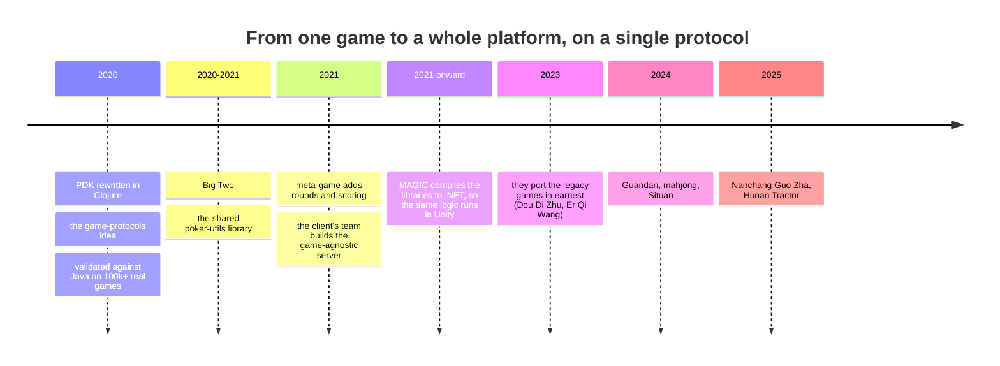
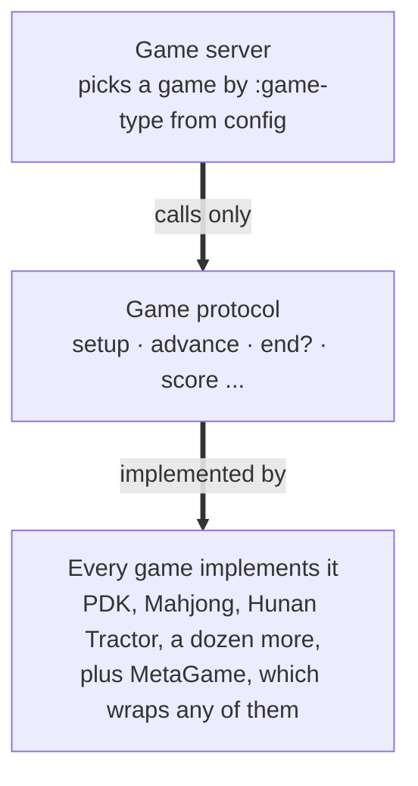
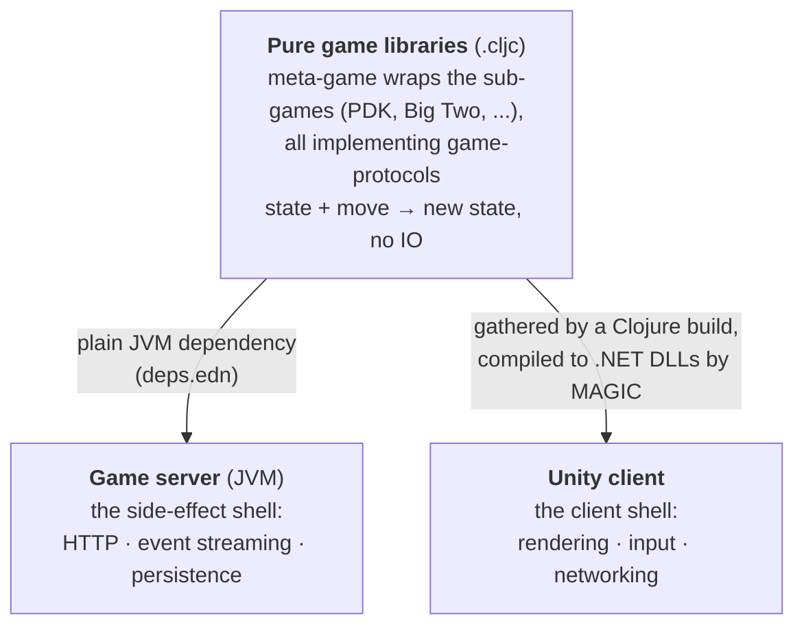

---
tags:
  - clojure
  - game-dev
  - meta-game
date: 2020-01-06
repos:
  - [magic, "https://github.com/flybot-sg/magic"]
  - [clr.test.check, "https://github.com/skydread1/clr.test.check/tree/magic"]
rss-feeds:
  - all
  - clojure
---
## TLDR

A client runs more than a dozen card and mahjong games on a single Clojure `Game` protocol, wrapped by a `meta-game` engine that adds rounds, scoring, and tournaments. Because `meta-game` implements that same protocol, one game-agnostic server runs all of them, and because the libraries are `.cljc`, the same logic runs on the JVM backend and, through [MAGIC](https://github.com/flybot-sg/magic), inside the Unity client. [Flybot](https://flybot.sg) built the proof of concept and several of the games; the client's engineers in China built more on the same protocol, wrote the server, and run the platform.

## Context

[Flybot](https://flybot.sg) is a small engineering team in Singapore. One of our clients, in China, runs a busy platform of card and mahjong games, more than a dozen of them, on a backend that was all legacy Java. Every game stood on its own there: its own server logic, no shared code. A new game meant reimplementing the whole stack from scratch.

We thought Clojure could turn that around, with one uniform API that every game speaks instead of one stack per game. To make the case we built a proof of concept: the `game-protocols` and `meta-game` libraries, plus the first two games, PDK and Big Two. It worked, and from there it became a shared effort across two teams. Flybot built several of the games (PDK, Big Two, Situan, Hunan Tractor); the client's engineers in China built others, wrote the game-agnostic server, and run the platform; and both sides kept evolving the core libraries together. I was new to Clojure at the time and still learning it, and Mr Chen, an experienced engineer on the client's side, shaped the design with me.

The pieces landed in this order:

## Pure logic, one protocol

We started with PDK (跑得快), a climbing game where you race to be the first to empty your hand. Rewriting it forced two decisions that shaped everything that came after.

First, the game logic is **pure**. A game state is plain data, and a move is just a function, `state + move -> new state`, with no IO, no networking, no persistence. All of that lives in the server, which wraps the pure core and owns the storage and the network; the game libraries never touch it. Purity bought the usual things, straightforward tests and rules that compose cleanly, and one less usual thing: it is how we trusted the rewrite at all. We replayed more than 100,000 real games from the Java logs straight through the Clojure functions and compared the outcomes. Every one matched except two games, and those two contained invalid moves the old Java server should never have allowed in the first place. The bug was in the code we were replacing, not in ours.

Second, every game implements the same `Game` protocol: one interface for setting up a game, advancing it, scoring it, and listing the legal moves. A `setup-game` multimethod builds a game from a `:game-type` and a config map, and from then on the server and the frontend call nothing but protocol methods, never a specific game. The frontend, for instance, calls `possible-moves` to highlight a player's legal cards.

## Meta-game, and recursion

Games could run over many rounds, up to a score target or a fixed number of rounds. `meta-game` wraps any game that implements the protocol and adds exactly that, all driven from a config map. The trick that makes it compose is what `meta-game` itself implements: **a `meta-game` is also a `Game`.** A multi-round match looks like a single hand to everything above it, which means a `meta-game` can wrap another `meta-game`. A tournament, then, is just a meta-game of meta-games. The tournament layer lives in the engine today, though we have not yet needed to run one in production.

## One server runs them all

This is where the design earns its keep. Mr Chen built the server that ties it all together: a single game-agnostic service whose code only ever touches `meta-game` and the protocol, never an individual game. Every game, even a one-off hand, is wrapped in a `meta-game`, so the server only ever sees one type. A request names its `:game-type`, the server loads that game from config, and from there it calls nothing but protocol methods. The games hold no state of their own, so the server keeps all of it in external storage and stays stateless: any instance can run any game. Adding a game changes none of the server's logic; it still calls nothing but protocol methods.

## How far it stretches

The protocol grew out of climbing games like PDK and Big Two, but nothing in it is tied to that style, or even to cards.

Take Hunan Tractor. Its lifecycle is far longer than a climbing game's: deal, bid for a trump suit, counter-bid, bury cards, exchange cards between partners, then play, and that is the short version. Many more phases than PDK's deal-then-play, and not one of them needed a change to `meta-game` or `game-protocols`, because the protocol already dispatches on the current phase.

Mahjong goes further still. It is a tile game, not a card game at all, and the client's own team wrote it on the very same protocol. To the server, a climbing game, a phase-heavy bidding game, and a tile game are interchangeable: set up, advance, score. The protocol is small enough, too, that a new engineer onboards by implementing a fresh game against it.

## One codebase, two runtimes

Here is where the purity pays off a second time. Because the game libraries hold no side effects, they carry no server infrastructure with them, and because they are all `.cljc`, the same files compile to both targets. Nothing about running them on a second runtime fights the design, because there is no IO to port.

The two runtimes load the same core by different routes. The server pulls the libraries in as plain JVM dependencies through `deps.edn`. The client takes the longer road: a Clojure build gathers `meta-game` and the sub-games, and [MAGIC](https://github.com/flybot-sg/magic) compiles the lot to .NET DLLs that ship inside the Unity project. Same pure core, two runtimes, no parallel C# reimplementation to keep in sync.

The compilation pipeline itself is covered in [MAGIC Compiler and Nostrand Integration](https://www.loicb.dev/blog/magic-compiler-and-nostrand-integration) and [Making Magic stable](https://www.loicb.dev/blog/making-magic-stable).

## The trade-offs

One API stretched across games this different is not free, though the cost is not where you might guess. `meta-game` itself stayed small: under 800 lines of source across three files, even after a 2.0 rewrite. The pressure shows up in two other places.

The first is the protocol. `game-protocols` keeps growing methods to cover needs no climbing game ever had, which is how it reached close to thirty methods with about a third now deprecated, and a game as involved as Hunan Tractor still has to implement most of what remains. The second is coupling at the server. The server declares every sub-game as a build dependency, PDK, Big Two, Situan, the mahjong and tractor games, all of them, and picks which to instantiate from config at runtime. So a single deployment carries the whole catalog, and adding a game means a new dependency and a redeploy, even though not a line of the server's logic changes. Neither cost sank the design, but neither is free.

## Where it stands

So we now have generic pure card game API that composed over `meta-game` that all implement the same `Game` protocol that allows us to have a generic `server` that run an arbitrary meta-game. Then the code has reader conditionals for JVM/CLR interop so it can run on both platforms. So the libs can be also compiled to .dll and run in our Unity frontend.