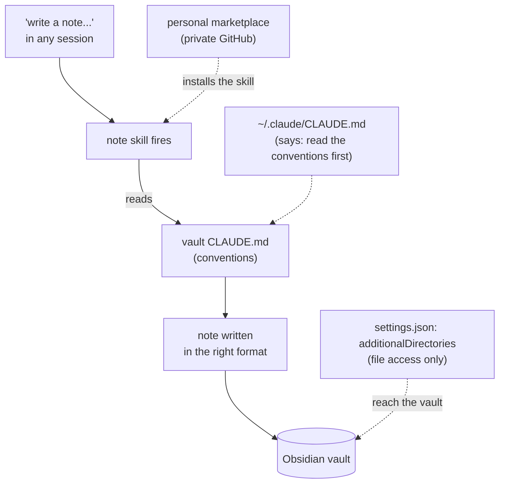
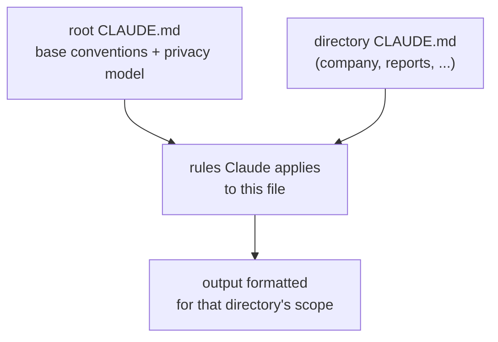

---
tags:
  - llm
  - obsidian
  - cli
  - portfolio
date: 2026-02-19
rss-feeds:
  - all
---
## TLDR

How I use Claude Code as the main interface to an Obsidian vault: capturing well-linked notes without leaving the session, while the context is still live, then generating team sprint reports and blog articles from those same notes. Nested `CLAUDE.md` files give each directory (public, company, private) its own rulebook, so every output comes out in the right style.

## The problem

Storing notes is a solved problem. [Obsidian](https://obsidian.md) is local-first, portable (plain markdown at the end of the day), and links notes to each other with `wikilink`s. I keep two Obsidian vaults, one personal and one for technical work; this article is only about the technical one. It holds everything work-related: technical notes, public blog drafts, company docs, private work notes. Git gives me version history, Obsidian Sync handles devices, and [Restic](https://restic.net) runs a weekly backup to [Backblaze B2](https://www.backblaze.com/cloud-storage).

What is not solved is the capture. Turning what just happened into a well-formed, well-linked note takes real time, and that is time consuming. [Claude Code](https://docs.claude.com/en/docs/claude-code) already holds the session context: what I just debugged, which tradeoff I weighed, what code I wrote. So instead of writing it up by hand afterwards, I tell it to write the note in place, while the details are still there, and the note is written in seconds.

## The setup

The config wires Claude Code to the vault; the conventions themselves live in `CLAUDE.md` files inside the vault (more on those below). Three files do the wiring, and the diagram shows the path a note takes from a request to a formatted file.



**1. Vault conventions (`CLAUDE.md` at the vault root).** This is the base rulebook: frontmatter format, tag taxonomy, wiki link style, directory layout. It is checked into git, so the vault owns its own rules.

```markdown
### Key Rules
- No H1 headers (Obsidian uses the filename as the title)
- Wiki links: [[Note Name]] for internal references
- Technical notes go in Notes/, blog drafts in Articles/blog/
```

The tag taxonomy lives here too. Claude adds a tag when it judges one relevant and updates the taxonomy to match, so I do not curate tags by hand.

**2. Global pointer (`~/.claude/CLAUDE.md`).** This is my user-level file, loaded in every session on the machine. It is a two-line pointer that tells Claude where the vault is and to read the root conventions before writing:

```markdown
When asked to create a note, write to `/path/to/dev-notes/Notes/`.
Read `/path/to/dev-notes/CLAUDE.md` for conventions before writing.
```

That explicit "read the conventions first" matters: from a session running in some other project, this pointer is what pulls the vault's rules into context.

**3. Directory access (`~/.claude/settings.json`).** `additionalDirectories` grants file access to the vault from any session, wherever it launched:

```json
{
  "additionalDirectories": ["/path/to/dev-notes"]
}
```

## A CLAUDE.md per scope

This one technical vault holds content for three different audiences, and each has different output rules and a different privacy level:

- **public**: my blog, deployed to the web. No secrets, no client names.
- **company**: docs pushed to the company Notion. Different house style.
- **private**: technical notes and sensitive work content that never leaves the vault.

A single rulebook cannot serve all three. So the vault uses **nested `CLAUDE.md` files**. When I work inside the vault, Claude Code reads the root `CLAUDE.md` and loads a subdirectory's `CLAUDE.md` on demand when it touches a file there. The two combine, the nested one layering its rules on top of the root, so a file is governed by exactly the rules of the place it lives.



Two directories carry their own `CLAUDE.md` today; everything else inherits the root. The table shows the split.

| Area              | Scope                          | Own `CLAUDE.md`? | What its rules enforce                                      |
| ----------------- | ------------------------------ | ---------------- | ----------------------------------------------------------- |
| `Notes/`          | Private, Claude-managed        | root only        | frontmatter, tags, wiki links, no H1                        |
| `Articles/blog/`  | Public (my blog)               | root only        | `## TLDR` first, `## Internal refs` last, no secrets        |
| `Work/blog/`      | Public (company blog)          | root only        | "we" voice, no internal references                          |
| `Work/Notion/`    | Company (Notion)               | yes              | Notion conventions: no wiki links, no TLDR, copy-paste-ready |
| `Work/private/`   | Private, off-limits to Claude  | n/a              | Claude never reads or writes it                             |
| `sprint-reports/` | Team                           | yes              | git-driven report-generation workflow                       |

Note the two private tiers. `Notes/` is private in the sense that it never leaves the vault, but Claude reads and writes it freely. `Work/private/` (HR matters, infra config, anything sensitive) is private in a stronger sense: Claude is told never to open it at all.

The company `CLAUDE.md` is the clearest example of a scoped rulebook. That content is synced with the company's Notion, which follows Notion's conventions rather than Obsidian's: Notion does not understand `[[wiki links]]` or my blog's `## TLDR`. So the directory's rules strip both, demand copy-paste-ready markdown, and document a set of small [Babashka](https://babashka.org) tasks that push and pull pages through the Notion MCP server (the bridge that lets Claude read and write Notion). The `sprint-reports/` directory goes further: its `CLAUDE.md` is not a format guide at all but a workflow that reads git history across repos and drafts a bi-weekly summary.

This also gives me a shortcut. Because those two directories have their own `CLAUDE.md`, I can start a session directly inside one instead of at the vault root. Launching in `sprint-reports/` loads its workflow rules first, and Claude still walks up the tree and applies the root conventions on top. Local context first, every rule above it still in force.

This is what makes one vault safe to hold public, company, and private content side by side. The rule that keeps a client name out of a blog post is attached to the directory, not to my memory.

## Writing notes without leaving the session

The flow: at some point in a session, often as I wrap it up, something is worth keeping, a gotcha that cost me an hour, a decision whose reasoning is not obvious. I say "capture this Rama partitioning insight" or "write a note about the S3 lifecycle policy we just figured out," and Claude writes it from what it already has in context: the problem, the approaches I rejected, the exact error, the code that worked.

I would write better prose by hand than Claude does, at least in a more optimized wya for MY understanding. That is not where the win is. The win is speed and consistent linking: the note exists seconds after I ask, with the right tags and wiki links to the related notes that already exist. Linking and tagging are exactly the parts I cut corners on when I write by hand, because I do not remember every related note or hold the whole taxonomy in my head. Claude searches the vault before writing, so it links the right notes and applies the taxonomy every time, and the graph stays connected instead of quietly rotting.

Not every session gets a note. Routine work (a typo fix, a dependency bump, a deployment I have run a hundred times) has nothing to capture. The bar is simple: would I want to find this again in six months?

## Retrieving knowledge

The vault is not write-only. I pull from it as often as I write to it:

- **During implementation**: "check my notes on how I set up the OIDC trust policy for GitHub Actions," and Claude reads the note and applies the pattern.
- **Decision context**: "what did I decide about the Datahike storage backend, and why?" Claude finds the note and lays out the tradeoffs.
- **Framework patterns**: "read my note on Rama PState operations before writing this topology."

A note written in one session becomes context for the next sessions and in any location, so the value compounds: better notes lead to better work, which produces better notes.

## The note-writing plugin

The `note` skill encodes the workflow. A skill is just a markdown file that hands Claude a workflow on demand. This one lives in my personal marketplace, a private GitHub repo Claude Code installs from and updates against.

```yaml
---
name: note
description: Creates or updates notes in the Obsidian vault following
  vault conventions. Use when asked to write a note, document learnings,
  capture knowledge, update a note, or save something to the vault.
---
```

The body says three things: read the vault's `CLAUDE.md` first, search for an existing note and update it rather than duplicate, and follow the format rules. The `description` field is doing real work: the trigger phrases in it ("write a note," "document learnings," "capture knowledge") are what make Claude auto-load the skill when I use them. A vague description fires unreliably.

Why a plugin when the global `CLAUDE.md` already points at the vault? Because the skill enforces the search-before-create step. Without it, Claude sometimes writes a new note when it should have updated one. I can also invoke it explicitly by name instead of relying on the auto-match. One file, but it is the difference between mostly following the conventions and always following them.

## Vault vs shared project context

The vault is my knowledge: cross-project patterns, framework comparisons, debugging techniques, decision records. It is not the only place context lives. Each project also carries a `PROJECT_SUMMARY.md` (an LLM-friendly file describing the architecture, key files, and recent changes) and its own `CLAUDE.md`. Those are checked into git and help everyone on the team, whatever editor or model they use. The conventions the team shares live in Claude Code plugins rather than in my vault, a split I describe in [Building Claude Code Plugins for the Team](https://www.loicb.dev/blog/building-claude-code-plugins-for-the-team).

The two work at different scopes. A vault note on Rama partitioning helps me across every project I touch; an updated `PROJECT_SUMMARY.md` helps the next person who opens a session on that repo. Together they mean I am not a knowledge bottleneck for my team.

## "But you should write notes yourself"

A common objection: if you do not write notes by hand, you never internalize them. The writing is the learning.

I disagree. My notes are not a study aid. They are context for two readers, future me and Claude, and both want precision over the memory of having once typed something out. Six months later I need the exact error and the config that fixed it, not a fuzzy recollection. And I do not rubber-stamp the output. Every Friday I go through the notes Claude wrote that week, clean up whatever needs it, and only then commit them. Claude writes fast and links thoroughly during the week; the Friday pass is the human review that keeps the vault trustworthy.

## Obsidian with zero plugins

My Obsidian install has zero community plugins. No Dataview, no Templater, no automation. Obsidian is a visual layer: a good editor with a graph view.

The real work (writing, linking, tagging, searching) happens through Claude Code, which keeps the vault portable: plain markdown with YAML frontmatter and wiki links, nothing locked to Obsidian. My blog already proves this out. It reads the article files straight from the vault and converts the `[[wiki links]]` to ordinary links when it renders, the setup I cover in [Obsidian Vault as Blog Source](https://www.loicb.dev/blog/obsidian-vault-as-blog-source). Leaving Obsidian entirely would be that same one-step conversion, nothing more. No plugin lock-in, no custom syntax, no database.

## What changed

I take more notes now, and they are better connected. Each one lands tagged and wiki-linked into the graph, so a related note surfaces when I need it months later instead of being lost.

The bigger shift is that the notes stopped being the end of the line. With a scoped `CLAUDE.md` and the right skill per directory, the same raw notes get turned into finished, correctly styled outputs: a bi-weekly sprint report for my team, drafted straight from our git history; company docs in Notion; and public articles for both the company blog and my own. None of it needs reformatting by hand.

The vault used to be where notes went to sit. Now it is the source my team's reports and my published writing are generated from, each in its own style.