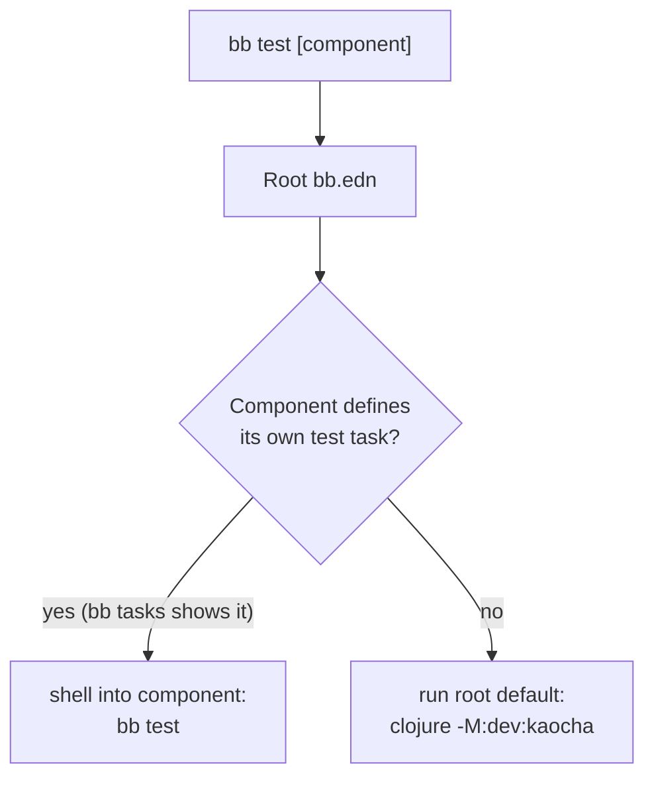
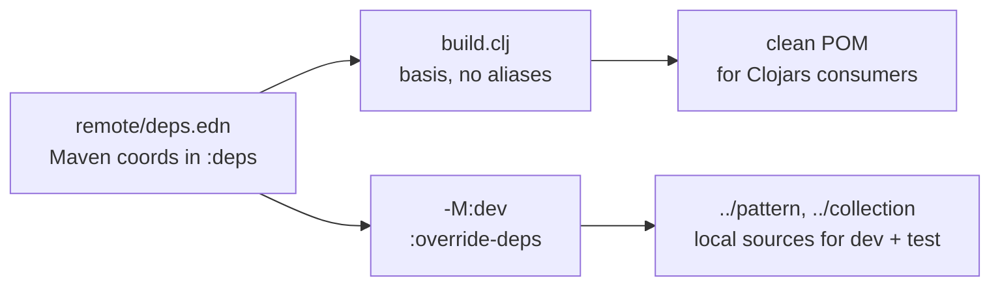
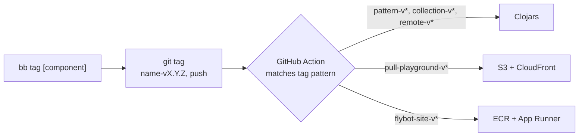

---
tags:
  - clojure
  - babashka
  - architecture
  - devops
  - lasagna-pattern
date: 2026-02-17
repos:
  - [lasagna-pattern, "https://github.com/flybot-sg/lasagna-pattern"]
rss-feeds:
  - all
  - clojure
---
## TLDR

A [Babashka](https://babashka.org/)-driven way to run a Clojure monorepo: each component owns its `deps.edn`, and a root task runner auto-discovers components, delegates to per-component overrides, and shares one convention for aliases and deploys. Applied to [lasagna-pattern](https://github.com/flybot-sg/lasagna-pattern), a toolbox of five components spanning libraries and full-stack apps.

## The problem

Most Clojure monorepos start with a single root `deps.edn` and one alias per job. It works at first. But that one file has to describe every component at once, so as components pile up, the aliases and the restrictions between them pile up with them. It gets worse the moment components target different platforms: one `deps.edn` then has to carry both the JVM and the ClojureScript toolchains side by side.

[lasagna-pattern](https://github.com/flybot-sg/lasagna-pattern) is a Clojure monorepo of five components where that pressure is real:

- `pattern`: the core pull-based pattern-matching DSL, a cross-platform `.cljc` library
- `collection`: a CRUD abstraction over any data source, another `.cljc` library
- `remote`: HTTP transport that carries patterns over the wire, `.cljc` with a JVM-only client
- `examples/flybot-site`: the full-stack [flybot.sg](https://www.flybot.sg) site, a ClojureScript frontend on a JVM backend
- `examples/pull-playground`: the SPA at [pattern.flybot.sg](https://pattern.flybot.sg) for learning pull patterns

The three libraries need little more than a test runner. The two apps add nREPL, shadow-cljs, environment variables, and their own deploy pipelines, and the frontend is ClojureScript while the rest is JVM Clojure. Force all of that through one `deps.edn` and the same four problems keep coming back:

- **Aliases for everything in one file.** Every component's aliases land in the same `deps.edn` (`:server/dev`, `:client/test`, `:build`), and the file only grows.
- **No isolation.** Every REPL loads the whole dependency set, even the deps only one component needs.
- **Manual orchestration.** You have to remember which aliases to combine to get a working REPL (`:jvm-base` + `:server/dev` + `:build`).
- **No clean per-component override.** A component that wants a different test strategy means yet another alias in the pile.

So we inverted it. Instead of one `deps.edn` describing every component, **each component owns its own `deps.edn`, and a root [Babashka](https://babashka.org/) task runner orchestrates them.**

## Repo structure

Each component is a self-contained directory with its own `deps.edn`. The root `bb.edn` is the only shared piece.

```
lasagna-pattern/
├── bb.edn              # Root task runner
├── pattern/
│   ├── deps.edn        # Own deps, own aliases
│   └── bb.edn          # Override: dev + test run RCT only
├── collection/
│   ├── deps.edn
│   └── bb.edn
├── remote/
│   └── deps.edn        # No bb.edn, uses root defaults
└── examples/
    ├── flybot-site/
    │   ├── deps.edn
    │   ├── bb.edn      # Override: dev, test, serve, deploy
    │   └── .env
    └── pull-playground/
        ├── deps.edn
        └── bb.edn
```

The key idea: **adding a component is just adding a directory with a `deps.edn`.** No registration, no root configuration. Run `bb list` and it shows up.

The root-level `bb.edn` approach was [Robert Luo](https://github.com/robertluo)'s idea. I extended it with the two-layer delegation below and a uniform alias convention, so the setup stays predictable as components grow.

## Auto-discovery

The root `bb.edn` finds components by scanning for directories that contain a `deps.edn`, both at the top level and one level down under `examples/`:

```clojure
-components
{:task (vec (concat
              ;; Top-level: pattern/, collection/, remote/
              (for [dir (fs/list-dir ".")
                    :let [dir-name (str (fs/file-name dir))]
                    :when (and (fs/directory? dir)
                               (not (str/starts-with? dir-name "."))
                               (not= dir-name "examples")
                               (fs/exists? (fs/file dir "deps.edn")))]
                dir-name)
              ;; Nested: examples/flybot-site/, examples/pull-playground/
              (when (fs/exists? "examples")
                (for [dir (fs/list-dir "examples")
                      :let [path (str "examples/" (fs/file-name dir))]
                      :when (and (fs/directory? dir)
                                 (fs/exists? (fs/file path "deps.edn")))]
                  path))))}
```

That gives us the live list:

```bash
$ bb list
pattern
collection
remote
examples/flybot-site
examples/pull-playground
```

## Two-layer task delegation

The root defines the common tasks (`test`, `rct`, `dev`, `clean`, `nrepl`, and so on). For each one, it asks a simple question: does this component define its own version of the task? If yes, delegate to the component's `bb.edn`. If not, run the root default. The diagram below shows that strategy.



The check reads the component's `bb tasks` output rather than parsing its `bb.edn`, which is more robust against formatting differences:

```clojure
-comp-task?
{:task (fn [dir task]
         (let [{:keys [out]} (shell {:dir dir :out :string :continue true}
                                    "bb" "tasks")
               pattern (re-pattern (str "^" task "\\s"))]
           (some (fn [line] (re-find pattern line))
                 (str/split-lines out))))}
```

Every delegating task follows the same shape. Here is `test`:

```clojure
test
{:doc "Run tests (kaocha): bb test [component]"
 :depends [-components -comp-task?]
 :task (let [target (first *command-line-args*)
             components (if target [target] -components)]
         (doseq [c components]
           (println (str "\n=== " c " ==="))
           (if (-comp-task? c "test")
             (shell {:dir c} "bb" "test")
             (clojure {:dir c} "-M:dev:kaocha"))))}
```

Run everything with `bb test`, or one component with `bb test pattern`. The root never needs to know how a component tests itself.

## The alias convention

Delegation only works if the defaults can assume something. So every component uses the same alias names, and the root defaults are wired to them.

| Alias | Purpose | Invoked by |
|-------|---------|------------|
| `:dev` | Dev deps (RCT, nREPL, cider) | `bb dev <comp>` |
| `:rct` | RCT exec-fn | `bb rct` (default) |
| `:kaocha` | Kaocha main-opts | `bb test` (default) |

[RCT](https://github.com/robertluo/rich-comment-tests) (rich-comment-tests) runs the `(comment ...)` blocks in your source as tests, and [kaocha](https://github.com/lambdaisland/kaocha) is a fuller test runner for components that need one. A minimal library `deps.edn` needs only `:dev` and `:rct`:

```clojure
{:paths ["src"]
 :deps {org.clojure/clojure {:mvn/version "1.12.4"}}
 :aliases
 {:dev {:extra-paths ["notebook"]
        :extra-deps {io.github.robertluo/rich-comment-tests
                     {:mvn/version "1.1.78"}}}
  :rct {:exec-fn com.mjdowney.rich-comment-tests.test-runner/run-tests-in-file-tree!
        :exec-args {:dirs #{"src"}}}}}
```

The real `pattern/deps.edn` adds nREPL and cider to `:dev`, but the shape is the same. A pure-RCT library needs no `:kaocha` alias at all: its local `bb.edn` just points `test` straight at RCT.

```clojure
;; pattern/bb.edn
{:tasks
 {dev  {:doc "Start nREPL with cider middleware"
        :task (clojure "-M:dev -m nrepl.cmdline
                        --middleware \"[cider.nrepl/cider-middleware]\"")}
  test {:doc "Run RCT (no kaocha needed)"
        :task (clojure "-X:dev:rct")}}}
```

## Overrides for apps

Libraries mostly want tests. Apps want a lifecycle. `flybot-site` defines the whole thing in its own `bb.edn`, and the root simply delegates to it:

```clojure
;; examples/flybot-site/bb.edn
{:tasks
 {dev
  {:doc "Start nREPL with shadow-cljs + cider middleware"
   :task (clojure {:env (current-env)}
           "-M:dev:cljs -m nrepl.cmdline
            --middleware \"[shadow.cljs.devtools.server.nrepl/middleware
                           cider.nrepl/cider-middleware]\"")}
  test
  {:doc "Run tests (kaocha includes RCT)"
   :task (apply clojure "-M:dev:kaocha" *command-line-args*)}

  serve
  {:doc "Build and serve the release frontend"
   :task (do (shell "npm install")
             (clojure "-M:cljs -m shadow.cljs.devtools.cli release app")
             ;; ... render index.html with hashed asset paths, then:
             (shell "npx http-server resources/public -p 3000 -c-1
                     --proxy http://localhost:8080"))}

  deploy
  {:doc "Build and push container image to ECR"
   :depends [clean]
   :task (do (shell "npm install")
             (clojure "-M:cljs -m shadow.cljs.devtools.cli release app")
             (clojure "-T:jib build"))}}}
```

The root `dev` task delegates here and loads the component's `.env` on the way, so `bb dev examples/flybot-site` starts the app REPL with its environment already set:

```clojure
dev
{:doc "Start REPL: bb dev <component>"
 :depends [-comp-task? -load-env]
 :task (if-let [component (first *command-line-args*)]
         (let [env (-load-env component)]
           (if (-comp-task? component "dev")
             (shell {:dir component :env env} "bb" "dev")
             (clojure {:dir component :env env}
                      "-M:dev" "-m" "nrepl.cmdline"
                      "--middleware" "[cider.nrepl/cider-middleware]")))
         (println "Usage: bb dev <component>"))}
```

## Local dependencies without a publish step

In a monorepo, components depend on each other, and you do not want to publish an artifact and bump a version just to test a change across two of them. How a component points at a sibling comes down to one thing: whether that component itself gets published.

The example apps never publish. They ship as a container or an S3 bundle, so they point straight at the sibling source with `:local/root`:

```clojure
;; examples/flybot-site/deps.edn  (nested under examples/, hence ../../)
{:deps {sg.flybot/lasagna-pattern    {:local/root "../../pattern"}
        sg.flybot/lasagna-collection {:local/root "../../collection"}
        sg.flybot/lasagna-remote     {:local/root "../../remote"}}}
```

An edit in a sibling's `src` is picked up immediately: no publish, no version bump. (What these components actually do is a separate story, told in [Building a Pure Data API with Lasagna Pattern](https://www.loicb.dev/blog/building-a-pure-data-api-with-lasagna-pattern). Here they are just boxes in a build.)

A component that *does* publish cannot be that casual, which is the next section.

## Publishing the libraries to Clojars

The three libraries publish to [Clojars](https://clojars.org/) as independent Maven artifacts:

| Component | Maven coordinate |
|-----------|------------------|
| `pattern/` | `sg.flybot/lasagna-pattern` |
| `collection/` | `sg.flybot/lasagna-collection` |
| `remote/` | `sg.flybot/lasagna-remote` |

Here is the tension. `remote` depends on `pattern` and `collection`. A Clojars consumer needs those as **Maven coordinates** in the published POM. But during local development, you want an edit in `pattern/src` to reach `remote` without republishing. Those two requirements pull in opposite directions.

The fix is `:override-deps` in the `:dev` alias. The top-level `:deps` carries the Maven coordinates that end up in the POM; the `:dev` alias swaps them for local sources during development and tests.

```clojure
;; remote/deps.edn
{:deps {sg.flybot/lasagna-pattern    {:mvn/version "0.1.3"}   ;; what Clojars sees
        sg.flybot/lasagna-collection {:mvn/version "0.1.1"}}  ;; what Clojars sees
 :aliases
 {:dev {:override-deps
        {sg.flybot/lasagna-pattern    {:local/root "../pattern"}
         sg.flybot/lasagna-collection {:local/root "../collection"}}}}}
```

The trick is that the two resolution paths never cross. `build.clj` builds its basis from `deps.edn` with no aliases, so the POM gets the Maven coordinates. Every dev and test command runs through `-M:dev`, so `:override-deps` kicks in and resolves to the local sources.



Each library has its own `build.clj` using standard [tools.build](https://github.com/clojure/tools.build) and [deps-deploy](https://github.com/slipset/deps-deploy). The version is read from `resources/version.edn`.

**Publish order matters, once.** `pattern` and `collection` have no internal dependencies, so they go first, in either order. `remote` goes last, because a consumer resolving it from Clojars needs the other two already there. CI sidesteps the build-time version of this by installing `pattern` and `collection` into the local `~/.m2` before it builds `remote`.

The root `bb.edn` exposes the build tasks with the same delegation pattern as `test`:

```bash
bb jar <component>      # build the JAR
bb install <component>  # install to ~/.m2
bb deploy <component>   # deploy to Clojars
```

## Release and deploy, by git tag

Both publishing to Clojars and deploying the apps run off the same mechanism: a git tag. The `bb tag` task reads `resources/version.edn` from the component and creates a tag named `<component>-v<version>`.

```bash
$ bb tag examples/pull-playground
Creating tag: pull-playground-v0.4.5
Pushing tag to origin...
Done! CI/CD will deploy examples/pull-playground with tag pull-playground-v0.4.5
```

From there, GitHub Actions matches the tag pattern and routes to the right target. One tag mechanism, three destinations:



A `remote-v*` tag runs one extra step: because `remote` depends on `pattern` and `collection`, the workflow installs those two locally first, then deploys `remote`. Everything else is a straight build-and-ship.

## Adding a new component

1. Create the directory with a `deps.edn`.
2. Optionally add a local `bb.edn` for custom tasks.
3. Run `bb list` to confirm discovery.

That is it. No root configuration to update, no registration step. The convention (consistent aliases, `bb tasks` delegation) makes the rest work on its own.

## Conclusion

One `deps.edn` is fine for a small project, but it does not survive a monorepo of mixed component types. Babashka task delegation gives us four things that do:

- **Zero-config discovery**: drop in a directory with a `deps.edn`, and it appears.
- **Defaults with overrides**: libraries get RCT for free, apps define their own lifecycle.
- **A uniform interface**: `bb test`, `bb dev`, `bb clean` work the same everywhere.
- **Local dependencies**: edits propagate immediately, with no publish step in the loop.

The full setup is in [lasagna-pattern/bb.edn](https://github.com/flybot-sg/lasagna-pattern/blob/main/bb.edn).