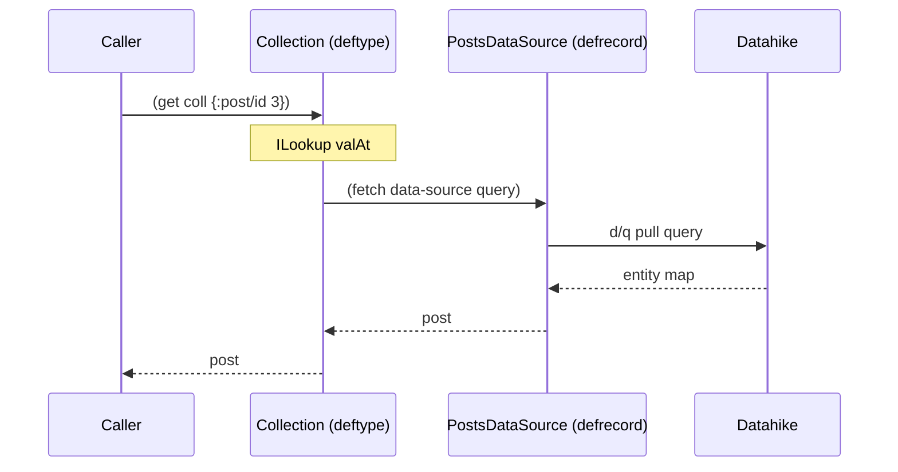
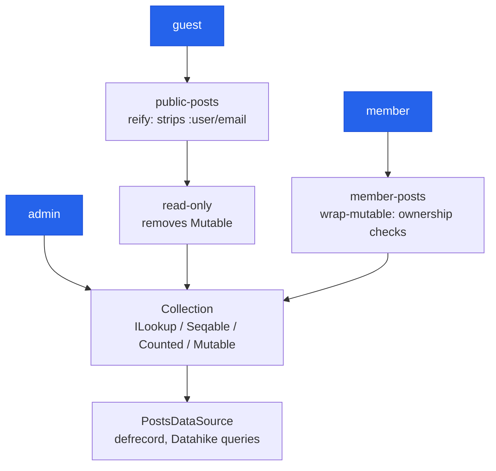
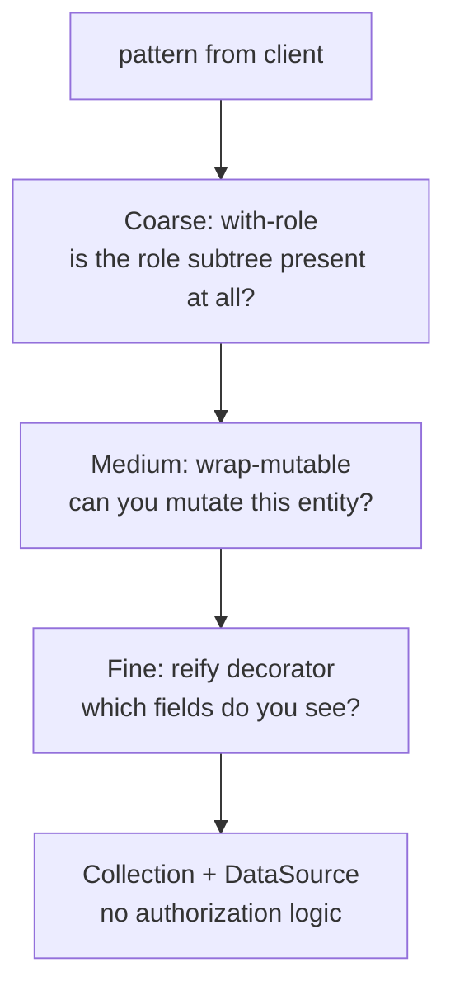

---
tags:
  - clojure
  - architecture
  - lasagna-pattern
date: 2026-03-25
repos:
  - [lasagna-pattern, "https://github.com/flybot-sg/lasagna-pattern"]
rss-feeds:
  - all
  - clojure
---

## TLDR

How `defprotocol`, `defrecord`, `deftype`, and `reify` compose into a decorator pattern, taught through a real [collection library](https://github.com/flybot-sg/lasagna-pattern/tree/main/collection): implement the interfaces behind Clojure's built-in verbs once, so a database-backed type behaves like native Clojure data, then give each user role a thin wrapper that overrides only the behavior it needs.

## The problem

Take a blog API backed by one database. Guests can read posts but must not see author emails. Members can create posts and edit only their own. Admins can edit anything. Owners manage users and roles. Same storage, four different views of it.

The naive way to model this is one implementation per role:

```clojure
;; 3 records duplicating the same Datahike queries
(defrecord GuestPostsDataSource [conn] ...)
(defrecord MemberPostsDataSource [conn] ...)
(defrecord AdminPostsDataSource [conn] ...)
```

Each record carries a full copy of the same fetch, list, create, update, and delete logic, and every query change must be applied three times. That is textbook duplication, and it gets worse with every role you add.

The [lasagna-pattern](https://github.com/flybot-sg/lasagna-pattern) **[collection](https://github.com/flybot-sg/lasagna-pattern/tree/main/collection)** library ([Clojars](https://clojars.org/sg.flybot/lasagna-collection)) takes the other route: implement the storage once, make it behave like a native Clojure collection, and give each role a thin wrapper that changes only what that role needs. All the role wrappers shown in this article come from the repo's [flybot-site example](https://github.com/flybot-sg/lasagna-pattern/tree/main/examples/flybot-site), a complete blog built on the library. The companion article, [Building a Pure Data API with Lasagna Pattern](/blog/building-a-pure-data-api-with-lasagna-pattern), covers the full architecture. In this article, I focus on the Clojure constructs that make the wrappers possible: `defprotocol`, `defrecord`, `deftype`, and `reify`.

## Clojure dispatches on interfaces

Clojure's built-in functions work on built-in types because those types implement specific Java interfaces. `get` works on maps because maps implement `clojure.lang.ILookup`. `seq` works on vectors because vectors implement `Seqable`. `count` works on both because they implement `Counted`.

The interesting part: your own types can implement the same interfaces. Once they do, the standard library treats them as first-class citizens, so `get`, `seq`, `map`, `filter`, and `count` all work transparently, with no special dispatch and no wrapper functions. The collection library uses exactly this: it defines a `Collection` type backed by a database, then implements `ILookup` and `Seqable` so that `(get coll {:post/id 3})` runs a database query while looking like a plain map lookup to the caller.

## The four constructs

Clojure provides four ways to define types that implement protocols and interfaces, and each serves a different purpose. In this section I go through them in the order you would reach for them.

### defprotocol: the contract

A **protocol** defines method signatures with no implementation, conceptually similar to a Java interface. The library's storage contract is one protocol:

```clojure
(defprotocol DataSource
  (fetch [this query])
  (list-all [this])
  (create! [this data])
  (update! [this query data])
  (delete! [this query]))
```

This says: any storage backend must support these 5 operations. It does not say how. The implementation is left to the types that satisfy the protocol.

### defrecord: named, map-like type

A `defrecord` is a concrete implementation with named fields, and it behaves like a Clojure map (you can `assoc`, `dissoc`, and destructure it). The blog's storage backend is a record holding a [Datahike](https://github.com/replikativ/datahike) connection:

```clojure
(defrecord PostsDataSource [conn]
  DataSource
  (fetch [_ query]    (d/q ... @conn))
  (list-all [_]       (d/q ... @conn))
  (create! [_ data]   (d/transact conn [data]))
  (update! [_ q data] (d/transact conn [(merge ...)]))
  (delete! [_ query]  (d/transact conn [[:db/retractEntity ...]])))
```

Use `defrecord` for persistent, reusable implementations with named fields: storage backends, services, configuration holders.

### deftype: named, not map-like

A `deftype` is like `defrecord` but without the map behavior. It is the right tool for structural wrappers that implement platform interfaces rather than domain protocols:

```clojure
(deftype Collection [data-source id-key indexes]
  clojure.lang.ILookup
  (valAt [this q] (.valAt this q nil))
  (valAt [_ q nf] (or (fetch data-source q) nf))

  clojure.lang.Seqable
  (seq [_] (seq (list-all data-source))))
```

Use `deftype` when you need to override built-in Clojure verbs (`get`, `seq`, `count`). The type itself is opaque: callers interact with it through standard Clojure functions, not through field access.

### reify: anonymous, inline type

`reify` has the same capability as `deftype` but is anonymous and created inline, and it closes over local variables:

```clojure
(defn profile-lookup [session]
  (reify clojure.lang.ILookup
    (valAt [this k] (.valAt this k nil))
    (valAt [_ k nf]
      (case k
        :name  (:user-name session)
        :email (:user-email session)
        nf))))
```

Use it for one-off objects, per-request wrappers, or anywhere a named type would be overkill. The `session` value is captured from the enclosing scope.

### Summary table

| Construct | What it is | When to use |
|-----------|-----------|-------------|
| `defprotocol` | Contract (method signatures) | Define a role: "what must a DataSource do?" |
| `defrecord` | Named type, map-like | Concrete implementations: `PostsDataSource` |
| `deftype` | Named type, not map-like | Structural wrappers: `Collection` |
| `reify` | Anonymous inline type | One-off objects: per-request lookups |

## Overriding built-in verbs

Each Clojure interface corresponds to a built-in verb, and implementing the interface teaches Clojure how your type responds to that verb. The sequence diagram below shows what actually happens when a caller runs `get` on the collection: a plain map lookup on the outside, a database query on the inside.



### ILookup: powers `get`

When you call `(get thing key)`, Clojure checks whether `thing` implements `ILookup` and, if so, calls `(.valAt thing key)`. Maps implement this by default. Custom types do not:

```clojure
;; Without ILookup
(deftype Box [x])
(get (->Box 42) :x)  ;; => nil (Box doesn't implement ILookup)

;; With ILookup
(deftype SmartBox [x y]
  clojure.lang.ILookup
  (valAt [this k] (.valAt this k nil))
  (valAt [_ k nf]
    (case k :x x :y y nf)))

(get (->SmartBox 1 2) :x)  ;; => 1
```

In the collection library, `ILookup` is what makes `(get coll {:post/id 3})` trigger a database query. The caller writes standard Clojure, and the collection translates the `get` call into a `fetch` on the underlying `DataSource`.

### Seqable: powers `seq` (and `map`, `filter`, etc.)

```clojure
clojure.lang.Seqable
(seq [_] (seq (list-all data-source)))
```

Once a type implements `Seqable`, all sequence functions work: `(seq coll)`, `(map f coll)`, `(filter pred coll)`. The collection becomes iterable by delegating to its `DataSource`'s `list-all`.

### Counted: powers `count` directly

```clojure
clojure.lang.Counted
(count [_] (count (list-all data-source)))
```

Surprisingly, `count` on a custom `Seqable` type throws `UnsupportedOperationException`. Clojure's `RT.count()` does not fall back to `seq`: it handles `Counted`, `IPersistentCollection`, `java.util.Collection`, and a few other JDK types, and a bare `Seqable` is none of those. So if your type needs to support `count`, implement `Counted` explicitly. This also gives you an optimized path when one exists (a `SELECT COUNT(*)` instead of fetching all rows, for instance).

## Custom protocols

The interfaces above override Clojure's built-in verbs, but some operations have no built-in verb. The collection library defines two custom protocols for these cases.

| Protocol | Verb | Purpose |
|----------|------|---------|
| `Mutable` | `mutate!` | Unified CRUD: `(nil, data)` = create, `(query, data)` = update, `(query, nil)` = delete |
| `Wireable` | `->wire` | Serialize for HTTP transport: collections become vectors, lookups become maps or nil |

`mutate!` unifies create, update, and delete into a single function, with the operation determined by the arguments: nil query means create, nil value means delete, both present means update.

`Wireable` is conceptually similar to `clojure.core.protocols/Datafiable` (`datafy`). Both turn opaque types into plain Clojure data, but the intent differs: `datafy` is for introspection and navigation, `->wire` is specifically for HTTP serialization.

## The decorator pattern

Now that we have one `DataSource` and one `Collection`, the roles come back into the picture. A **decorator** is a wrapper that implements the same interfaces as the thing it wraps, delegating most operations and overriding a few. The design rule is: one DataSource, one Collection, then one thin decorator per role. The diagram below shows how the three roles that touch posts converge on a single storage implementation (the owner role follows the same pattern on a separate users collection).



The `DataSource` is created once. Each role gets a wrapper that overrides only the behavior it needs, so reads, storage queries, and domain logic live in one place.

### Wrapper functions

The library ships the common wrappers, and `reify` covers the rest:

| Wrapper | What it overrides | Use case |
|---------|-------------------|----------|
| `coll/read-only` | Removes `Mutable` entirely | Guest access (no writes) |
| `coll/wrap-mutable` | Overrides `mutate!`, delegates reads | Ownership enforcement |
| `reify` (manual) | Override any interface | Transform read results, composite routing |
| `coll/lookup` | Provides `ILookup` from a keyword-value map | Non-enumerable resources (profile, session data) |

### Building the views per role

In the API builder, the stable collections are created once at startup, and only the member wrapper is built per request because it closes over the user's identity:

```clojure
(defn make-api [{:keys [conn]}]
  (let [posts       (db/posts conn)                ;; one Collection, created once
        guest-posts (public-posts posts)
        users       (coll/read-only (db/users conn))]
    (fn [ring-request]
      (let [ident (get-identity ring-request)]
        {:guest  {:posts guest-posts}
         :member (with-role ident :member
                   {:posts (member-posts posts (:user-id ident) (:user-email ident))})
         :admin  (with-role ident :admin {:posts posts})
         :owner  (with-role ident :owner {:users users})}))))
```

Guests see a read-only view with PII stripped, members see a mutable view that enforces ownership, and admins see the raw collection. Owners don't touch posts at all: they get a read-only wrap of the separate users collection. Each wrapper does one thing.

The `public-posts` wrapper is where `reify` earns its place: the library provides `read-only` (restricts writes) and `wrap-mutable` (intercepts writes), but no built-in way to transform read results. For that, you implement the interfaces directly:

```clojure
(defn- public-posts [posts]
  (let [inner (coll/read-only posts)]
    (reify
      clojure.lang.ILookup
      (valAt [_ query]
        (when-let [post (.valAt inner query)]
          (strip-author-email post)))
      (valAt [this query not-found]
        (or (.valAt this query) not-found))

      clojure.lang.Seqable
      (seq [_]
        (map strip-author-email (seq inner)))

      clojure.lang.Counted
      (count [_]
        (count inner))

      coll/Wireable
      (->wire [this]
        (some-> (seq this) vec)))))
```

Every read path (`get`, `seq`, and the wire serialization) goes through `strip-author-email`, while storage stays in the inner collection.

## Three layers of authorization

Authorization in this pattern is distributed structurally rather than imperatively. Instead of a single middleware that checks permissions, three layers each guard a different granularity, and a request passes through them from coarse to fine:



### Coarse: `with-role` (API map structure)

The coarse layer is a binary gate: you have the role or you don't. The entire subtree of collections is either present or replaced with an error map:

```clojure
(defn- with-role [ident role data]
  (if (has-role? ident role)
    data
    {:error {:type :forbidden :message (str "Role " role " required")}}))

;; In make-api:
:owner (with-role ident :owner
         {:users users, :users/roles roles})
```

A non-owner sending `'{:owner {:users ?all}}` hits the error map, not the collection. Before matching, the remote layer walks each variable path over the raw data and trims the pattern wherever it finds `{:error ...}`, so the denial surfaces as a `:forbidden` failure (HTTP 403) without ever reaching a collection. A plain map is enough, no sentinel object required.

### Medium: `wrap-mutable` (per-entity mutation rules)

The medium layer controls who can create, update, or delete specific entities:

```clojure
(coll/wrap-mutable posts
  (fn [posts query value]
    (if (owns-post? posts user-email query)
      (coll/mutate! posts query value)
      {:error {:type :forbidden :message "You don't own this post"}})))
```

Reads pass through untouched, only mutations are intercepted, and the check is per-entity: does this user own this specific post?

### Fine: `reify` decorator (field-level read transformation)

The fine layer controls which fields are visible:

```clojure
(public-posts posts)  ;; strips :user/email from author on every read
```

Every `get` and `seq` call on this wrapper runs through a transformation that removes sensitive fields before the data reaches the caller.

### Authorization summary

| Layer | Tool | What it guards | Example |
|-------|------|----------------|---------|
| Coarse | `with-role` | "Can you access `:owner` at all?" | Non-owners get error map |
| Medium | `wrap-mutable` | "Can you mutate this entity?" | Members can only edit own posts |
| Fine | `reify` decorator | "What fields can you see?" | Guests don't see author email |

The `DataSource` knows nothing about authorization, only about storage. That is what keeps it reusable across all roles without conditional logic.

## When to skip the full stack

Not everything needs `defrecord` + `DataSource` + `Collection`, and reaching for the full stack everywhere is overkill. If a resource is read-only, non-enumerable, and has a single query shape, a raw `reify` implementing `ILookup` + `Wireable` is enough.

For instance, the post history lookup takes a post ID and returns the revision history:

```clojure
(defn post-history-lookup [conn]
  (reify
    clojure.lang.ILookup
    (valAt [_ query]
      (when-let [post-id (:post/id query)]
        (post-history @conn post-id)))
    (valAt [this query not-found]
      (or (.valAt this query) not-found))

    coll/Wireable
    (->wire [_] nil)))  ;; can't enumerate all history
```

The pattern engine still calls `get` on it, so it works identically from the caller's perspective. The full stack would add index validation, `Seqable`, and `Mutable`, none of which history needs.

### Decision guide

| Need | Tool |
|------|------|
| Full CRUD + enumeration + index validation | `defrecord` + `coll/collection` |
| Read-only, keyword keys, mix of cheap + lazy fields | `coll/lookup` |
| Read-only, map keys, single query shape | Raw `reify` with `ILookup` + `Wireable` |

`coll/lookup` accepts `delay` values for expensive fields: `(coll/lookup {:id uid :slug (delay (db-slug conn uid))})`. Each delay fires at most once whether reached via `get` or `->wire`. For map keys like `{:post/id 3}`, use a raw `reify`.

## The payoff

One `DataSource`, one `Collection`, and a handful of decorators serve four roles with different read visibility and write rights. Adding a role means writing one wrapper function, not a new storage backend, and a query change lands in exactly one place. On the outside, callers only ever write `get`, `seq`, and `count`: plain Clojure verbs, whatever behavior you need behind them.