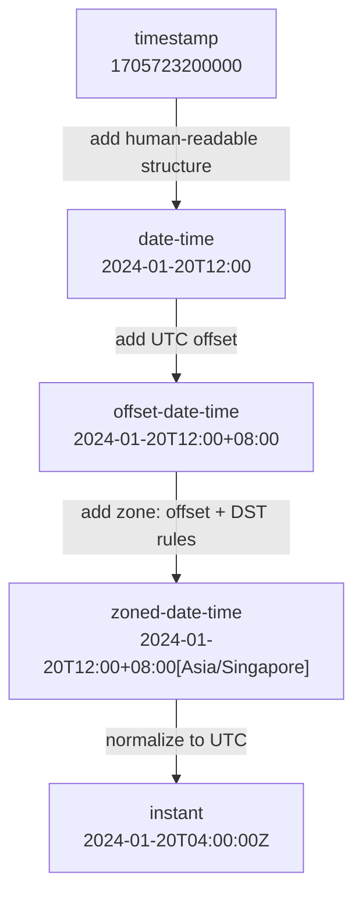
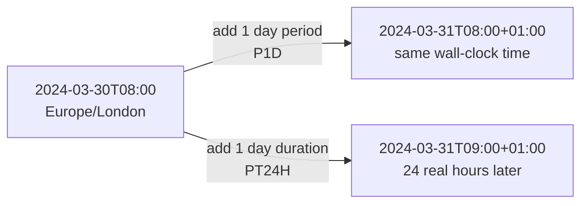

---
tags:
  - clojure
  - java
date: 2024-04-20
repos:
  - [juxt/tick, "https://github.com/juxt/tick"]
rss-feeds:
  - all
---

## TLDR

Time in programming has too many representations, and jumping between them is where bugs live. This article walks the progression from `timestamp` to `instant` using [juxt/tick](https://github.com/juxt/tick), explains why an offset is not a zone, and shows the DST edge case where adding "one day" gives two different answers depending on whether you add a `duration` or a `period`.

## The problem

Every project I have worked on eventually hits a time bug. Someone stores a local date-time without a zone. Someone else assumes it is UTC. A third person adds 24 hours when they meant "next calendar day", and the result drifts by one hour twice a year. These bugs are correct on your machine and wrong six months later in another timezone. That is the worst kind of bug.

The root cause is always the same: time has many representations (`timestamp`, `date-time`, `offset-date-time`, `zoned-date-time`, `instant`), each encoding a different amount of information, and picking the wrong one at the wrong layer produces failures that only DST or a user in another country can reveal.

[juxt/tick](https://github.com/juxt/tick) is a Clojure library that wraps `java.time` and treats dates and times as values you can pipe through `->` chains. I use it here because it makes each conversion one explicit function call, but the concepts apply in any language.

## The progression

Each representation adds one piece of information to the previous one. The diagram below shows the full ladder, from raw timestamp to instant:



The rest of the article climbs this ladder one rung at a time, then finishes with the duration versus period distinction, which is where DST bites.

## Timestamp

A **timestamp** is the number of milliseconds (or seconds) since the Unix epoch, 1970-01-01T00:00:00Z. It is just an integer like `1705723200000`: universal and unambiguous, but unreadable by humans. We need structure.

## Date-time

*Alice is having fish and chips for lunch in London. Her wall clock shows 12pm, her calendar shows January 20th.*

A **date-time** is a date plus a time of day, with no zone information. Java calls this `java.time.LocalDateTime`; tick drops the "local" prefix, since time is always local when you read it off a wall clock:

```clojure
(-> (t/time "12:00")
    (t/on "2024-01-20"))
;=> #time/date-time "2024-01-20T12:00"
```

*At the "same moment", Bob is having fish soup at a food court in Singapore. His wall clock shows 8pm.*

Alice and Bob read different times for the same moment, and a date-time alone cannot express that they are simultaneous. We need an offset.

## Offset-date-time

The **UTC offset** is the difference between local time and Coordinated Universal Time (UTC). The UK sits on the prime meridian at `UTC+0` (written `Z`), and Singapore is eight hours ahead at `UTC+8`:

```clojure
;; Alice in London
(-> (t/time "12:00")
    (t/on "2024-01-20")
    (t/offset-by 0))
;=> #time/offset-date-time "2024-01-20T12:00Z"

;; Bob in Singapore
(-> (t/time "20:00")
    (t/on "2024-01-20")
    (t/offset-by 8))
;=> #time/offset-date-time "2024-01-20T20:00+08:00"
```

In Java this is `java.time.OffsetDateTime`, and the `+08:00` suffix is the offset. It looks sufficient, but there is a problem: the offset of a given location is not constant.

## Zoned-date-time

Alice's offset is `UTC+0` in winter but `UTC+1` in summer:

```clojure
;; Alice in winter
(-> (t/time "12:00")
    (t/on "2024-01-20")
    (t/in "Europe/London")
    (t/offset-date-time))
;=> #time/offset-date-time "2024-01-20T12:00Z"

;; Alice in summer
(-> (t/time "12:00")
    (t/on "2024-08-20")
    (t/in "Europe/London")
    (t/offset-date-time))
;=> #time/offset-date-time "2024-08-20T12:00+01:00"
```

The difference is Daylight Saving Time (DST): in spring, UK clocks move forward one hour, and in autumn they move back. A **zone** like `Europe/London` encodes those rules, so the correct offset is derived from the date automatically. Not every country plays this game: Singapore sits near the equator with near-constant daylight hours year-round, so `Asia/Singapore` is `UTC+8` all year long.

Thus, an offset is not a zone. A zone is the offset plus the rules for when it changes:

```clojure
(-> (t/time "12:00")
    (t/on "2024-01-20")
    (t/in "Europe/London"))
;=> #time/zoned-date-time "2024-01-20T12:00Z[Europe/London]"
```

In Java: `java.time.ZonedDateTime`. For Alice and Bob, the consequence is that Bob is 8 hours ahead of Alice in winter but only 7 in summer.

## Instant

For storage and computation we want the opposite of all this local detail. An **instant** is a point on the **UTC timeline**, independent of any zone: the human-readable twin of the timestamp.

```clojure
;; Alice at 12pm London
(-> (t/time "12:00")
    (t/on "2024-01-20")
    (t/in "Europe/London")
    (t/instant))
;=> #time/instant "2024-01-20T12:00:00Z"

;; Bob at 8pm Singapore
(-> (t/time "20:00")
    (t/on "2024-01-20")
    (t/in "Asia/Singapore")
    (t/instant))
;=> #time/instant "2024-01-20T12:00:00Z"
```

Both expressions produce the same instant: 12pm in London and 8pm in Singapore are the same moment. In Java: `java.time.Instant`. The epoch itself is one:

```clojure
(t/epoch)
;=> #time/instant "1970-01-01T00:00:00Z"
```

This gives the rule that prevents most time bugs: **store and compute with instants, display with zoned-date-times**. Everything in between is an intermediate form, useful for specific conversions.

## Displaying time for users

Alice and Bob do not care about instants: Alice wants London time, Bob wants Singapore time. Deriving a zoned-date-time from a stored instant is straightforward:

```clojure
;; Alice's browser
(t/format (t/formatter "yyyy-MM-dd HH:mm:ss")
          (t/in #time/instant "2024-01-20T12:00:00Z" "Europe/London"))
;=> "2024-01-20 12:00:00"

;; Bob's browser
(t/format (t/formatter "yyyy-MM-dd HH:mm:ss")
          (t/in #time/instant "2024-01-20T12:00:00Z" "Asia/Singapore"))
;=> "2024-01-20 20:00:00"
```

## inst vs instant

As a Clojure developer, you will also meet `#inst` literals. These are `java.util.Date` instances, the legacy class that `java.time` replaced back in Java 8. Avoid it in new code, but some libraries still speak it, so tick converts both ways:

```clojure
(t/inst #time/instant "2024-01-20T04:00:00Z")
;=> #inst "2024-01-20T04:00:00.000-00:00"

(t/instant #inst "2024-01-20T04:00:00.000-00:00")
;=> #time/instant "2024-01-20T04:00:00Z"
```

## Duration vs period

Now that storage and display are settled, the remaining trap is arithmetic. A **duration** is time-based (hours, minutes, seconds); a **period** is calendar-based (days, weeks, months, years). They are not interchangeable:

```clojure
(t/new-duration 10 :seconds)
;=> #time/duration "PT10S"

(t/new-period 10 :weeks)
;=> #time/period "P70D"

(t/new-period 10 :seconds)
;; Execution error (IllegalArgumentException)
;; No matching clause: :seconds
```

A day is the ambiguous unit: it can be a duration (exactly 24 hours) or a period (one calendar day):

```clojure
(t/new-duration 10 :days)
;=> #time/duration "PT240H"

(t/new-period 10 :days)
;=> #time/period "P10D"
```

The distinction matters because of DST. In London, at 1am on March 31st 2024, clocks spring forward one hour, so that calendar day is only 23 hours long. Adding "one day" to the morning before therefore gives two different answers, as the diagram below shows:



```clojure
;; Add a period of 1 day (calendar-based)
(-> (t/time "08:00")
    (t/on "2024-03-30")
    (t/in "Europe/London")
    (t/>> (t/new-period 1 :days)))
;=> #time/zoned-date-time "2024-03-31T08:00+01:00[Europe/London]"

;; Add a duration of 1 day (exactly 24 hours)
(-> (t/time "08:00")
    (t/on "2024-03-30")
    (t/in "Europe/London")
    (t/>> (t/new-duration 1 :days)))
;=> #time/zoned-date-time "2024-03-31T09:00+01:00[Europe/London]"
```

The period preserves the wall-clock time, because "next calendar day" is a calendar question. The duration lands one hour later, because 24 physical hours after 8am the clocks have jumped ahead. Both answers are correct; they answer different questions. The bug is asking the wrong one, for instance scheduling a daily 8am report by adding a 24-hour duration in a loop.

## Conclusion

- A zone is the `UTC` offset plus the `DST` rules for a region. An offset alone is not enough.
- Store and compute with `instants`: zone-independent, unambiguous, comparable.
- Convert to `zoned-date-time` only at the display layer, so each user sees their local time.
- Use a `duration` for physical elapsed time and a period for calendar arithmetic. DST is where mixing them up becomes visible.

With tick, each of these conversions is one function in a `->` chain, so the representation a value is in, and the moment it changes, is always visible in the code. Pick the right rung of the ladder for each layer and the twice-a-year bugs disappear.