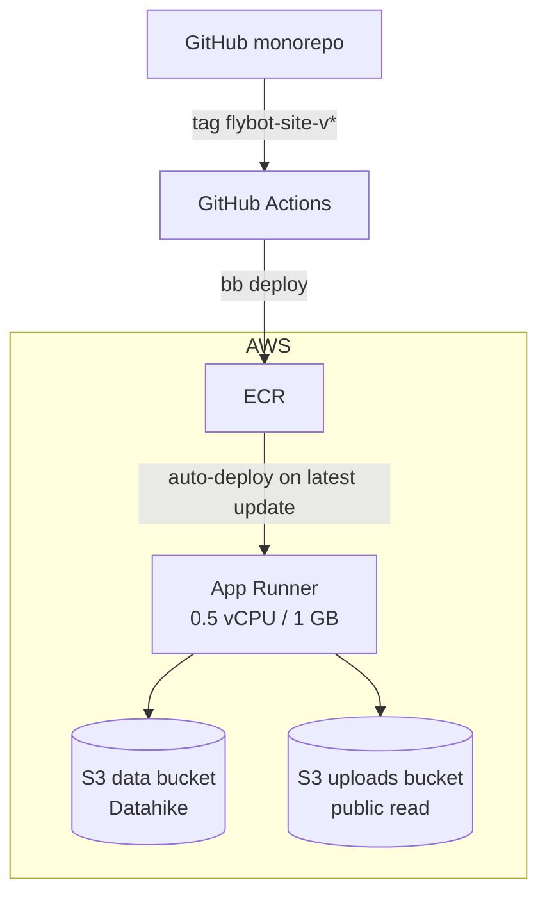
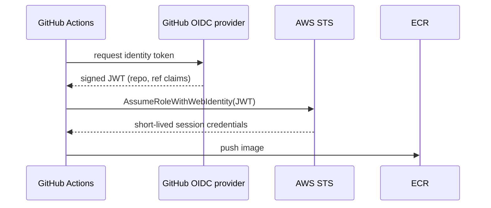

---
tags:
  - clojure
  - aws
  - devops
  - docker
  - lasagna-pattern
date: 2026-02-17
repos:
  - [lasagna-pattern, "https://github.com/flybot-sg/lasagna-pattern"]
rss-feeds:
  - all
---
## TLDR

How I migrated the flybot.sg deployment from EC2 with two load balancers to [AWS App Runner](https://aws.amazon.com/apprunner/) with S3-backed Datahike, cutting the bill from about $50 to about $15 a month and removing most of the operational work.

## The problem

The [flybot.sg](https://www.flybot.sg) website is a full-stack Clojure app (Ring backend, ClojureScript + [Replicant](https://github.com/cjohansen/replicant) SPA) running as a single container. It lives in the [lasagna-pattern](https://github.com/flybot-sg/lasagna-pattern) monorepo under `examples/flybot-site/`.

The original deployment ran that container with Docker on an EC2 instance, behind an ALB for SSL termination and redirects, and an NLB in front of the ALB to get a static IP for the apex domain's A record. Two load balancers at ~$18/month each, so $36/month of infrastructure just to route traffic to a site with modest traffic. That is disproportionate. On top of the cost, the setup demanded regular chores: Docker updates on the instance, EBS snapshots for the embedded [Datalevin](https://github.com/juji-io/datalevin) database, and security group maintenance.

In February 2026 I migrated everything to **AWS App Runner**, a managed service that runs a container image directly from ECR with HTTPS, custom domains, and auto-scaling built in. This article covers the decisions behind that migration: why App Runner, what had to change in the app to survive ephemeral containers, and how the deploy pipeline works.

## Why App Runner

I evaluated the usual AWS compute options:

| Option | Pros | Cons |
|--------|------|------|
| **EC2 + ALB + NLB** (old) | Full control | $36/month of LBs, manual Docker, EBS management |
| **ECS Fargate** | Managed containers | Task definitions to maintain, ALB still needed |
| **EKS** | Full Kubernetes | ~$73/month control plane alone |
| **App Runner** | Zero-config, auto-scale, built-in HTTPS | Less networking flexibility |

EKS for a single container is overkill, and Fargate would have kept the ALB, which was the main cost I wanted to kill. App Runner won because:

- **No load balancer.** SSL termination, HTTP-to-HTTPS redirect, and custom domains are built in. That alone removes $36/month.
- **No instance management.** No SSH, no Docker daemon, no security patches. Push an image and it runs.
- **Automatic scaling.** When there is no traffic, App Runner pauses the instance: you keep paying for the provisioned memory but not the vCPU, and the next request wakes it up.
- **Simple pricing.** With 0.5 vCPU and 1 GB of RAM, our bill lands around $15/month.

## Architecture

The diagram below shows the whole chain, from a git tag on the monorepo to a running container talking to S3:



There is no load balancer, no EC2 instance, and no EBS volume anywhere in this picture. The only stateful pieces are two S3 buckets: a private one holding the database, and a public-read one serving user-uploaded images.

## Surviving ephemeral containers

App Runner containers have no persistent filesystem, so anything the old deployment kept on disk had to move out of the container. This was the real prerequisite of the migration, and it forced three changes.

**Database.** The old site used Datalevin, a Datalog database backed by LMDB files, which I persisted on disk on an EBS volume and backed up with snapshots. Ephemeral containers rule that out, so I switched to [Datahike](https://github.com/replikativ/datahike), a Datalog database with pluggable storage backends, and its [datahike-s3](https://github.com/replikativ/datahike-s3) backend. The database state lives in an S3 bucket, and any container instance can read and write it:

```clojure
;; production backend config
{:backend :s3 :bucket "flybot-site-data" :region "ap-southeast-1"}
```

**Sessions.** In-memory session storage dies with the instance, so sessions moved to an encrypted cookie store. The session is stateless on the server side and survives restarts and redeploys.

**Uploads.** User-uploaded images used to land on the local filesystem. They now stream to a second S3 bucket with a public-read policy, and are served directly from S3.

## Building container images with Jibbit

[Jibbit](https://github.com/atomisthq/jibbit) is a Clojure wrapper around Google's [Jib](https://github.com/GoogleContainerTools/jib). It builds OCI container images directly from the classpath, no Docker daemon needed, which also means CI does not need Docker-in-Docker. I maintain a [fork](https://github.com/skydread1/jibbit) that adds a configurable entry-point ([atomisthq/jibbit#24](https://github.com/atomisthq/jibbit/pull/24)).

The `jib.edn` config:

```clojure
{:aot          true
 :main         sg.flybot.flybot-site.server.system
 :user         "root"
 :base-image   {:image-name "eclipse-temurin:21-jre"
                :type       :registry}
 :target-image {:image-name "$ECR_REPO"
                :type       :registry
                :tagger     {:fn jibbit.tagger/tag}
                :authorizer {:fn   jibbit.aws-ecr/ecr-auth
                             :args {:type   :environment
                                    :region "ap-southeast-1"}}}
 :entry-point  jibbit/entry-point}
```

Key choices:

- **AOT compilation** for faster startup. App Runner's health check has a timeout, and Clojure startup without AOT can be slow enough to fail it.
- **eclipse-temurin:21-jre** instead of the full JDK: smaller image, and a JRE is all an AOT-compiled app needs.
- **`:tagger`** uses the git tag (e.g. `flybot-site-v0.2.4`) as the image tag, giving immutable versioned images to roll back to.
- **Custom entry-point** wraps the command in `/bin/sh -c` so `${JAVA_OPTS}` expands at runtime (the default Jibbit entry-point does not). This matters on a 1 GB instance: I pass `JAVA_OPTS=-XX:MaxRAMPercentage=75.0` so the JVM actually uses the container's memory instead of defaulting to a quarter of it. When AOT is on, the entry-point also runs the jar with direct linking and `-XX:TieredStopAtLevel=1`, both of which cut startup time further.

## CI/CD pipeline

Deployments are triggered by git tags. The monorepo's `bb tag` task reads the component version from `resources/version.edn`, then creates and pushes the tag:

```bash
bb tag examples/flybot-site
# Creates and pushes: flybot-site-v0.2.4 → GitHub Actions picks it up
```

The GitHub Actions workflow then runs `bb deploy`, which builds the ClojureScript frontend with shadow-cljs, builds the container with Jibbit, and pushes it to ECR under the version tag. A final step re-tags that image as `latest` by re-putting its manifest with `aws ecr put-image`, no pull or push involved. App Runner is configured to auto-deploy whenever `latest` updates, so that re-tag is the deploy.

For authentication, the workflow uses **OIDC federation** instead of long-lived AWS credentials stored in GitHub. The sequence below shows the exchange:



AWS validates the JWT against a pre-configured OIDC provider and checks that the `repo` claim matches the IAM role's trust policy, so only workflows from our repository can assume the role. The only GitHub secret in the whole pipeline is `AWS_ROLE_ARN`, and it is not even sensitive, just not worth publishing.

## Apex domain routing

One more blocker: App Runner exposes a DNS name, not a static IP. `www.flybot.sg` points to it with a CNAME, but the apex domain `flybot.sg` cannot use a CNAME per DNS spec, and our DNS lives at GoDaddy, so Route 53 ALIAS records are not an option either. Rather than paying for another load balancer just to get a static IP, I use [redirect.pizza](https://redirect.pizza) (free tier) to 301-redirect the apex to `www.flybot.sg` with path forwarding and its own SSL certificate. I covered this problem and the alternatives in [Apex Domain to Subdomain Redirect](https://www.loicb.dev/blog/apex-domain-to-subdomain-redirect).

## What changed from EC2

| Aspect | EC2 + ALB + NLB | App Runner |
|--------|-----------------|------------|
| **Cost** | ~$36/month (LBs) + EC2 + EBS | ~$15/month |
| **SSL** | ACM cert + ALB listener rules | Built-in |
| **Apex domain** | NLB for static IP ($18/month) | redirect.pizza (free) |
| **Scaling** | Manual | Automatic |
| **Docker** | Installed on EC2, manual updates | Not needed (Jibbit) |
| **Database** | Datalevin on EBS | Datahike on S3 |
| **Deploys** | SSH to EC2, pull, restart | `bb tag` → auto-deploy |
| **CI auth** | Long-lived `AWS_ACCESS_KEY_ID` | OIDC (short-lived tokens) |

## Conclusion

The bill dropped from ~$50 to ~$15 a month, and the operational work dropped with it. There is no instance to patch, no Docker daemon to update, no EBS snapshot schedule, and no load balancer config to maintain. A release is one command, `bb tag`, and a couple of minutes later the new version is live. The trade was making the app fully stateless, which S3-backed Datahike, cookie sessions, and S3 uploads took care of, and that constraint turned out to be a feature: any instance can serve any request, so scaling comes for free.