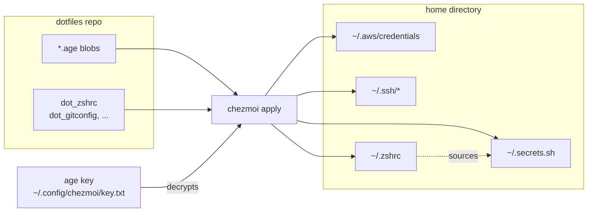
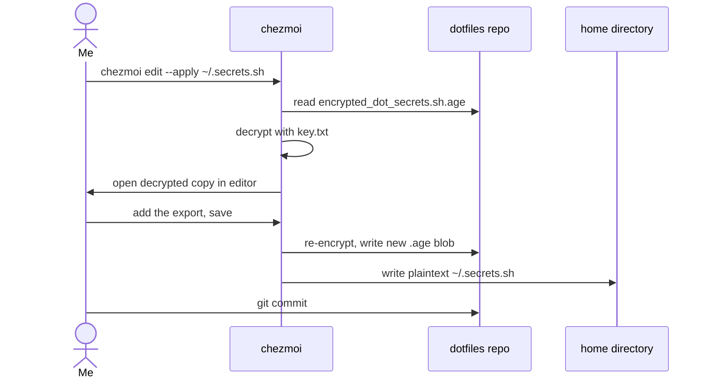
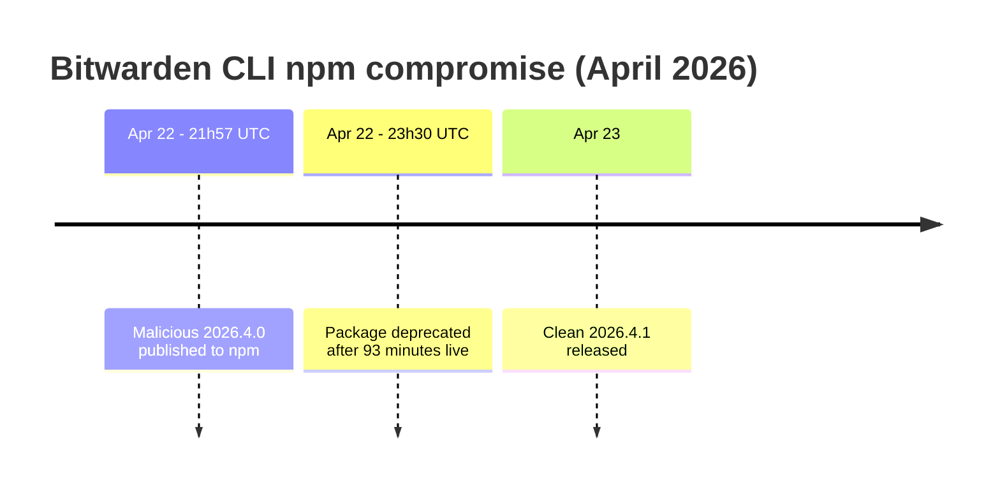
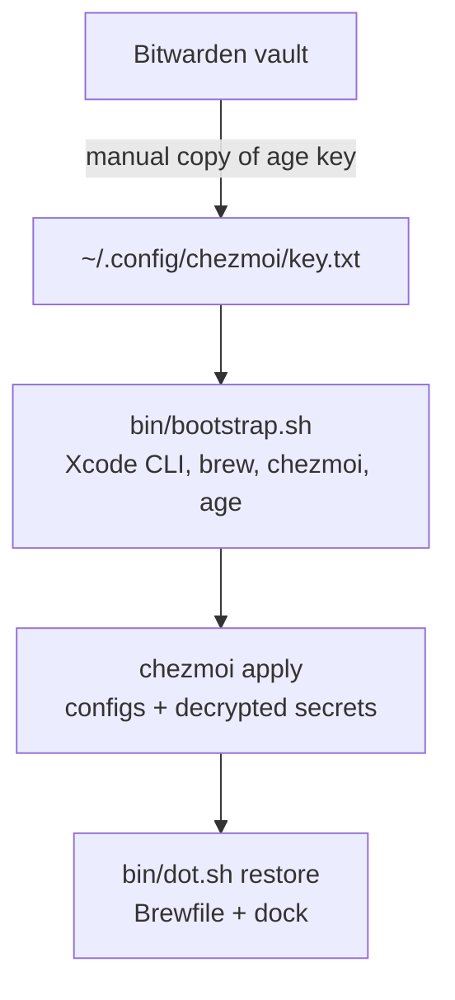

---
tags:
  - dotfiles
  - security
  - macos
  - cli
  - git
date: 2026-05-12
rss-feeds:
  - all
---

## TLDR

My macOS environment lives in a single git repo managed by [chezmoi](https://www.chezmoi.io/), with secrets encrypted at rest using [age](https://github.com/FiloSottile/age). Bootstrapping a new machine is one script and one manual step: restoring the age key. I started with the Bitwarden CLI feeding chezmoi's secret templates, then migrated to age. The April 2026 Bitwarden CLI supply chain attack on npm landed after that migration.

## Why a dotfiles repo

Setting up a new Mac by hand takes a day, and you always forget something: the shell config, the git identity, the AWS credentials, the SSH keys, the forty Homebrew packages. Worse, without a single source of truth the config **drifts** between machines, and you only notice when a command works on one laptop and fails on the other.

The classic fix is a dotfiles repo, a git repo holding your config files. The simplest version is a folder of symlinks:

```bash
ln -sf ~/dotfiles/.zshrc ~/.zshrc
```

That works until you need secrets. My `~/.aws/credentials` and SSH keys are part of my environment too, so either they stay out of git and I rebuild them by hand on every machine, or I pick a tool that encrypts them in place.

The popular options:

| Tool | Approach | Secrets | Complexity |
|------|----------|---------|------------|
| [GNU Stow](https://www.gnu.org/software/stow/) | Symlinks only | None (manage yourself) | Very low |
| Bare git repo | `git --bare` in `$HOME` | None | Minimal |
| [yadm](https://yadm.io/) | Git-based | GPG or OpenSSL (plus transcrypt, git-crypt) | Low |
| [chezmoi](https://www.chezmoi.io/) | Declarative + templated | age, GPG, vault integrations | Medium |
| [Nix Home Manager](https://github.com/nix-community/home-manager) | Declarative | sops-nix, agenix | High |

I picked chezmoi for two reasons. It is **declarative**: the repo is the source of truth and `chezmoi apply` writes to `$HOME`, instead of `$HOME` being a pile of symlinks back into the repo. And it has per-file age encryption built in. Nix Home Manager solves the same problem more thoroughly, but it drags a whole package-management worldview along with it, which is overkill for one laptop. chezmoi is the sweet spot: templating when I need it, age built in, nothing else to install.

## Layout

The git repo is the chezmoi **source directory**. chezmoi finds it through the `sourceDir` setting in `~/.config/chezmoi/chezmoi.toml`, which points at the checkout (`~/workspaces/dotfiles` in my case).

```
dotfiles/                               (git repo = chezmoi source)
├── .chezmoiignore                      Repo files chezmoi must not deploy
├── Brewfile                            Homebrew packages manifest
├── bin/                                Bootstrap and backup/restore scripts
├── dot_zshrc                           Deployed as ~/.zshrc
├── dot_gitconfig                       Deployed as ~/.gitconfig
├── dot_aws/
│   ├── config                          Plain AWS config
│   └── encrypted_credentials.age       Encrypted AWS keys
├── encrypted_dot_secrets.sh.age        Encrypted env-var secrets
├── private_dot_ssh/                    SSH keys and config, age-encrypted
└── private_Library/                    VSCode settings and snippets
```

The naming is chezmoi's convention. Filename prefixes drive behaviour at apply time:

- `dot_` becomes a leading dot in the destination (`dot_zshrc` becomes `~/.zshrc`)
- `private_` removes group and world permissions on apply (files land as `0600`)
- `encrypted_` triggers age decryption on apply
- `executable_` marks the file executable on apply

Prefixes compose, so `private_dot_ssh/encrypted_private_id_ed25519_signing.age` deploys as `~/.ssh/id_ed25519_signing`, decrypted, owner-only. The age private key lives at `~/.config/chezmoi/key.txt` and is never committed.

## How age encryption fits in

`age` is public-key encryption with none of GPG's ceremony. It ships as two small binaries: `age` encrypts and decrypts, `age-keygen` generates keys. An **identity** is the file holding your private key, and a **recipient** is a public key that can encrypt to it.

Generating the key pair is a one-time step:

```bash
age-keygen -o ~/.config/chezmoi/key.txt
# Public key: age1...
```

The recipient goes into `~/.config/chezmoi/chezmoi.toml` next to the source directory:

```toml
sourceDir = "~/workspaces/dotfiles"
encryption = "age"

[age]
  identity = "~/.config/chezmoi/key.txt"
  recipient = "age1..."
```

After that, adding a secret file is one command:

```bash
chezmoi add --encrypt ~/.aws/credentials
```

chezmoi reads the file, encrypts it with the recipient public key, and stores it in the source directory as `dot_aws/encrypted_credentials.age`. The git repo only ever sees the encrypted blob.

## What I encrypt, and why

| Deployed to          | Source in repo                      | Contents                                 |
| -------------------- | ----------------------------------- | ---------------------------------------- |
| `~/.aws/credentials` | `dot_aws/encrypted_credentials.age` | AWS access keys                          |
| `~/.secrets.sh`      | `encrypted_dot_secrets.sh.age`      | Git emails, private registry credentials |
| `~/.ssh/*`           | `private_dot_ssh/encrypted_*.age`   | SSH keys, ssh config, allowed signers    |

The diagram below shows the full flow on any machine that has the key: encrypted blobs and plain configs go in, `chezmoi apply` decrypts and writes, and `~/.zshrc` sources `~/.secrets.sh` to load the secret environment variables.



There is no password prompt and no vault unlock. The age key sits on disk, protected the same way an SSH key is: file permissions plus FileVault. age also supports passphrase-protecting the key, the same option `ssh-keygen` gives you.

### Editing a secret, end to end

Day to day, I never touch the `.age` blobs directly. Say I want to add an export to `~/.secrets.sh`. One command drives the whole round trip:

```bash
chezmoi edit --apply ~/.secrets.sh
```

The sequence below shows what happens behind that command: chezmoi decrypts the blob into a temporary copy, opens it in the editor, re-encrypts it into the source directory when I save, and writes the new plaintext to my home directory. Git only ever sees the new encrypted blob.



For a plain file like `~/.zshrc`, the flow is the same minus the two crypto steps.

## Why I left the Bitwarden CLI behind

My first version of this setup had no `.age` files at all. chezmoi has first-class [Bitwarden](https://bitwarden.com/) support through the `bitwarden` and `bitwardenFields` template functions, and my old `dot_zshrc.tmpl` pulled every secret live from the vault at apply time:

```
# dot_zshrc.tmpl (old setup)
export GITHUB_EMAIL='{{ (bitwardenFields "item" "Github").primary_email.value }}'
export NEXUS_PWD='{{ (bitwarden "item" "Nexus").login.password }}'
```

It is a clean model in theory: the repo holds no secret, encrypted or not, and every `chezmoi apply` shells out to `bw get` to render the real values into `$HOME`. In practice I migrated off it for three reasons:

1. **Friction**. Every apply required an unlocked vault, so editing even a non-secret file meant `bw unlock` first.
2. **Credential exposure in the terminal**. The unlock dance either has you typing the master password into prompts all day, or exporting a long-lived `BW_SESSION` token that lands in shell history and process environments.
3. **Heavyweight**. The secrets I actually need are a handful of values that change rarely. Unlocking a full vault to read them on every apply is ridiculous.

`age` gave me a much smaller attack surface. The key is a file. If the disk is encrypted and the file is `0600`, it has the same security properties as `~/.ssh/id_ed25519`. If I lose the laptop, FileVault is the layer that matters.

| Threat | Bitwarden CLI | age (FileVault on) |
|--------|---------------|--------------------|
| Master password or session token leaked in terminal | Risk | Nothing to type |
| Stolen laptop (disk encrypted) | Safe | Safe |
| Malicious script reading files | Safe (vault locked) | Same risk as SSH keys |
| Supply chain compromise of the CLI | Yes (see below) | age is a small single-purpose binary |

### The April 2026 incident

The last row stopped being theoretical on April 22, 2026, when a malicious version `2026.4.0` of the `@bitwarden/cli` npm package was published:



The payload, part of the third wave of the Shai-Hulud campaign, stole npm tokens, GitHub authentication tokens, SSH keys, and cloud credentials for AWS, Azure, and Google Cloud, exfiltrated them by creating public GitHub repositories under the victim's own account, and used the stolen npm tokens to inject itself into other packages the victim could publish to.

The root cause was not Bitwarden's codebase. The attacker came through a [compromised GitHub Action](https://www.bleepingcomputer.com/news/security/bitwarden-cli-npm-package-compromised-to-steal-developer-credentials/) linked to the Checkmarx supply chain attack, and rode Bitwarden's release pipeline into npm. No vault data was affected; only the CLI distribution channel was hit.

Still, the blast radius of a tool that can read your entire secrets vault is exactly your entire secrets vault. A 93-minute window on a single package registry is enough for that to matter.

I still use Bitwarden as a password manager, and happily. The age private key is stored in my vault like any other secret, and on a new machine I copy it to `~/.config/chezmoi/key.txt` by hand. That is the only time Bitwarden touches the dotfiles flow.

## SSH key management

SSH keys are age-encrypted in `private_dot_ssh/` and deployed by `chezmoi apply` like everything else. Two conventions have served me well.

**Name keys by purpose, not by protocol or person.** `id_ed25519_signing` is fine because it says what the key does. `work-bastion` is fine. `bob_key` is not, because the key outlives the colleague's role, and generic names like `id_rsa` collide on machines with more than one identity. One hygiene rule on top: no IP addresses in filenames. They end up in git history and tie a key's identity to an ephemeral network location.

**Let `~/.ssh/config` be the documentation.** Instead of keeping a separate inventory note, each key is documented by its `Host` entry:

```
Host work-bastion
  HostName bastion.example.com
  User ec2-user
  IdentityFile ~/.ssh/work-bastion

Host work-gitlab
  PreferredAuthentications publickey
  IdentityFile ~/.ssh/work-gitlab
```

The benefit is twofold. First, `ssh work-bastion` does the right thing without me thinking about which key or which user. Second, the config file is the source of truth for which keys exist and why, so there is no drift between an inventory note and the actual ssh config.

The signing key doubles as the commit-signing identity. `~/.gitconfig` is deployed by chezmoi and wires it up, along with the `allowed_signers` file (also age-encrypted in the repo) that lets git verify signatures locally:

```ini
[gpg]
  format = ssh
[user]
  signingkey = ~/.ssh/id_ed25519_signing.pub
[gpg "ssh"]
  allowedSignersFile = ~/.ssh/allowed_signers
[commit]
  gpgsign = true
[tag]
  gpgsign = true
```

So commits sign themselves on a fresh machine the moment `chezmoi apply` finishes.

## The orchestrator scripts

chezmoi handles file deployment, but a real machine also needs Homebrew packages, VSCode settings, and a dock layout for instance. Those live in `bin/` as small, single-purpose shell scripts:

| Script | Purpose |
|--------|---------|
| `bootstrap.sh` | First-time setup: Xcode CLI, Homebrew, chezmoi, age, apply |
| `dot.sh` | Orchestrator: `dot.sh backup [component]` / `restore [component]` |
| `brew.sh` | Backup/restore Homebrew packages via `Brewfile` |
| `vscode.sh` | Back up VSCode settings, keybindings, and snippets into the chezmoi source |
| `dock.sh` | One-time dock layout setup via [dockutil](https://github.com/kcrawford/dockutil) |

`bin/` is excluded from chezmoi state via `.chezmoiignore`, along with `README.md`, `CLAUDE.md`, and the `Brewfile`. The scripts manage the chezmoi source, they are not deployed by it. Note the asymmetry for VSCode: `vscode.sh` only backs up, because restoring is just `chezmoi apply` (the settings live in `private_Library/`) and the extensions come with the Brewfile.

The orchestrator pattern means I never remember the individual commands:

```bash
./bin/dot.sh backup        # gitconfig + VSCode + Brewfile
./bin/dot.sh restore       # install brew packages + set up dock
./bin/dot.sh backup brew   # one component at a time
```

## New machine setup

The full bootstrap is one script and one manual step, shown in the diagram below:



1. Restore the age key from Bitwarden to `~/.config/chezmoi/key.txt`
2. Run `bin/bootstrap.sh`, which installs Xcode CLI, Homebrew, chezmoi, and age, then runs `chezmoi apply`
3. Run `bin/dot.sh restore` to install the Brewfile packages and configure the dock
4. Upload the SSH signing pub key to GitHub and GitLab

Step 1 is the only thing I cannot automate, by design: the age key is what every other step depends on, so it has to come from outside the repo. `bootstrap.sh` even enforces the order, stopping with instructions if the key is missing.

The payoff: a new Mac goes from unboxing to a fully configured environment, signed commits included, in well under an hour. Secrets are encrypted at rest with no daemon, no vault unlock, and no master password prompt, `~/.ssh/config` is the canonical SSH inventory, and the rest is just file permissions and FileVault doing their job.