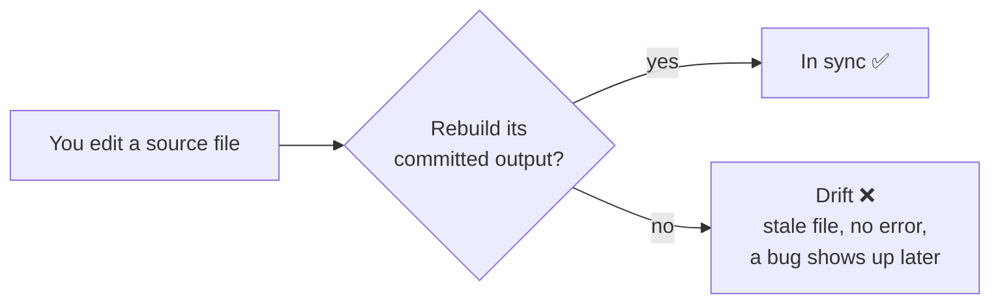
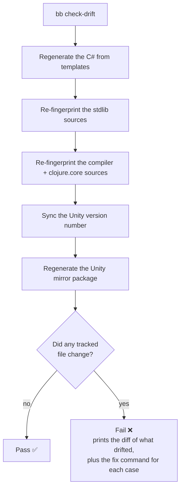

---
tags:
  - clojure
  - dotnet
  - compiler
  - bootstrap
  - devops
  - magic
date: 2026-06-25
repos:
  - [magic, "https://github.com/flybot-sg/magic"]
rss-feeds:
  - all
  - clojure
---
## TLDR

[MAGIC](https://github.com/flybot-sg/magic) is a compiler. It turns Clojure into .NET so Clojure can run in Unity, even on iOS. To do its job, it commits some of its build outputs straight into the repo, including the compiler's own compiled files. Those files can quietly fall out of sync with their source, and a normal build never notices. This post is about the small CI check that catches that, and it pairs with [Making Magic stable](https://www.loicb.dev/blog/making-magic-stable).

## The bug you cannot see coming

Here is a scenario every contributor eventually hits. You edit a source file, forget one rebuild step, and commit. Everything looks fine: the code compiles, the tests pass, the review is green. Then, a week later, something breaks somewhere that has nothing to do with your change, and you lose an afternoon before you trace it back to that one forgotten step.

That is the worst kind of bug, because there is no error and no stack trace to follow, just wrong behavior a long way from its cause. In MAGIC it has one main source: the repo commits generated files.

## Why a compiler commits its own output

A compiler turns source code into something else, and MAGIC turns Clojure source into compiled `.dll` files (a `.dll` is the .NET unit of compiled code). Most projects rebuild those files on every build, so they always match the source. MAGIC cannot do that for all of them, because the compiler is partly built from its own previous output. It **compiles itself**, which means some of its compiled files have to be committed and then reused to build the next version.

A committed file is really a snapshot of its source at one moment in time. Edit the source without rebuilding, and that snapshot quietly becomes a lie. That mismatch has a name: **drift**.



## You cannot catch drift by comparing files

The obvious fix is to rebuild the file and compare it against the committed one: if they differ, someone forgot a step. Unfortunately that does not work, because MAGIC produces a slightly different file every time, even from identical source. It picks random internal names while compiling, and .NET stamps every assembly with a fresh ID, so the bytes never match even when nothing meaningful has changed. Comparing binaries would fail on every commit and tell us nothing useful.

So instead of comparing the binaries, we compare the source they came from.

## The trick: fingerprint the source

For each committed binary, we record a fingerprint of its source. A **fingerprint** is just a SHA hash, a short string that changes whenever the file changes. We keep all of them together in a **manifest** file that is committed to the repo, with one line per source that maps it to the hash it was last built from. The entry for `clojure.core`, for example, looks like this:

```clojure
clojure.core {:source "magic-compiler/src/stdlib/clojure/core.clj"
              :sha256 "33435bc12bcc893ebe91319b5cefa21aa6cfb31254b5269c4cc687feedebb1d2"}
```

When the binary is rebuilt, we recompute that hash and write it back here, so the manifest moves in lockstep with the source. When the source is edited but the binary is not, the hash in the manifest still describes the old version, and that mismatch is the signal we are looking for. Because the manifest is itself a committed file, the mismatch surfaces as an ordinary change in git, which, as we will see next, is exactly what the check inspects.

A few outputs are not compiled binaries at all: some generated C#, a version number, a copied Unity package. Those come out identical every time, so for them we skip the fingerprint and simply regenerate and compare directly.

That leaves two rules, and together they are the whole idea:

- If the output is **deterministic** (the same bytes every time), regenerate it and compare.
- If the output is a **compiled binary**, compare the source fingerprints, never the bytes.

## The call sites it generates ahead of time

One of the things the check regenerates is C#, and it is worth a closer look. When MAGIC compiles a method call, it does not hard-wire the target. It emits a **call site**: a small object that finds the right method the first time, caches it by the argument types it saw, and reuses it on every later call, so the lookup cost is paid only once. A call site has to be written for a fixed number of arguments, and Clojure calls functions with anywhere from none to many. ClojureCLR builds these while the program runs. MAGIC cannot, because Unity's IL2CPP compiles everything to C++ ahead of time, and there is no runtime left in which to generate code.

So MAGIC generates the call sites up front, one set for each call arity up to twenty, as ordinary C# that IL2CPP can compile like anything else. Rather than hand-write twenty near-identical copies of five classes, a few Mustache templates stamp them out, and the result is committed as `.g.cs` files. Edit a template and forget to regenerate, and that committed C# goes stale. This is the easy case from earlier: the output is plain text and identical every run, so the check just regenerates it and compares it byte for byte.

## One version for the whole monorepo

Another regenerated value is a version number, and the reason it needs guarding is a good one. MAGIC is a monorepo: six projects that used to live in six separate repositories, each with its own version, now share **one version**. It is written once, in `version.edn`, and an MSBuild rule feeds it into every C# project automatically, so the whole stack always builds as a matched set. You can depend on MAGIC 0.8.0 and get one coherent version of every piece, instead of juggling six numbers that drift apart on their own.

There is exactly one file that rule cannot reach: the Unity package's `package.json`, which is plain JSON, outside MSBuild. A small task copies the version into it, and the drift check makes sure nobody bumps `version.edn` and forgets to. It is a tiny check guarding a deliberate decision: one version, for everything.

## What CI runs

All of this runs from a single command, `bb check-drift`, on every change in GitHub CI. It regenerates or re-fingerprints everything, then asks git one simple question: did any tracked file change? If the answer is yes, something was not refreshed, and the build fails. It prints the diff of exactly which files changed, followed by the fix command for each kind of drift, so you can match the two and run the right one.



The check covers every generated file in the repo, including the compiler itself and `clojure.core`, the heart of the language. Those are the files where a stale copy would do the most damage, so they are guarded exactly like everything else.

## The fix and its binary travel together

Day to day, the check is the backstop, not the main event. The habit that keeps the repo honest is simpler than the machinery behind it: whenever you change a compiler or stdlib source, you rebuild its committed binary and commit the two as a **pair**. The source change is one commit, and the refreshed `.dll` rides along in a companion commit tagged `chore(bootstrap)` that names the fix it belongs to. Each fix carries its refresh right behind it, so a slice of the log reads in pairs:

```
* 8c9a0d7e - fix(compiler): resolve inherited interface properties via interface walk
* 5da7deff - chore(bootstrap): refresh analyze-host-forms DLL for inherited interface property fix
* 7b639c7b - fix(compiler): resolve proxy-super base type from enclosing proxy
* 8ae40888 - chore(bootstrap): refresh typed-passes DLL for proxy-super shadowed-this fix
```

Anyone reading the history sees each change and its regenerated binary side by side, and the drift check is simply there for the day you forget the second half.

## The payoff

The result is that nobody has to remember the rebuild steps, and nobody can quietly skip them either. If you edit a source and forget to rebuild it, the check fails in CI the moment you push, and shows you what drifted and how to fix it. A whole class of silent, confusing bugs simply stops existing. That is the beauty of it.