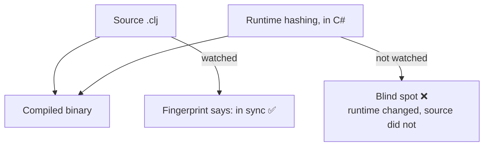
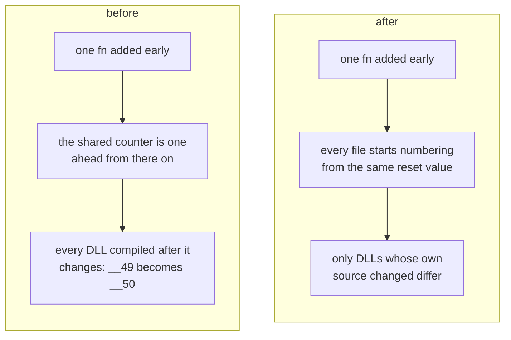
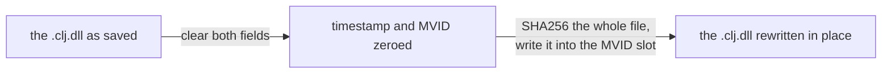
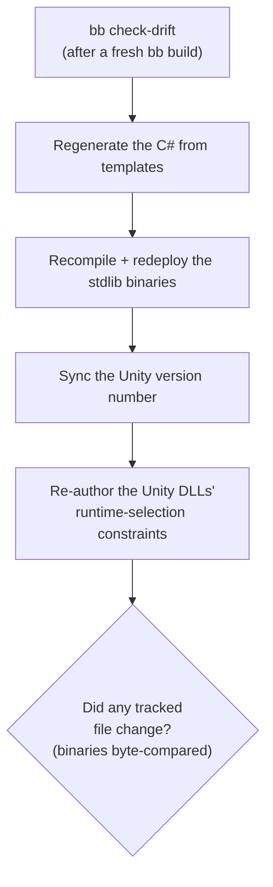

---
tags:
  - clojure
  - dotnet
  - compiler
  - bootstrap
  - devops
  - magic
date: 2026-08-24
repos:
  - [magic, "https://github.com/flybot-sg/magic"]
rss-feeds:
  - all
  - clojure
---
## TLDR

[MAGIC](https://github.com/flybot-sg/magic) is a compiler. It turns Clojure into .NET so Clojure can run in Unity, even on iOS. To do its job, it commits some of its build outputs straight into the repo, including the compiler's own compiled files. Making the compiler deterministic unlocks some interesting features such as doing the drift check via a byte diff directly and being able to see at a glance which DLLs are impacted by a change.

## Why bother making it deterministic
[MAGIC](https://github.com/flybot-sg/magic) is a compiler. It turns Clojure into .NET so Clojure can run in Unity, even on iOS. To do its job, it commits some of its build outputs straight into the repo, including the compiler's own compiled files. You can read more about it here [Making Magic stable](https://www.loicb.dev/blog/making-magic-stable). At first the compilation was not deterministic, so a small change to the compiler would generate different DLLs during bootstrap which made the byte diff impossible. Technically it is fine, but having the compiler deterministic unlocks some interesting features such as doing the drift check via a byte diff directly and being able to see at a glance which DLLs are impacted by a change.
## What led to that decision
I wanted to always have a pair of commits: the source change and the bootstrap containing only the DLLs impacted. But since the compiler was not deterministic and all DLLs had moved, I was handpicking the ones I thought were impacted based on what the source change was. That works fine when it is, say, a Clojure fix in the Clojure compiler, but it is very hard to "guess" when it is a runtime change that could subtly impact a lot of DLLs.

In [bc629a67](https://github.com/flybot-sg/magic/commit/bc629a6702001240352f2fd808736a198ca19290) I changed how the C# runtime hashes strings and maps to match JVM Clojure. The change reached binaries I never considered, 17 stdlib ones affected indirectly through hashes baked into their compiled bytes, and since their `.clj` sources never moved, nothing flagged them. The code compiled, the tests passed, the review was green. Seven weeks later every `clojure.spec.alpha` regex op threw `No matching clause` ([#40](https://github.com/flybot-sg/magic/issues/40)), and the trail led back to that hash change; [b70ac965](https://github.com/flybot-sg/magic/commit/b70ac965de8780dbbbdaf7d15ab2ab5d8c40bc5a) is the patch that refreshed the binaries my selection had missed.

As I was explaining this to my colleague, he mentioned very casually "why not make the compiler deterministic then". And this is how I decided to look into it.
## Why the compiler commits its own output

A compiler turns source code into something else, and MAGIC turns Clojure source into compiled `.dll` files (a `.dll` is the .NET unit of compiled code). Other compilers rebuild those files on every build, so they always match the source. MAGIC cannot do that, because the compiler is built from its own previous output. It **compiles itself**, which means its self-hosted `.clj.dll`s have to be committed and then reused to build the next version (the C# parts rebuild like any project though). It is called **bootstrapping**.

A committed file is a snapshot of its source at one moment in time. Edit the source without rebuilding, and that snapshot quietly becomes a lie, a **drift**. And catching this drift is almost trivial with determinism: just a byte diff.
## Drift check attempt before determinism
Before determinism, comparing the binaries was off the table: every rebuild changed every DLL's bytes, so a diff against the committed ones would fail on every commit and prove nothing. What I had instead were two workarounds, one for picking the DLLs to commit and one for catching a forgotten rebuild. Let's look at these workarounds first.

### Claude Code picked the DLLs to commit

Since every rebuild left every committed DLL modified, choosing which ones carried a real change was a judgment call, and I delegated the judgment to Claude Code: given the source change, reason about which binaries it can reach, commit only those, revert the rest. It was impressively good at this. For the `:extend-via-metadata` port ([2af529c5](https://github.com/flybot-sg/magic/commit/2af529c5)), it refreshed `core_deftype`, `clojure.core.protocols` *and* the C# `Clojure.dll` in [one paired commit](https://github.com/flybot-sg/magic/commit/424e0ceb25a6599816c2e104c66d62b3189a5126), three artifacts for one logical change. Even the stdlib miss from earlier was very likely my fault, not its analysis: I did not suspect that the stdlib DLLs could be affected by the C# change, so my prompt never put them in scope.

But I could not trust the LLM to always be right. There was no tool that could have caught a wrong pick. Plus, it is bad software engineering practice to rely on an LLM for a check that must be deterministic. **An LLM should help us write the deterministic tooling, not be the tooling.** In our example, we should use Claude Code to help us find how to make the compilation deterministic, so drift is caught by a predictable CI pipeline instead of a judgment call.
### A manifest of source fingerprints

The second workaround guarded against forgetting the rebuild entirely. A committed manifest maps each binary to a **fingerprint** of its `.clj` source (a SHA hash, a short string that changes whenever the file changes). Back then it was two files, `stdlib-manifest.edn` and `bootstrap-manifest.edn`; determinism later merged them into one `dll-sources.edn`. The entry for `clojure.core` looked like this:

```clojure
clojure.core {:source "magic-compiler/src/stdlib/clojure/core.clj"
              :sha256 "33435bc12bcc893ebe91319b5cefa21aa6cfb31254b5269c4cc687feedebb1d2"}
```

I had a refresh task that rewrote the manifest, in the same run that rebuilt the DLLs. CI then re-hashed every source and compared against it. It answers only one question: does this source change come with its updated DLL? It is not much, but at least it forces the developer to run the bootstrap and commit its output.

### What neither workaround could prove

Neither workaround ever looked at the committed bytes. The hasheq incident is the proof: a `case` over keywords bakes each key's hash into a jump table inside the DLL, so a C# change to hashing invalidates binaries whose `.clj` sources never moved, and no source hash can see it. The diagram below shows the blind spot:


```mermaid
flowchart TD
    SRC["Source .clj"] --> BIN["Compiled binary"]
    RT["Runtime hashing, in C#"] --> BIN
    SRC -->|watched| FP["Fingerprint says: in sync ✅"]
    RT -->|not watched| GAP["Blind spot ❌<br/>runtime changed, source did not"]
```

The honest fix is a byte diff of the binaries themselves, and that is impossible while the compiler is non-deterministic. So the real work became removing the non-determinism.

## Making the build deterministic

**Deterministic** here means one thing: identical inputs produce identical bytes. Five things stood in the way, each found the same way, by compiling the same namespace twice (and later, on two different machines) and diffing the disassembled output. The full site-by-site inventory is in [docs/deterministic-compilation.md](https://github.com/flybot-sg/magic/blob/main/docs/deterministic-compilation.md); here is what each one was.

### Class member order

Take one small form:

```clojure
(reify
  System.IDisposable (Dispose [_] ...)
  Object             (ToString [_] ...))
```

Compile it twice in a row and diff the disassembly of the generated class:

```diff
 .class private '<magic>user$reify__0'
-  .method public Dispose  ...   ; body at IL offset 0x2050
-  .method public ToString ...   ; body at 0x20c4
+  .method public ToString ...   ; body at 0x2050
+  .method public Dispose  ...   ; body at 0x20c4
```

Both DLLs hold the same two methods, but the order the class members are emitted in decides where each body lands in the file, so one swapped pair shifts every byte after it and the two files diff from that point on.

What happens is that each method in a `reify` implements a method that already exists on an interface or base class, so the compiler pairs every body with the host method it implements, in a map keyed by that method's `MethodInfo` object. 

A `MethodInfo` has no value to hash by, so its hash code is just an arbitrary number the runtime assigns to that object **per process**; same method, new process, new number, so the map iterates in a different order in every process. Maps keyed by `Type` or `Var` objects have the same problem, and this was not one bug but a pattern: five places in the emitter iterated collections that way. Each now sorts its entries by a key built from the content itself. For a method it hashes the full signature string, so every process emits in the same order. The doc linked above lists all five.

### String sort order

The CLR's default string compare does not behave the same across OSes. `String.CompareTo` does not compare character codes: it asks the platform's collation library how the user's language orders these words, Windows' NLS or ICU on macOS and Linux, each machine shipping its own version of the rules. Collation is linguistic (it files `"a"` before `"B"`, where a code-unit compare puts every uppercase letter first), and which rules run, in which version, depends on the machine, so the same sort could emit different bytes on macOS and Linux. Every sort in the emitter now compares ordinally, raw UTF-16 units via `String.CompareOrdinal`, which is arithmetic and therefore the same everywhere.

The CLR does offer the ordinal compare, but only as an explicit opt-in at each call site, and that is the trap: the bare `String.CompareTo` is what `IComparable` binds, so every generic path, a default comparer, a plain sort, Clojure's own `compare`, silently gets the culture-sensitive one. There is not even a parameter to forget, because generic code offers no place to pass it. Most languages put the defaults the other way around, the JVM included: Java's `String.compareTo` is defined as code-unit comparison, and locale-aware sorting is the explicit opt-in. So the emitter carries its own ordinal comparator, and the fix simply mirrors the JVM `compare` behavior.

### Source paths

Every `def` bakes its source's `:file` path into metadata, and it used to be the absolute path, so the bytes depended on where the repo was cloned. It is now the load-relative path, `clojure/zip.clj` instead of `/home/me/.../clojure/zip.clj` for instance, matching JVM Clojure. Old committed DLLs could be dated by this alone: some still carried Ramsey's `/home/nasser/...` paths in their bytes from years ago.

### Generated names

Every anonymous fn compiles to a generated type, and those types are numbered by process-global counters, gensym included. Everything `nos` does before compiling your file consumes them: booting compiles nostrand's own Clojure in memory, resolving dependencies runs more. So any edit to that prelude shifted every number that every later file baked. 

For example, one edit to `nostrand/core.clj` renumbered every committed stdlib DLL, the only difference in each being `__49` becoming `__50`. The counters now reset at each file-writing compile. So an emitted name is a function of the namespace and the toolchain alone; REPL evals keep the process-global counter and its uniqueness guarantee. The diagram below shows both regimes:


```mermaid
%% mermaid lays disconnected subgraphs out perpendicular to the parent
%% direction, so "after" is declared first to render "before" on the left
flowchart TD
    subgraph after["after"]
        direction TB
        a1["one fn added early"] --> a2["every file starts numbering<br/>from the same reset value"]
        a2 --> a3["only DLLs whose own<br/>source changed differ"]
    end
    subgraph before["before"]
        direction TB
        b1["one fn added early"] --> b2["the shared counter is one<br/>ahead from there on"]
        b2 --> b3["every DLL compiled after it<br/>changes: __49 becomes __50"]
    end
```

When I described the reset to Ramsey Nasser, he immediately said it could collide, without looking at the code. He was right: a process-global counter guarantees a gensym name is fresh for the whole process, and resetting per file lets two files mint the same one. Equal names are harmless where they are scoped, and locals and type names both are, but a namespace split across files whose macro `def`s a gensym-named var is not:

```clojure
;; main.clj
(defmacro defslot [reader v]
  (let [g (gensym "slot")]
    `(do (def ~g ~v) (defn ~reader [] ~g))))

(load "part_a")   ;; (defslot read-a :from-a)
(load "part_b")   ;; (defslot read-b :from-b)
```

Each sub-file compiles as its own unit, so both reset to the same value, both mint `slot10001`, and part_b's `def` silently shadows part_a's: `(read-a)` returns `:from-b`. No stdlib or compiler macro writes that pattern, so nothing in the tree hits it, but MAGIC compiles anyone's code, and the trigger is ordinary: a plain `nos build` of a namespace split across `(load ...)` files is enough, no special driver. The possible fix would be to seed the counter per file, or to fail the build when a gensym-shaped var is redefined across files of one namespace. It's a niche case but I will address it.

### Assembly ID and timestamp

Two values in the emitted file say nothing about the code: 
- the build timestamp
- MVID, a GUID identifying the module that gets randomized on every run. 

`Reflection.Emit` offers no option to control either, where the C# compiler has `-deterministic`, so the only way is to patch the bytes ourselves once the assembly is saved. The timestamp is easy, a fixed offset in the [PE header](https://learn.microsoft.com/en-us/windows/win32/debug/pe-format), the container format .NET assemblies use. The MVID is not in that header at all: it sits in the metadata `#GUID` heap, so reaching it means walking the section table and the stream headers by hand.

Then the trick, in the arrows below: a file cannot contain the hash of itself, so both fields are cleared first, and the hash of that cleared file becomes the MVID.


```mermaid
flowchart LR
    A["the .clj.dll as saved"]
    B["timestamp and MVID zeroed"]
    C["the .clj.dll rewritten in place"]
    A -->|"clear both fields"| B
    B -->|"SHA256 the whole file,<br/>write it into the MVID slot"| C
```

Together, the bytes are a function of the source and the toolchain, nothing else. A Linux container running mono 6.12 rebuilds the 73 committed compiler and stdlib binaries byte-for-byte from a tree committed on macOS with mono 6.14.

The first real audit of the now-comparable bytes also settled how much the old checks had missed: it found seven committed DLLs that no build flow ever rebuilt, the oldest untouched since 2020, one of them from a source file that could no longer compile at all ([#45](https://github.com/flybot-sg/magic/issues/45)). Five years of green checks, and no judgment, no review, and no hash had any way to see it. The byte-diff did, on its first run.

With that, the special case for compiled binaries disappears: the check rebuilds everything and byte-compares the lot, binaries included.

## What the check does today

All of it runs from a single command, `bb check-drift`, on every change in GitHub CI, right after a fresh build. It regenerates the C# call sites MAGIC pre-generates for IL2CPP (committed `.g.cs` files, plain text, so these were always byte-comparable), recompiles and redeploys the stdlib binaries, syncs the Unity version, re-authors the Unity package's runtime-selection constraints, then asks git one simple question: did any tracked file change?

Because the build is deterministic, that question now covers the committed binaries too, byte for byte (the two runtime DLLs that embed a git-derived version stamp are restored from the commit instead, since their bytes change with every commit by design).

If the answer is yes, something was not refreshed, and the build fails, listing exactly what drifted.


```mermaid
flowchart TD
    Start["bb check-drift<br/>(after a fresh bb build)"] --> S1["Regenerate the C# from templates"]
    S1 --> S2["Recompile + redeploy the stdlib binaries"]
    S2 --> S3["Sync the Unity version number"]
    S3 --> S4["Re-author the Unity DLLs'<br/>runtime-selection constraints"]
    S4 --> Q{"Did any tracked<br/>file change?<br/>(binaries byte-compared)"}
```


## The fix and its binary travel together

The convention I used from the start is that for changes in the monorepo requiring new DLLs, I push a pair of commits: one for the source change and one for the bootstrap.

```
* 8c9a0d7e - fix(compiler): resolve inherited interface properties via interface walk
* 5da7deff - chore(bootstrap): refresh analyze-host-forms DLL for inherited interface property fix
* 7b639c7b - fix(compiler): resolve proxy-super base type from enclosing proxy
* 8ae40888 - chore(bootstrap): refresh typed-passes DLL for proxy-super shadowed-this fix
```

It is just a convention, both could go in the same commit really, but some commits do not affect the DLLs at all (updating the docs, a bb task, and so on) so I find it clearer to have two separate commits when a dll moves. Sometimes a third one follows, adding the smoke test that guarantees the fix under IL2CPP.
## The payoff

The result is that we can see exactly which DLLs a source change affects, whether it came from the Clojure compiler or the C# runtime.

On top of that, a byte diff is enough as a drift check in CI to catch any missing bootstrap.

And we get usable versioning on the DLLs themselves. Since only the DLLs a change really touched ever move, `git log` on one of them lists the commits that actually changed it. So when a DLL misbehaves, the last commit that touched it, and the source commit paired with it, is the change that caused it.