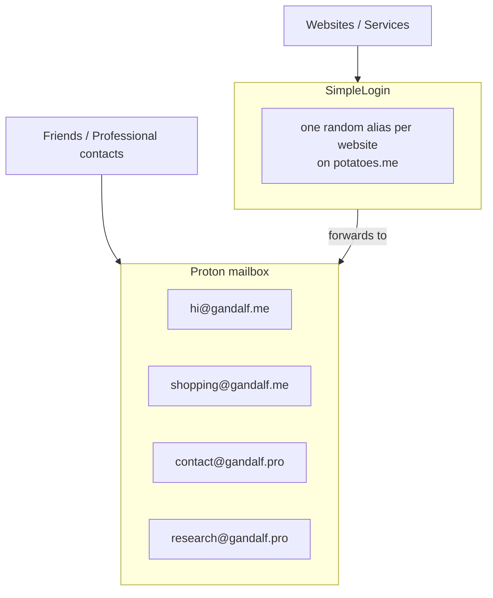
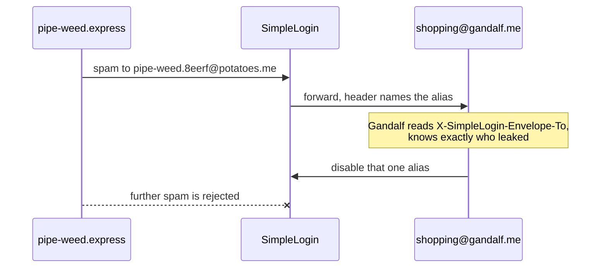
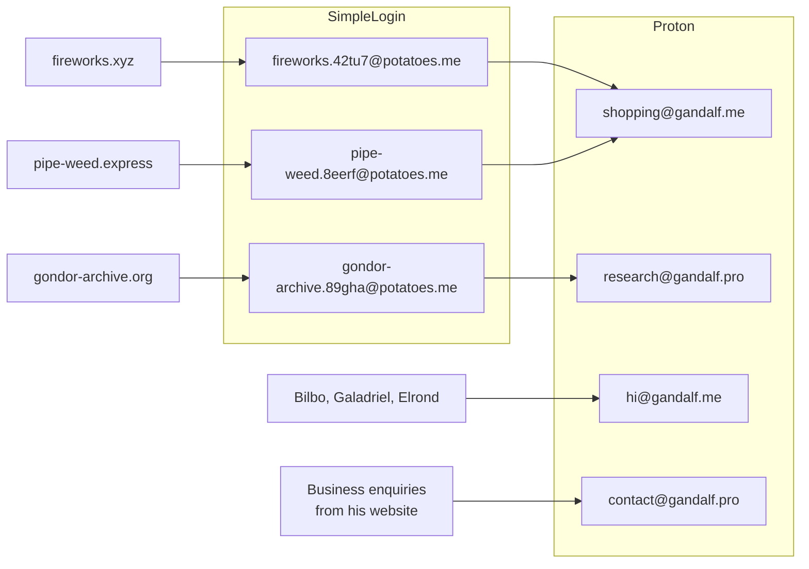

---
tags:
  - security
  - privacy
  - dns
  - email
date: 2025-06-23
rss-feeds:
  - all
---
## TLDR

A three-layer email setup (custom domains, an alias service, an encrypted mailbox) that makes spam traceable to the service that leaked your address, containable by disabling a single alias, and portable across providers with a DNS update.

## The problem with one address for everything

Most people use one or two email addresses for everything: shopping, banking, social media, friends. That works fine until the address leaks, and it will. Once one website sells or loses your address, spam floods the inbox that also holds your bank statements and your family conversations, and you have no way to tell which service is responsible. Worse, you cannot kill the leaked address without losing access to everything else tied to it.

The address itself is the problem: it is a single identifier shared with hundreds of parties that do not deserve the same level of trust. The fix is to stop handing out one address and instead separate email into three layers, each solving one problem.

## Disclaimer

This setup requires the Proton Unlimited plan (or equivalent). The free tier does not support custom domains, limits you to one Proton address, and does not include SimpleLogin Premium, which you need for a custom alias domain and for initiating new emails from an alias (replying from an alias works on the free tier). This article is not sponsored; these are tools I use and pay for.

## Three layers

The three layers are custom domains for portability, an alias service for spam isolation, and an encrypted mailbox for privacy. Custom domains appear at every layer: meaningful domains (`gandalf.me`, `gandalf.pro`) for the Proton mailbox, and a separate, intentionally random one (`potatoes.me`) for SimpleLogin aliases. The diagram below shows how mail flows through them.



Websites only ever see aliases. People you trust get a Proton address directly. Nothing ever exposes the mailbox to a service that could leak it.

### Layer 1: Custom domains (portability)

Custom domains (`gandalf.me`, `gandalf.pro`, `potatoes.me`) mean your addresses belong to you, not to Gmail, Proton, or SimpleLogin. If you ever switch providers, you update DNS records and every address keeps working. No need to notify contacts or update hundreds of logins. Renting your identity from your email provider is the real lock-in, and a ten-dollar domain removes it.

I use multiple domains on Proton to separate contexts: `.me` for personal, `.pro` for professional. The SimpleLogin domain is a separate, random-looking one, since websites do not care how your email domain looks.

Other benefits:

- Clean addresses like `hi@gandalf.me` or `contact@gandalf.pro` instead of `gandalf.contact.2024@gmail.com`
- You own the namespace, so no address is ever "already taken"
- The same domain can serve your portfolio/business website (looks way more professional than a gmail/yahoo email etc)

### Layer 2: Alias service (spam isolation)

An **alias** is a disposable address that forwards to your real mailbox. An alias service like [SimpleLogin](https://simplelogin.io) sits between websites and Proton: you create one alias per website and never give your actual address to any service.

Using a custom domain on SimpleLogin (`potatoes.me` instead of `@simplelogin.co`) matters more than it looks: some websites reject known alias domains, which sit on shared disposable-email blocklists. A custom domain sidesteps this entirely, because the website has no way to tell the address is an alias.

Each alias also gets a random suffix. If Gandalf registers on `fireworks.xyz`, his alias is `fireworks.42tu7@potatoes.me`. Without the suffix, anyone who learns one alias (`fireworks@potatoes.me`) can guess the others (`instagram@potatoes.me`, `facebook@potatoes.me`).

The payoff comes when spam arrives. Every forwarded email carries an `X-SimpleLogin-Envelope-To` header naming the alias it came through, so a leak identifies itself. The sequence below shows Gandalf tracing junk mail back to the shop that leaked his address.



One leak, one disabled alias, zero collateral damage. Every other login keeps working.

Aliases also help when you switch mailbox providers: you change the forwarding address once in SimpleLogin instead of updating every website login individually.

### Layer 3: Encrypted mailbox (privacy)

[Proton](https://proton.me) is the actual mailbox, never exposed to websites. The Unlimited plan supports 3 custom domains and 15 addresses, which is plenty for clean, context-specific addresses:

- `hi@gandalf.me` for friends (Gandalf trusts Galadriel not to leak it)
- `shopping@gandalf.me` as the forwarding target for shopping aliases
- `contact@gandalf.pro` for professional contacts and freelance inquiries
- `research@gandalf.pro` for academic correspondence

These addresses are private-facing. Only people you trust, and SimpleLogin, know they exist.

I use Proton specifically because I would rather pay for an encrypted mailbox than pay Google with my data. Proton also [acquired SimpleLogin in 2022](https://proton.me/blog/proton-and-simplelogin-join-forces), so the Unlimited plan bundles SimpleLogin Premium along with the paid tiers of VPN, Drive, Calendar, and Pass, which makes the cost easier to justify.

### Organizing your Proton inbox

With multiple domains and addresses, sorting matters. I mirror the domain and address hierarchy in Proton's folders:

```
├── me/                     # gandalf.me domain
│   ├── hi/                 # hi@gandalf.me
│   └── shopping/           # shopping@gandalf.me
└── pro/                    # gandalf.pro domain
    ├── contact/            # contact@gandalf.pro
    └── research/           # research@gandalf.pro
```

A [Sieve filter](https://proton.me/support/sieve-advanced-custom-filters) (Proton's server-side filtering language) routes each email automatically. The `X-Original-To` header holds the Proton address the email was delivered to, including for SimpleLogin-forwarded mail, so it is the right key to sort on:

```sieve
require ["fileinto", "imap4flags"];

if header :matches "X-Original-To" "hi@gandalf.me" {
  fileinto "me/hi";
} elsif header :matches "X-Original-To" "shopping@gandalf.me" {
  fileinto "me/shopping";
} elsif header :matches "X-Original-To" "contact@gandalf.pro" {
  fileinto "pro/contact";
} elsif header :matches "X-Original-To" "research@gandalf.pro" {
  fileinto "pro/research";
}
```

This keeps everything categorized without manual drag-and-drop.

## When to skip the alias

Not everything should go through SimpleLogin. Give a Proton address directly to:

- **Friends and family**: `hi@gandalf.me` is more personal than `friends.234rt@potatoes.me`
- **Professional contacts**: `contact@gandalf.pro` looks credible on a business card
- **Government services**: some institutions are picky about unusual domains

The rule of thumb: if you need to email someone first (not just receive), or if the relationship is high-trust, use the Proton address directly.

## Full example

The diagram below puts the whole setup together for Gandalf: three websites with their own aliases, friends writing to him directly, and business enquiries landing on the professional address he publishes on his website.



No website ever sees his real mailbox, every alias is individually disposable, and every address sits on a domain he owns.

## Conclusion

This setup has three properties I care about:

- **Leak isolation**: one alias per website means spam is traceable and containable
- **Provider independence**: custom domains on both Proton and SimpleLogin mean I can switch either service with a DNS update
- **Clean separation**: private addresses for people I trust, disposable aliases for everything else

It costs a few domain registrations plus Proton Unlimited, and in exchange a leaked address goes from a permanent inbox disaster to a thirty-second fix.