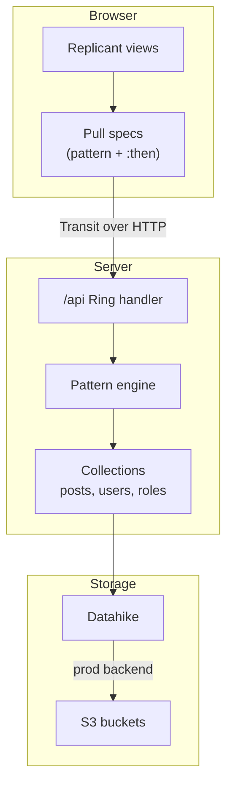

---
tags:
  - clojure
  - clojurescript
  - architecture
  - web
  - lasagna-pattern
date: 2026-02-17
repos:
  - [lasagna-pattern, "https://github.com/flybot-sg/lasagna-pattern"]
rss-feeds:
  - all
---
## TLDR

[flybot.sg](https://www.flybot.sg/) is a full-stack Clojure web app built to demonstrate the lasagna stack: a pull-based pattern language where the same declarative patterns handle reads, writes, authorization, and client-server transport. This article is the project overview, with links to the detailed articles on each part of the stack.

## Context

Most web applications scatter their data access logic across the stack. The shape of what a client can read lives in the route handlers, the mutations live in a service layer, and the authorization rules live in middleware, each in a different form. Answering "what can this user actually do with this API?" means reading all three.

The [lasagna-pattern](https://github.com/flybot-sg/lasagna-pattern) toolbox, designed by [Robert Luo](https://github.com/robertluo), takes a different approach: **one pattern language** for the whole stack. Patterns are plain EDN data, not strings and not macros, and the same pattern expresses both the shape of the data you want and the mutations you need. Robert designed and implemented the three core components (`pattern`, `collection`, `remote`), evolving them from an earlier pull-pattern library he had been refining for years (I covered that evolution in [From Functions to Data - Evolving a Pull-Pattern API](https://www.loicb.dev/blog/from-functions-to-data-evolving-a-pull-pattern-api)). I focused on the example applications and on improving the core components as the examples put them to the test.

[flybot.sg](https://www.flybot.sg/) is the proof that this approach works in production. It is an open-source company blog where employees write and manage posts in Markdown, with role-based access control, Google OAuth, post history, and image uploads. The entire application (backend, frontend, and shared code) lives in the monorepo as an example component, next to the [pull-playground](https://pattern.flybot.sg).

## Architecture

The backend is a Ring app served by http-kit, with the whole pull API behind a single `/api` endpoint. The frontend is a ClojureScript SPA compiled by shadow-cljs and rendered with Replicant. The two speak Transit-encoded pull patterns over HTTP. The diagram below shows the path a pattern takes from a view to the database:

There is no REST routing and no per-resource endpoint: the client sends a pattern, the server runs it against role-filtered collections, and the same mechanism covers queries and mutations. On the storage side, Datahike runs embedded in the app process, backed by S3 in production, and images upload to a second S3 bucket.

The whole application fits in a handful of namespaces split between `server/` and `ui/`, most of them `.cljc` so code like schemas and markdown parsing is shared between the JVM and the browser.

## Stack

| Layer | Library | Why |
|-------|---------|-----|
| Pattern matching | [lasagna-pattern](https://github.com/flybot-sg/lasagna-pattern) | The core value prop: declarative patterns for reads and writes |
| Dependency injection | [fun-map](https://github.com/robertluo/fun-map) | Associative DI with lazy initialization and lifecycle management |
| Database | [Datahike](https://github.com/replikativ/datahike) | Datalog with history tracking, runs embedded (no separate process), S3-backed in prod |
| Frontend rendering | [Replicant](https://github.com/cjohansen/replicant) | Lightweight hiccup rendering with `defalias`, no framework overhead |
| Frontend build | [shadow-cljs](https://github.com/thheller/shadow-cljs) | npm interop (`marked`, `@toast-ui/editor`, `highlight.js`), hot reload, hashed release builds |
| HTTP server | [http-kit](https://github.com/http-kit/http-kit) | Simple, performant Ring-compatible server |
| Auth | [oie](https://github.com/flybot-sg/oie) | Flybot OSS auth library on top of ring-oauth2: decodes the Google id-token (JWT), manages session identity and role-based authorization |
| Validation | [Malli](https://github.com/metosin/malli) | Data-driven schema validation, shared between client and server |
| Logging | [mulog](https://github.com/BrunoBonacci/mulog) | Structured event logging with pluggable publishers |
| Container build | [jibbit](https://github.com/atomisthq/jibbit) | Builds OCI images directly from deps.edn, no Dockerfile ([our fork](https://github.com/skydread1/jibbit) adds a configurable entry-point for `JAVA_OPTS`) |

## What was replaced and why

flybot.sg existed before the lasagna rewrite, so several choices are deliberate replacements of the previous stack:

| Layer | Before | Now | Reason for change |
|-------|--------|-----|-------------------|
| Database | Datalevin | Datahike | Datahike supports history tracking (`keep-history? true`) out of the box, which the post versioning feature needs, and it has an S3 storage backend for production. Datalevin has neither. |
| Frontend framework | Re-frame + Reagent | Replicant + dispatch-of | Re-frame's subscription/event system is overkill for an app this size. Replicant's `defalias` with plain hiccup is simpler, and a small `dispatch-of` effect pattern gives the same unidirectional flow with less ceremony. |
| Frontend build | Figwheel-main | shadow-cljs | Better npm interop for the Markdown editor and renderer, and shadow-cljs handles hashed release builds natively. |
| HTTP server | Aleph | http-kit | Aleph's Netty-based async was unnecessary. http-kit is simpler and sufficient. |
| Repo structure | Standalone repo | Monorepo component | The app now lives in [lasagna-pattern/examples/flybot-site](https://github.com/flybot-sg/lasagna-pattern/tree/main/examples/flybot-site), using local deps to the `pattern`, `collection`, and `remote` components. |

## Deep dives

Each part of the stack has its own article:

- [Building a Pure Data API with Lasagna Pattern](https://www.loicb.dev/blog/building-a-pure-data-api-with-lasagna-pattern): how the backend uses collections, patterns, and role-based authorization to build a single-endpoint pull API
- [Managing Web App Modes with Fun-Map in Clojure](https://www.loicb.dev/blog/managing-web-app-modes-with-fun-map-in-clojure): how fun-map's `life-cycle-map` wires the system together, with `assoc`-based overrides for the `dev`, `dev-with-oauth2`, and `prod` modes
- [Building a ClojureScript SPA with Replicant and dispatch-of](https://www.loicb.dev/blog/building-a-clojurescript-spa-with-replicant-and-dispatch-of): the frontend architecture using effects-as-maps, a watcher pattern, and pure state functions
- [Clojure Monorepo with Babashka](https://www.loicb.dev/blog/clojure-monorepo-with-babashka): how the monorepo is managed with auto-discovered components and two-layer task delegation
- [Deploying a Clojure App to AWS with App Runner](https://www.loicb.dev/blog/deploying-a-clojure-app-to-aws-with-app-runner): the migration from EC2+ALB+NLB to App Runner with S3-backed storage
- [Pull Playground - Interactive Pattern Learning](https://www.loicb.dev/blog/pull-playground-interactive-pattern-learning): the companion app at [pattern.flybot.sg](https://pattern.flybot.sg) for learning pull patterns interactively

The full source is in [lasagna-pattern/examples/flybot-site](https://github.com/flybot-sg/lasagna-pattern/tree/main/examples/flybot-site). Everything these articles describe runs today at [flybot.sg](https://www.flybot.sg/), on a single App Runner container that costs about 15 USD a month.