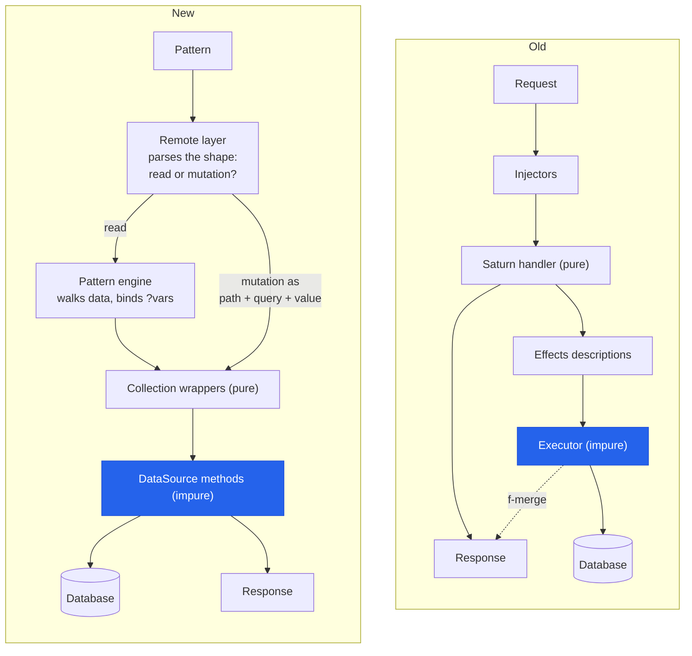

---
tags:
  - clojure
  - architecture
  - web
  - lasagna-pattern
date: 2026-03-25
repos:
  - [lasagna-pattern, "https://github.com/flybot-sg/lasagna-pattern"]
rss-feeds:
  - all
  - clojure
---
## TLDR

How a pull-pattern API evolved from function-calling patterns to structural data matching, and what the shift from verbs to nouns taught us about API design in Clojure.

## Context

We built our pull-pattern API on [lasagna-pull](https://github.com/flybot-sg/lasagna-pull), a library designed by [Robert Luo](https://github.com/robertluo) that lets clients send EDN patterns to describe what data they want. The core pattern-matching engine is solid. But as we added more resources, roles, and mutation types, we wanted a different model for how patterns interact with data sources and side effects. This article is about the design decisions behind [lasagna-pattern](https://github.com/flybot-sg/lasagna-pattern), the successor stack that replaces the function-calling handler layer while building on the same pull-pattern ideas.

This is the "why we changed" article. For what the new architecture looks like in production, see [Building a Pure Data API with Lasagna Pattern](https://www.loicb.dev/blog/building-a-pure-data-api-with-lasagna-pattern), and for the site built on it, see [Flybot.sg - A Full-Stack Clojure Web App](https://www.loicb.dev/blog/flybot-sg-a-full-stack-clojure-web-app).

## The old model: patterns call functions

In lasagna-pull, the core mechanism was `:with`. Patterns contained function calls: `(list :key :with [args])` told the engine to look up `:key` in a data map, call the function stored there, and pass it `args`. Functions returned `{:response ... :effects ...}`. Listing all dashboards, for instance, took two nested calls, one for the role check and one for the listing function:

```clojure
{:dashboards
 {(list :role/user :with [])
  {(list :self :with []) [{:title '? :id '?}]}}}
```

On the server, the data map was a nested structure of functions, with an action keyword dispatching CRUD inside each one:

```clojure
(defn pullable-data [session]
  {:dashboards
   {:role/user (with-role session :user
     (fn []
       {:dashboard (fn [data action]
                     (case action
                       :read   {:response (get-dash (:id data))}
                       :save   {:response data
                                :effects  {:rama {...}}}
                       :delete {:response true
                                :effects  {:rama {...}}}))}))}})
```

Authorization was a function wrapper: `with-role` took a session, a role keyword, and a thunk (a zero-argument function that delays a computation until called) returning the data map. If the role was missing, the thunk never ran.

### The saturn handler: pure by design

This architecture had a name: the **saturn handler** pattern, also designed by Robert. The Ring handler contained no business logic at all. It was a thin impure orchestrator that ran the request through three stages: inject the dependencies, call the pure core, execute the returned effects, and assemble the Ring response:

```clojure
(defn mk-ring-handler
  [injectors saturn-handler executors]
  (fn [req]
    (let [sat-req (merge req ((first injectors)))  ; inject db snapshot
          {:keys [response effects-desc session]}
          (saturn-handler sat-req)                 ; pure core
          resp    (if (seq effects-desc)
                    ((first executors) response effects-desc) ; run db transactions
                    response)]
      {:body resp :session session})))             ; ring response
```

The saturn handler in the middle was purely functional: it ran the pull pattern against `pullable-data`, validated the result with Malli, and returned the `:response` for the client, the `:effects-desc` (the side effects to perform, described as pure data), and the `:session` update. The `context-of` mechanism coordinated the accumulation during pattern resolution: a modifier extracted `:response`, `:effects`, and `:session` from each operation result, and a finalizer attached the accumulations to the final result.

```clojure
;; Saturn handler: purely functional, no side effects
(defn saturn-handler [{:keys [db session] :as req}]
  (let [pattern (extract-pattern req)
        data    (pullable-data db session)
        result  (pull/with-data-schema schema (mk-query pattern data))]
    {:response     ('&? result)
     :effects-desc (:context/effects result)
     :session      (merge session (:context/sessions result))}))
```

This purity was the genuine innovation, and it paid off twice. Testing was bliss: feed a request map in, assert on the data that comes out, no mocks, no test database. And validation was safe by construction: a Malli failure threw before anything executed, so a bad pattern could never leave a half-applied mutation behind.

## What pushed us to redesign

The saturn handler separation was elegant, but as the system grew, specific limitations emerged.

**Response before effects.** The saturn handler computed `:response` before the executor ran `:effects`. This worked when the response data was already known (e.g., returning the input entity on create). But when you needed something produced by the side effect itself (a DB-generated ID, a timestamp set by the storage layer, a merged entity after a partial update), you were stuck. The `f-merge` escape hatch existed: a closing function in the effects description that could amend the response after execution. But using `f-merge` essentially reintroduced in-place mutation, defeating the purpose of the pure/impure split.

**Verb-oriented patterns.** Every pattern was a set of function calls. Reading all items called a function. Reading one item called a different function with a `:read` action. Creating called the same function with a `:save` action. The `case` dispatch inside each `:with` function grew as operations multiplied. The pattern language was supposed to describe data, but it was describing procedure calls.

**Authorization at two granularities.** `with-role` gated access to the entire data map (coarse). But ownership enforcement (can this user edit this specific item?) had to live inside the `:with` function's `case` dispatch (fine). These were two different authorization mechanisms in two different places, with no intermediate layer for "can mutate, but only own entities."

**Indirection through context-of.** The accumulation machinery did its job, but it was a layer you had to understand to trace a request end-to-end. Debugging meant following maps of `:response`, `:effects`, `:session`, and `:error` keys through the modifier and finalizer stages.

The redesign was not about fixing a broken system. It was about recognizing that once collections replaced functions as the API's building blocks, the pure/impure split could happen at a different boundary, and the accumulation machinery was no longer needed.

## The new model: patterns match data

The rewrite inverted the relationship. Instead of patterns calling functions, patterns match against data structures. Collections implement `ILookup` (Clojure's `get` protocol) for reads and a `Mutable` protocol for writes. The pattern engine does not know about functions. It just walks a data structure. Listing all dashboards becomes:

```clojure
'{:user {:dashboards ?all}}
```

`:user` is a top-level key in the API map. If the session has the user role, it resolves to a map containing `:dashboards`. If not, it resolves to `nil`. `?all` is a variable that binds to the collection's contents.

There is no `:with`, no action keywords, no `case` dispatch. The pattern syntax itself encodes the operation:

| Pattern shape | Operation |
|---------------|-----------|
| `?var` as value | read (list or fetch) |
| `{:id $id}` as key | parameterized lookup, `$id` substituted from request params |
| `nil` key, map value | create |
| key, `nil` value | delete |
| key, map value | update |

This table is the heart of the redesign: reads and writes share one shape. The client never announces an operation, there is no verb, no dedicated endpoint, no action keyword. It sends a pattern, and the `remote` layer decides what to do with it by looking at its shape: a pattern containing a mutation entry is routed to the collection's `mutate!`, anything else is handed to the pattern engine as a read. One language, one endpoint, and the shape alone decides.

On the server, the data map is a structure of collections, not functions:

```clojure
(defn make-api [{:keys [storage cache]}]
  (let [dashboards (coll/collection (->DashboardSource storage cache)
                                    {:id-key :id
                                     :indexes #{#{:id}}})]
    ;; users-collection and roles-collection are built the same way
    (fn [ring-request]
      (let [session (:session ring-request)]
        {:data   {:user  (with-role session :user
                           {:dashboards dashboards})
                  :owner (with-role session :owner
                           {:users users-collection
                            :roles roles-collection})}
         :schema {:user  {:dashboards [:vector Dashboard]}
                  :owner {:users [:vector User]}}
         :errors {:detect :error
                  :codes  {:forbidden 403 :not-found 404}}}))))
```

The full three-layer architecture (pattern, collection, remote) is the subject of [Building a Pure Data API with Lasagna Pattern](https://www.loicb.dev/blog/building-a-pure-data-api-with-lasagna-pattern); here I only need enough of it to show the contrast.

## The same operations, side by side

Now that both models are on the table, the remaining CRUD operations are clearest old and new next to each other.

### Read by ID with parameters

```clojure
;; OLD: function call with arguments
{:dashboards
 {(list :role/user :with [])
  {(list :dashboard :with [{:id 123} :read])
   {:title '? :content '?}}}}

;; NEW: indexed lookup with $params
{:pattern '{:user {:dashboards {{:id $id} ?dash}}}
 :params  {:id 123}}
```

`:with [{:id 123} :read]` called a function and passed it two arguments. `{:id $id}` is text substitution: `$id` becomes `123` before the pattern is even compiled, then `{:id 123}` is used as a lookup key on the collection, which delegates to the DataSource's `fetch` method. The engine never sees `$id`; by the time it runs, the pattern is static data with no function call in it at all.

### Create

```clojure
;; OLD: function call with :save action
{:dashboards
 {(list :role/user :with [])
  {(list :dashboard :with [{:title "New" :content "..."} :save])
   {:id '? :title '?}}}}

;; NEW: nil key = create
{:user {:dashboards {nil {:title "New" :content "..."}}}}
```

The old model used the same function for reads and writes, distinguished by an action keyword. The new model uses a structural convention: the remote layer recognizes the `nil` key as a create and calls `mutate!` on the collection. The response is the full created entity.

### Delete

```clojure
;; OLD: function call with :delete action
{:dashboards
 {(list :role/user :with [])
  {(list :dashboard :with [{:id 123} :delete])
   {:id '?}}}}

;; NEW: query key + nil value = delete
{:user {:dashboards {{:id 123} nil}}}
```

### Complex reads: the query map is the key

The lookup key in "Read by ID" was never limited to IDs. `{:id 123}` is just a query map, and the DataSource's `fetch` method receives whatever map was used as the key. That means a complex read stays structural too. Take an analytics resource whose queries carry a data source, a column selection, and a time range. The query object is identical in both models; what changes is where it sits in the pattern:

```clojure
(def analytics-query
  {:data-source [:module-1 :stats]
   :select      :col-name
   :time-range  {:from "2026-01-01" :to "2026-02-01"}})

;; OLD: the query is an argument in a function call
{:analytics
 {(list :raw :with [analytics-query]) '?}}

;; NEW: the query IS the lookup key, injected via $params
{:pattern '{:user {:analytics {$query ?result}}}
 :params  {:query analytics-query}}
```

Here `$query` stands in for the whole key. After substitution, the pattern reads "look this query map up in the analytics collection and bind the result to `?result`", exactly like the ID lookup, just with a bigger key. The DataSource's `fetch` receives the full map and decides how to run it. In the old model, a read this complex needed a dedicated function taking the query as an argument. In the new model it needs nothing special at all, which is the real payoff of making reads structural.

## What we gained

The whole redesign fits in one table:

| Old (lasagna-pull) | New (lasagna-pattern) |
|--------------------|-----------------------|
| `:with` function calls inside patterns | `$params` substitution before compilation |
| Action keywords + `case` dispatch | Structural conventions (`?var`, `nil` key, `nil` value) |
| `with-role` wrapping a thunk | `with-role` returning data or an error map |
| Effects descriptions + executor | Side effects inside `DataSource` methods |
| `context-of` modifier/finalizer accumulation | Deleted, nothing left to accumulate |

The first two rows are exactly what the side-by-side examples showed. The subsections below cover the remaining three.

### Authorization is structural, not functional

Old: `(with-role session :user (fn [] ...))` wrapped a thunk. Authorization was a function that gated access to other functions.
New: `with-role` returns the data itself when the session has the role, or an error map in its place when it does not:

```clojure
(defn- with-role [session role data]
  (if (contains? (:roles session) role)
    data
    {:error {:type :forbidden}}))
```

In other words, authorization stops being code that runs and becomes data that is or is not there. The API map built for your session simply does not contain the branches you cannot access; it contains `{:error {:type :forbidden}}` where they would be. Before matching anything, the server checks the map, skips the parts of the pattern that point at an error, and answers 403 for those. Nothing is called, because there is nothing to call.

The finer-grained rule from the old model ("you can edit dashboards, but only your own") works the same way: `wrap-mutable` wraps the collection itself with an ownership check in front of every write, leaving reads untouched. Both levels of authorization are now the same idea, shaping the data a session can see, where the old model needed two unrelated mechanisms. The full authorization model and how the wrappers compose is covered in [Building a Pure Data API with Lasagna Pattern](https://www.loicb.dev/blog/building-a-pure-data-api-with-lasagna-pattern).

### The purity boundary moved

The old model kept the entire request pipeline pure by deferring effects; the new model pushes side effects into DataSource methods and keeps the layers around them pure. The diagram below shows both pipelines, with the impure stage highlighted in blue. Both branches of the new pipeline consume the pattern: a read is handed to the pattern engine, which walks the data and binds the `?vars`; a mutation is already fully described by its shape, so the remote layer extracts the collection path, the query, and the value from it and calls `mutate!` directly, because there is nothing left to match.



In the old pipeline, the response branches off *before* the executor touches the database, which is exactly why DB-generated IDs needed the `f-merge` escape hatch: the dashed arrow, where the executor reaches back to amend an already-computed response. In the new pipeline, `create!` performs the write and returns the entity, so the response comes out *after* the database:

```clojure
(defrecord DashboardSource [storage cache]
  coll/DataSource
  (create! [_ data]
    (storage-append! storage [data :save])
    (assoc data :id (generate-id) :created-at (now)))
  (delete! [_ query]
    (storage-append! storage [query :delete])
    true))
```

With effects executed in place, there is nothing to accumulate, so `context-of`, the modifier, and the finalizer disappear entirely. Sessions move to Ring middleware, and the pattern result is the final response with no post-processing.

The tradeoff: the saturn handler's strict pure/impure boundary is gone, and with it the feed-a-map-in, assert-on-data-out testing story. But look at what it bought. The pattern language is now uniform: one structural mechanism covers reads and mutations alike, and a lookup key is just a query map, matching entities on whatever keys it carries, from a bare `{:id 123}` to a full analytics query. No operation needs a function in the pattern anymore. And the loss is smaller than it looks: DataSource implementations are small, focused, and testable in isolation, the collection wrappers stay pure transformations, and if you need the old effects-description behavior for testing, you can wrap a DataSource to capture effects without executing them. The default path is direct execution, which is simpler to trace.

### Errors as data

Collections return errors as plain maps like `{:error {:type :forbidden}}`, and the `remote` layer maps error types to HTTP status codes through the `:errors` config shown in `make-api` above. Collections stay pure (they return data describing what happened) while the transport layer decides how to represent it, and reads support partial success: forbidden branches come back as errors alongside the successful bindings. The details, including the full error taxonomy, are in [Building a Pure Data API with Lasagna Pattern](https://www.loicb.dev/blog/building-a-pure-data-api-with-lasagna-pattern).

## Conclusion

The old saturn handler architecture was a genuinely clean design: a purely functional handler, effects as data descriptions, executors as the only impure component, isolated at the edge. It achieved testability and separation of concerns that many web frameworks do not even attempt.

The redesign was not about fixing something broken. It was about moving the purity boundary. The saturn handler kept the entire request pipeline pure by deferring effects. The new model keeps collections and their wrappers pure by pushing side effects into DataSource methods. The accumulation machinery disappears because there is nothing to accumulate, and the response-before-effects limitation disappears because `create!` returns the entity directly.

The deeper lesson is about API identity. When your API is a set of handler functions, cross-cutting concerns (authorization, transport, error handling) become imperative code woven through those handlers. When your API is a data structure, those same concerns become structural: the shape of the map enforces authorization, the protocols enforce CRUD semantics, and the transport layer works generically over any `ILookup`-compatible structure. And because reads and writes share one shape, the client never has to say which one it wants; the pattern already says it.

Verbs become nouns, and the nouns compose.