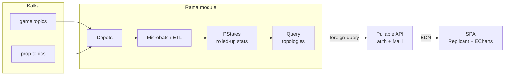
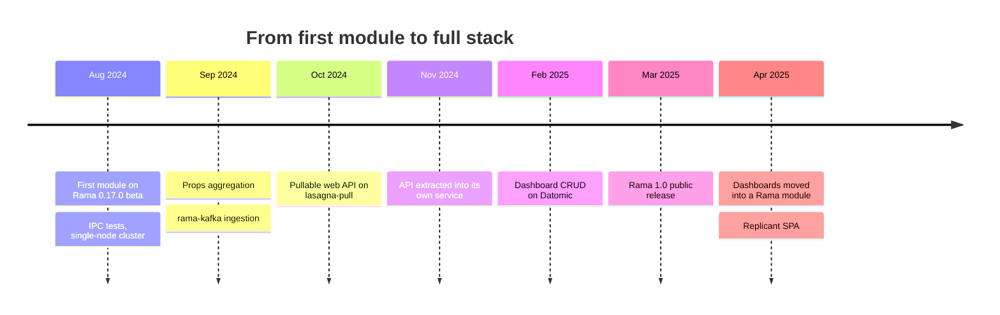

---
tags:
  - clojure
  - rama
  - kafka
  - analytics
  - hibou
date: 2024-08-12
rss-feeds:
  - all
---
## TLDR

A proof of concept for replacing Apache Druid + Imply with an all-Clojure analytics stack: Kafka events pre-aggregated by a [Rama](https://redplanetlabs.com/learn-rama) module, queried through a pullable EDN API, and visualized in a Replicant SPA. Built on a beta version of Rama, it proved the pipeline end to end and shaped the generic platform that came after it.

## Context

Our gaming platform produces a high volume of events across multiple Kafka topics. The stack aggregating and visualizing those stats was [Apache Druid](https://druid.apache.org/) + [Imply](https://imply.io/), and game operations kept hitting its walls. The worst was cross-topic joins: Druid caps join subquery intermediates at 100k rows (`maxSubqueryRows`), and at our data volumes the queries blew past it. Beyond that, changing an aggregation method after ingestion was not easy, and the SQL grew verbose quickly. On top of it, the whole OLAP layer sat outside our Clojure codebase, a separate system to operate and pay for.

As a Clojure-focused company, we wanted to know whether [Rama](https://redplanetlabs.com/learn-rama), Red Planet Labs' distributed stream processing platform, could replace that layer entirely. The goal was deliberately **end to end**: a Rama module ingesting real events, an authenticated API in front of it, and a dashboard UI on top. Not the smartest analytics engine, the whole chain working. I led the POC, with a colleague handling the AWS cluster setup and another joining later on the application side.

Rama was still in beta when I started (v0.17.0 in August 2024) and reached its public 1.0 release mid-project, in March 2025. [Nathan Marz](https://github.com/nathanmarz) was responsive throughout, helping us understand the platform as it evolved.

## Why Rama

Rama combines stream processing and state management in one platform. Instead of Kafka consumers feeding a separate OLAP store with a query layer on top, our Druid + Imply setup, one Rama module handles ingestion, stateful computation, and querying. A **module** is the deployment unit: it declares depots (append-only event logs), an ETL topology that consumes them, PStates (partitioned, durable indexes) holding the results, and query topologies to read them back. For our use case this meant:

- **Kafka integration**: [rama-kafka](https://github.com/redplanetlabs/rama-kafka) connects Rama directly to external Kafka topics
- **PStates for storage**: the aggregated stats live in Rama itself, no separate database
- **Query topologies**: queries run co-located with the data, avoiding network hops for reads
- **Microbatch topology**: simpler fault-tolerance semantics, higher throughput, and more expressive due to batch blocks

The diagram below shows the stack the POC ended up with: events flow left to right into PStates at write time, and the dashboard pulls the pre-computed results back out.



## The analytics module

The first goal was a module that ingests game events, pre-aggregates them into PStates organized by time granularity and dimensions, and exposes query topologies to fetch the results. This is a **rollup-only** approach: metrics are computed at write time and stored in deeply nested maps, one rollup per granularity, and queries return pre-computed aggregates, never individual records. Reads are fast, but the set of dimensions and metrics is fixed at module definition time.

Rama makes you think in reverse compared to Druid. With Druid, the data is stored the way the engine stores it, and you optimize your queries to get what you want out of it. With Rama, you start from the queries you want to serve, then design the PState shapes and the dataflow code that aggregates into them, partitioned and indexed with the end goal in mind.

We stuck to nested map PStates on purpose. It is the shape Rama's documentation and path API are built around, and a POC is exactly the time to learn how a platform wants to be used, not to fight it with a custom storage layout. Exotic PState designs could wait until we understood the idiomatic one.

Concretely, the game stats PState was a nested map keyed by granularity, then by dimensions, down to a time bucket holding a stats record (trimmed here for readability):

```clojure
(def GameStatsSchema
  {Keyword            ;; granularity (:hour, :day, ...)
   {String            ;; game
    {String           ;; server
     {String          ;; platform
      (r/map-schema
       Long            ;; time bucket
       ScoreStat       ;; running totals
       {:subindex? true})}}}})
```

`ScoreStat` is a Clojure record holding running totals (score, money, tax, event count) plus a cardinality sketch for distinct users, since exact distinct counts would mean storing every username at every path. Each incoming event updates the record at its path, once per granularity. The bucket maps are subindexed, so a query can page through a large time range without deserializing the whole map.

The module first ran on sample events appended to native Rama depots; ingestion from the real Kafka clusters came a month later through rama-kafka. Testing and deployment followed a ladder: Rama's In-Process Cluster (IPC) simulates worker processes as threads in a single JVM for unit tests, then we uberjar'd the module onto a single-node cluster (multiple processes on one machine) to exercise actual serialization and partition distribution, and finally deployed to a multi-node Rama cluster on AWS set up by my colleague.

## The API

Rama ships a [built-in REST API](https://redplanetlabs.com/docs/~/rest.html) for depot appends and PState queries via JSON. We built our own API service instead, for several reasons:

- **EDN over JSON**: we prefer working with EDN in Clojure
- **Validation**: [Malli](https://github.com/metosin/malli) schemas reject malformed queries before they hit the Rama cluster
- **Encapsulation**: the frontend never needs to know about Rama internals (partitions, PState names, query topology signatures)
- **Authorization**: the API layer handles authentication

The API is built on [lasagna-pull](https://github.com/flybot-sg/lasagna-pull): the client sends an EDN pattern describing what it wants, and the server returns exactly that shape. Since our dashboards always aggregate across partitions (multiple games, multiple users), the API talks to Rama exclusively through query topologies (`foreign-query`), never through direct partition lookups (`foreign-select`). For large scans, the query topologies use Rama's `yield-if-overtime` to paginate instead of blocking a task thread.

The API started as a namespace inside the module repo, but the two evolve at different speeds (a module redeploy is a heavier operation than bouncing a stateless web server), so after a few weeks we extracted it into its own service with its own release cycle.

## The dashboard UI

The frontend is an SPA using [Replicant](https://replicant.fun/) for rendering and [ECharts](https://echarts.apache.org/) for visualizations. Users compose dashboards out of query panes, each pane bound to one query EDN describing the time window, data source, grouping, and filters. Since the API is pullable, each pane asks for exactly the data its chart needs and nothing more.

## Dashboards: Datomic first, then Rama

Saved dashboards need CRUD storage, and the first version used [Datomic](https://www.datomic.com/), since we already ran it for other applications. It worked, but a teammate pointed out the obvious: we were operating a whole second stateful system to store a handful of EDN maps, next to a Rama cluster whose entire point is stateful storage. He was right.

Two months later we replaced it with a small dedicated Rama module handling dashboard CRUD via a depot and a PState. Writing it took only a few days, because by then the module patterns were familiar. One less system to operate, and the dashboards store scales and deploys like everything else in the stack.

## What the POC proved

The timeline below shows how the pieces landed over the nine months of the POC.



At the end we had the full chain we set out to build:
- Two Rama modules: one for analytics (pre-aggregated stats by granularity), one for dashboards
- A pullable API service with authentication encapsulating all Rama logic
- A Replicant SPA with a dashboard builder and ECharts visualizations

The POC proved the chain: events flowed from Kafka through PStates to an authenticated API and onto a dashboard, in Clojure top to bottom. Building it taught us the platform's idioms: depots, nested PStates, query topologies, deployment.

Let's be frank about what it did not prove: this was not a Druid + Imply replacement yet, and comparing the two at that point would have been meaningless. Druid indexes raw records and answers ad-hoc questions; our module only answered the questions wired into it at write time, for one client's event schema. The limitations were clear:

- **One monolithic module**: the analytics module was tightly coupled to one client's event schema
- **Config drift**: the API validation schemas and the Rama module definition were maintained separately
- **Only rolled-up data**: PStates stored pre-aggregated metrics, with no access to individual records, so no ad-hoc queries

The next step was to generify the stack into a reusable, configuration-driven platform. That became [Hibou](https://www.loicb.dev/blog/hibou-an-attempt-at-a-generic-analytics-platform-with-rama).