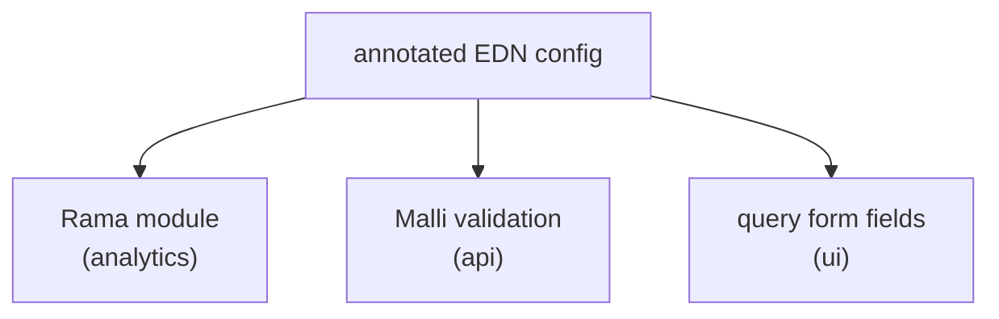
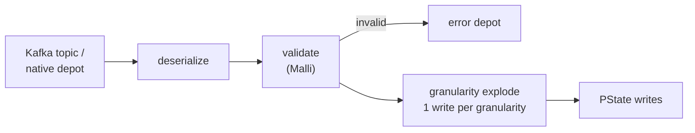

---
tags:
  - clojure
  - rama
  - analytics
  - hibou
date: 2025-10-13
rss-feeds:
  - all
---
## TLDR

Hibou is a configuration-driven analytics platform built on [Rama](https://redplanetlabs.com/learn-rama), generified from our gaming stats POC. A single annotated EDN config generates the Rama module, the API validation schemas, and the UI query forms, so adding analytics for a new event schema is a config file, not a development project. This article covers the architecture, the one-config-three-layers design, and what the generated modules support: nested rollup PStates and cross-topic correlation.

## Context

The [POC](https://www.loicb.dev/blog/gaming-stats-aggregation-with-rama) proved the chain: events flowed from Kafka through PStates to an authenticated API and a dashboard UI, in Clojure top to bottom. By the end it covered the client's main topics (game, prop, and user events) and served their dashboards from rollups at minute, hour, day, and rolling 30-day granularity. But it was not reusable:

- **Not domain-agnostic**: the implementation was written for this client's topics. Onboarding a second client meant rewriting dataflow code.
- **Config drift**: the module definition lived directly in the dataflow code, while the API validation schemas and the UI forms each re-described the same events on their side. Three hand-maintained descriptions of the same thing.
- **Scattered code**: the logic was spread across 5 repos (analytics, API, UI, dashboards, client code), each with its own versioning to maintain.

**Hibou** (French for owl) is the answer to all three: extract the generic machinery into a single, configuration-driven platform. [Andrean](https://github.com/chickendreanso) worked on it with me from the first commit; I focused on the module builder and he built most of the UI.

## Architecture

Hibou consolidates the generic parts into a monorepo with four components, following the setup described in [Clojure Monorepo with Babashka](https://www.loicb.dev/blog/clojure-monorepo-with-babashka):

- **analytics**: a generic Rama module builder that turns an EDN config into a full Rama module
- **dashboards**: a small Rama module (one depot, one PState) for dashboard CRUD, so dashboards live in the same infrastructure as the data and we avoid introducing another database
- **api**: authentication, [Malli](https://github.com/metosin/malli) validation, and a pullable API encapsulating all Rama interactions
- **ui**: a [Replicant](https://replicant.fun/) SPA with [ECharts](https://echarts.apache.org/) visualizations and a config-driven query builder

A client repo provides EDN config files describing its event schemas and desired aggregations, plus [Babashka](https://babashka.org/) tasks to build and deploy. Hibou generates everything else.

## One config, three layers

The core design decision was making annotated EDN configs the single source of truth for the whole stack. As the diagram below shows, the same config is consumed by three layers:



A config describes the depots to consume (a **depot** is Rama's append-only event log; ours are either external Kafka topics via [rama-kafka](https://github.com/redplanetlabs/rama-kafka) or native Rama depots), the PStates with their dimensions and metrics, the ETLs wiring depots to PStates, and the query topologies to expose. Namespaced keywords (`:depot/...`, `:pstate/...`, `:etl/...`, `:query/...`) annotate each entry with its role. Hibou is proprietary to Flybot, so I will not paste the real schema, but the shape of a config looks like this:

```clojure
{:resources
 {:depots  #:depot{:games {:schema [:map
                                    [:op-at :int]
                                    [:username :string]
                                    [:price :double]]}}
  :pstates #:pstate{:prices-per-user
                    {:dimensions [{:name :username :type :string}
                                  {:name :price-type :type :keyword}]
                     :metrics    [{:name :price :type [:record :number-metrics]}]}}}
 :etls    #:etl{:games->prices
                {:from/depot #:depot{:games {:timestamp-key :op-at}}
                 :to/pstates #:pstate{:prices-per-user {}}}}
 :queries #:query{:prices {:type :get-data
                           :query-location {#{:username} :pstate/prices-per-user}}}}
```

On the module side, a single macro expands the config into a complete Rama module: it declares the depots, generates a PState schema per entry, wires a microbatch topology per ETL, and declares the query topologies. A client module is one call:

```clojure
(defclient-module ClientAnalyticsModule client-config)
```

The API derives its Malli schemas from the same config, and they live in a `.cljc` sub-library that the UI depends on, so the frontend validates queries with the very same schemas as the backend. The UI query editor generates its form fields from them. When the config changes, the module, the validation, and the forms all adapt. No separate schema maintenance, no drift.

## The nested PState design

A **PState** is Rama's partitioned, durable index. Hibou stores metrics in deeply nested maps, aggregated at write time. The module builder adds two extra top layers for time to every PState:

```
{granularity {bucket {dim-1 {dim-2 {:metric-a agg, :metric-b agg}}}}}
```

The ingest pipeline is the same for every module, shown in the diagram below. Each event is validated against the depot's Malli schema (invalid events go to an error depot instead of killing the topology), then exploded into one write per time granularity: `:minute`, `:hour`, `:day`, and `:dt` (rolling 30 days). Each write walks the dimension path and updates the metrics in place.



Metrics come in three flavors: sets, frequency maps, and aggregate records (counts, sums, min/max, distinct counts) that accumulate a new value in one update. Since all the aggregation work happens during ingestion, a read is just a path lookup through the nested map, which makes dashboard queries quick regardless of how many events were ingested.

One detail I like on the query side: a query config maps the set of filtered dimensions to a PState, for instance `{#{} :pstate/stats, #{:username} :pstate/stats-per-user}`. The query topology picks the cheapest pre-aggregation for the filters the user actually sent.

Cross-topic correlation works too: every ETL hash-partitions its PState writes by the entity key (the username), so a user's data from all topics lands on the same partition and cross-topic queries become local reads. A module can also expose another module's query topologies through mirror queries, so one client module can combine results across modules.

The dimensions and metrics are fixed at deploy time, so answering a question nobody anticipated means updating the config and re-ingesting. That is not a Hibou quirk, it is the usual pre-aggregation trade ([Apache Druid](https://druid.apache.org/) in rollup mode has the same constraint), and for dashboards whose questions are known in advance, which is what Hibou is for, it is a fine one.

## The rest of the stack

### API

Like in the POC, I built a custom API layer rather than exposing Rama's REST API. The server is a [fun-map](https://github.com/robertluo/fun-map) system, and the API is pullable via [lasagna-pull](https://github.com/flybot-sg/lasagna-pull): the client sends an EDN pattern describing the data it wants, and the server returns exactly that shape. Malli validates every query before it reaches the Rama cluster, authentication uses our company SSO tokens, and the frontend never sees Rama internals.

### UI

Andrean built the UI as a Replicant SPA on top of [dashcraft](https://github.com/flybot-sg/dashcraft), our fork of [Robert Luo's dashcraft](https://github.com/robertluo/dashcraft) component library. The query editor generates itself from the shared Malli schemas, so users build queries visually with validation, and the underlying representation stays pure EDN. Results render as ECharts time series, bar and sunburst charts, and tables, with CSV export.

### Client integration

A client repo is mostly configuration:

1. Define annotated EDN configs for each analytics module
2. Use `analytics` to generate the modules and deploy them with Babashka tasks
3. Use `api` to stand up an authenticated API server
4. Embed `ui` for the frontend

## What I learned

Generifying the POC into Hibou clarified two things:

- **Config-driven generation pays off fast.** The investment in a generic module builder means a new analytics module for a different event schema is a config file, not weeks of Rama dataflow code.
- **Compile-time freedom over query-time flexibility.** Generating purpose-built modules at deploy time is a different philosophy from general-purpose OLAP, and it works well when the analytics needs are known and stable.

At the time of writing, Hibou only supports rollups in Rama, so I did not go too deep into our Rama code here. The storage evolution that followed deserves a dedicated article: from rollup-based PStates, to column-based, to block-based, the journey from OLTP to OLAP in Rama.