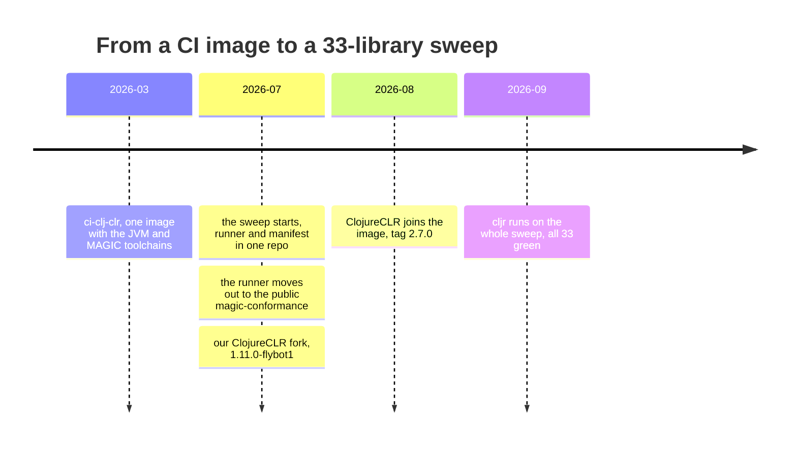
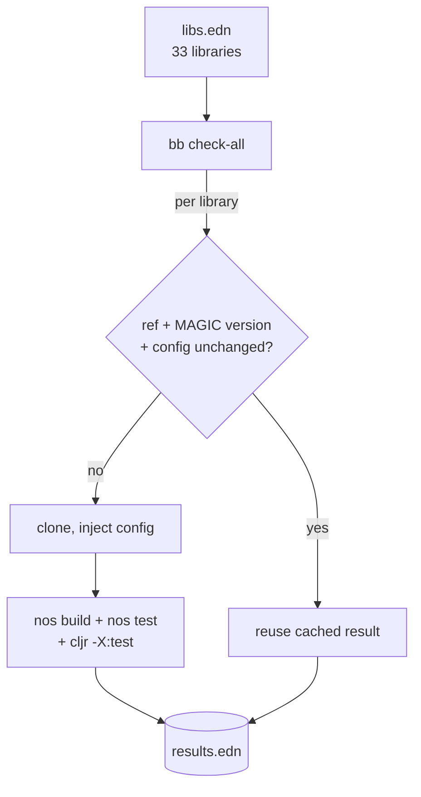

---
tags:
  - clojure
  - dotnet
  - clr
  - compiler
  - testing
  - devops
  - magic
date: 2026-09-14
repos:
  - [magic-conformance, "https://github.com/flybot-sg/magic-conformance"]
  - [ci-clj-clr, "https://github.com/flybot-sg/ci-clj-clr"]
  - [clojure-clr, "https://github.com/flybot-sg/clojure-clr"]
  - [magic, "https://github.com/flybot-sg/magic"]
rss-feeds:
  - all
  - clojure
---
## TLDR

Our client depends on 33 Clojure libraries that all have to compile to the CLR and run in Unity. [magic-conformance](https://github.com/flybot-sg/magic-conformance) rebuilds and retests every one of them on both CLR compilers in one command, inside a dedicated [image](https://github.com/flybot-sg/ci-clj-clr). It gives the client proof that a new [MAGIC](https://github.com/flybot-sg/magic) release does not break the libs they depend on, and it found a lot of compiler bugs along the way. As of MAGIC 0.13.0, all 33 pass.

## Testing bug fixes on real libraries

[MAGIC](https://github.com/flybot-sg/magic) compiles Clojure to .NET so our game logic can ship inside Unity, including on iOS. It is not the only Clojure on .NET. [ClojureCLR](https://github.com/clojure/clojure-clr) is David Miller's port. For legacy reasons, and because MAGIC was not always stable, our client's Unity projects run both: ClojureCLR in the editor, MAGIC in the player build. So every library they depend on has to build and pass on both.

Our client's Clojure libraries had all been partly ported to the CLR at some point in the past. The problem was that the compiler was not stable, so a lot of workarounds were in place. While [making MAGIC stable](https://www.loicb.dev/blog/making-magic-stable), I removed each one of those workarounds and reproduced the bug behind it, so I could file a minimal reproducible issue in MAGIC and fix the root cause. Some libs the client had not ported yet, and those turned up a few more bugs. As I ported and fixed these libs, I kept track of them in a private repo, so every time a fix landed I could test it against the already ported libs and see whether I had broken anything in one command.

So it started as a bug-reporting tool and ended up as a regression testing tool. Conformance here means one thing: a library builds and passes its own tests on a CLR compiler, the way it does on the JVM.

## How it came together

## The container that runs it anywhere

Three compilers mean three toolchains, which is a pain to install on every CI runner and worse to maintain across many repos. So I created [ci-clj-clr](https://github.com/flybot-sg/ci-clj-clr), a Debian image that carries all of them. Here is what tag `2.8.0` holds:

| Tool                        | Version                                                               | Purpose                                              |
| --------------------------- | --------------------------------------------------------------------- | ---------------------------------------------------- |
| Temurin JDK                 | 21                                                                    | JVM Clojure runtime                                  |
| Clojure CLI                 | 1.12.6.1673                                                           | Dependency management and REPL                       |
| Babashka                    | 1.12.216                                                              | Task runner and scripting                            |
| Node.js                     | 24.x                                                                  | shadow-cljs support                                  |
| Mono                        | 6.x                                                                   | Hosts Nostrand (net471 target)                       |
| Nostrand                    | v0.13.0                                                               | MAGIC task runner, dep manager, and REPL             |
| .NET SDK                    | 8.0 (LTS)                                                             | Hosts the ClojureCLR runtime and dotnet tools        |
| ClojureCLR (`Clojure.Main`) | [our fork](https://github.com/flybot-sg/clojure-clr) `1.11.0-flybot5` | ClojureCLR runtime, mirrors the Unity editor         |
| `cljr` CLI (`Clojure.Cljr`) | 0.1.0-alpha11                                                         | deps and CLI tooling for ClojureCLR (`cljr -X:test`) |

We use Babashka in pretty much all our repos, so it is bundled here too. Node.js is there because some of our libs also target JS.

Each image tag pins exactly one MAGIC release and one ClojureCLR build, so a sweep is reproducible months later and a bump is one tag change. Every MAGIC release ships a new image.

All our internal libraries ported to the CLR have to run on both the JVM server and the Unity frontend, so they all use our `ci-clj-clr` image, and their CI runs the tests on the JVM, on MAGIC and on our ClojureCLR fork.

Public libraries are usually ported for ClojureCLR, not MAGIC. MAGIC only supports Clojure core up to 1.10, so it is not the first choice for most people, especially if they do not run their libs in Unity.

So in the open-source repos we own at Flybot, we do it the ClojureCLR way for now, since it targets pretty much the latest Clojure version, and we do not force our `ci-clj-clr` image onto these libs. So their CI installs the latest upstream ClojureCLR as a dotnet tool and runs `cljr -X:test` against that instead.

## Making the runner public

I extracted the conformance runner into a public repo: [magic-conformance](https://github.com/flybot-sg/magic-conformance) so everybody can check their internal libs by just specifying a manifest of libs to test. Ours stays private: a manifest, a config file and a committed `results.edn`, pinning the runner by SHA. It also shows how I run the conformance checks with some open-source libs ported to the CLR.

## One command: `bb check-all`

That private repo holds the list as a `libs.edn` manifest. Its `bb check-all` task walks the manifest and prints a pass or fail per library, and `bb check <lib>` does a single one. A full sweep of all 33 with `bb check-all --force` takes 25 minutes in a container.

Most runs are far shorter than that, because a result is a pure function of three things:

1. the commit the ref resolves to
2. the MAGIC version
3. a digest of the library's build and test config

`bb check-all` does one `git ls-remote` per library, with no clone, and reuses the recorded result when all three match. Only what moved gets rebuilt. Bumping the MAGIC version invalidates everything at once, which is exactly what I want when a new compiler lands.

## Why the sweep runs two compilers

ClojureCLR was not in the sweep at first. I was fixing MAGIC, so I tested MAGIC.

While working on MAGIC I kept comparing its output against ClojureCLR 1.11, the closest reference to the Clojure version MAGIC targets. Our client still runs ClojureCLR in their editor, which they picked while waiting for MAGIC to become stable, and it now is, so we are adding the hot reloading part. They reported a fair number of bugs they hit in the editor, so we forked ClojureCLR 1.11 and fixed them, to make a library behave the same on both compilers.

A green result on one compiler is therefore not a result, and that is the rule the sweep runs on.

There is a second reason, and it outlives our particular Unity setup. ClojureCLR is the reference Clojure on .NET, the port that tracks upstream Clojure most closely, so running a library on both compilers is differential testing. When the two disagree, one of them is wrong, and the JVM result says which.

## IL2CPP case

What the conformance sweep does not catch is whether these 33 libs actually transpile under IL2CPP. Only a real IL2CPP player build can tell me that, and that needs a machine with Unity installed.

A separate [IL2CPP smoke project](https://github.com/flybot-sg/magic/tree/main/unity-examples/magic-unity-smoke) covers that gap. It does not build the 33 libs. It carries the smallest form of every IL2CPP bug we have hit, and I run it by hand after any fix that could behave differently under IL2CPP. [Making MAGIC stable](https://www.loicb.dev/blog/making-magic-stable) describes the suite.

## Where it stands

As of MAGIC v0.13.0, all 33 libraries pass on both CLR compilers. Eight of them are open source, and four build straight from upstream with no source change at all: [clr.test.check](https://github.com/clojure/clr.test.check), [clr.data.json](https://github.com/clojure/clr.data.json), [clr.data.generators](https://github.com/clojure/clr.data.generators) and [editscript](https://github.com/juji-io/editscript) from 0.8.0.

It is not every open source library recompiled, the way Rust does it with [Crater](https://rustc-dev-guide.rust-lang.org/tests/crater.html). It is the 33 we ship. But a compiler fix now has a real integration test suite behind it, one command away, and the client gets proof that their libs still build and pass on both CLR compilers.