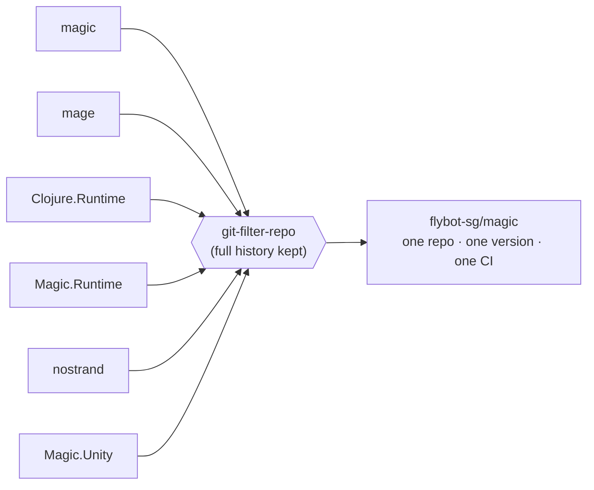
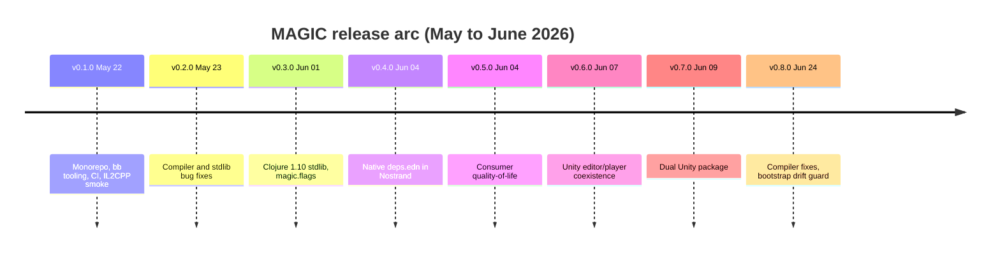
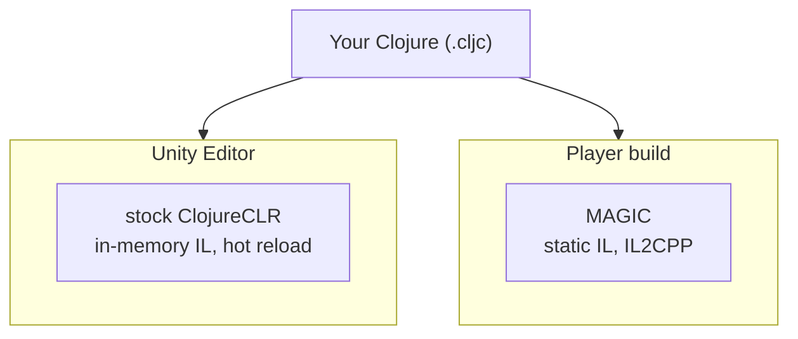

---
tags:
  - clojure
  - dotnet
  - unity
  - devops
  - magic
date: 2026-06-24
repos:
  - [magic, "https://github.com/flybot-sg/magic"]
  - [ci-clj-clr, "https://github.com/flybot-sg/ci-clj-clr"]
  - [rct-clr, "https://github.com/flybot-sg/rct-clr"]
rss-feeds:
  - all
  - clojure
---
## TLDR

MAGIC (Morgan And Grand Iron Clojure) compiles Clojure to .NET so we can run it in Unity, including on iOS. [Ramsey Nasser](https://nas.sr/about/) built it and maintained it almost single-handedly for close to a decade. With his time for it now limited, I set out to make it dependable: I consolidated his six repositories into one Flybot-owned monorepo, built the tooling and CI it lacked, and used that base to fix the bugs that had blocked us and to improve the Unity integration, shipping eight releases in about a month. This post is about the decisions behind that, not how the compiler works. The [docs](https://github.com/flybot-sg/magic/tree/main/docs) cover the how.

## ClojureCLR vs MAGIC

The first question is always why not just use [ClojureCLR](https://github.com/clojure/clojure-clr), David Miller's mature Clojure-to-.NET port. It runs well on the desktop, but it builds its call sites (the small objects that dispatch each method call) by emitting IL, the bytecode the .NET runtime executes, while the program runs. It does this through a part of .NET called the DLR, the Dynamic Language Runtime. Unity's IL2CPP backend compiles everything to C++ ahead of time, so there is no runtime left to execute IL that was generated on the fly. iOS forces IL2CPP, because Apple forbids any third-party JIT, and Android forces it too, not through a JIT ban but because Google mandates 64-bit and Unity's Mono has no ARM64 build. Our games target both, so ClojureCLR is out. MAGIC emits fully static IL instead, and that is the whole reason it exists. The mechanics are in [docs/why-magic.md](https://github.com/flybot-sg/magic/blob/main/docs/why-magic.md).

## How we use it at Flybot

At [Flybot](https://flybot.sg) we helped port a client's old Java game libraries to Clojure. Then, because we knew MAGIC already existed, we took on the harder task of making those Clojure libraries run as .NET DLLs inside Unity. The payoff is that the same game APIs run in both the server backend and the Unity frontend, written once. I worked closely with [Ramsey](https://github.com/nasser) across two stretches, first on performance and then on stability (the [earlier story](https://www.loicb.dev/blog/magic-compiler-and-nostrand-integration)), until those games shipped in production. I was doing the bug reporting, he was fixing the compiler.

The compiler did its job, but the toolchain around it was painful. Six repositories, each with its own version and no shared release. Ramsey's time for it had become limited, so bugs could sit. And the internals were undocumented, with no public dev workflow, so contributing meant first reverse-engineering how the pieces fit, which is what our clients did for the Unity part over the years. By the time I took it on, their repos still carried workarounds just to get MAGIC to compile and integrate with Unity.

## 1. Gather the six repos into one



A **monorepo** is a single repository that holds several related projects which ship together. It was the right call here, because these six always worked as one system. One version instead of six, one place to file bugs, and the freedom to land a compiler change, the runtime tweak it needs, and a stdlib fix in a single commit, instead of coordinating three separate repos. A fix that touches several components at once stops being a chore.

I used [git-filter-repo](https://github.com/newren/git-filter-repo) to merge the six trees while keeping every author and commit date from 2014 onwards. That was deliberate, and better than a clean import: it keeps the credit with Ramsey, and since the runtime is forked from ClojureCLR, with David Miller and the ClojureCLR contributors too.

It also lets anyone trace a bug back to the commit that introduced it. A human, and an LLM especially, can bisect far faster when the entire history of every piece sits in one place. Owning the repo under our own org also means fixes ship when they are ready, not when an external maintainer is free.

## 2. Build tooling instead of becoming a compiler expert

I am not a compiler expert, and trying to become one was not the objective. The better move was to make the compiler legible to anyone, me included. Everything runs as a [Babashka](https://babashka.org/) (`bb`) task, and two of them carry most of the debugging: `bb pipeline` walks a form through the reader, AST, and emitted IL, and `bb prepl-eval` runs a form against a live MAGIC runtime. Between them, that is usually enough to see where something goes wrong without reading the compiler internals.

For example, for `(+ 1 2)`, `bb pipeline` shows how it compiles, walking the form through the reader, AST and type stages down to the symbolic IL the emitter produces:

```bash
$ bb pipeline '(+ 1 2)'

================================================================
FORM   (+ 1 2)
================================================================

================================================================
AST (skeleton)
================================================================
{:args ...
 :fn {:op :var, :assignable? false, :var #'clojure.core/+, :form +},
 :original ...
 :type System.Int64,
 :op :intrinsic,
 :il-fn #object[MetaWrapper 0x189702c9 "clojure.lang.AFunction+MetaWrapper"],
 :form (+ 1 2)}

================================================================
TYPES (3 typed nodes)
================================================================
  :intrinsic (+ 1 2) :: System.Int64
  :const 1 :: System.Int64
  :const 2 :: System.Int64

================================================================
SYMBOLIC IL (3 instructions)
================================================================
  ldc.i8 1
  ldc.i8 2
  add.ovf
```

There is no Var lookup and no `IFn.invoke`: `+` is recognised as an **intrinsic**, a function the compiler knows how to emit directly, so it lowers to three CLR instructions. `bb prepl-eval` is the other half, running the same form on a live MAGIC runtime and handing back a structured reply:

```clojure
$ bb prepl-eval '(+ 1 2)'

{:tag :ret, :val "3", :ns "user", :ms 2.1492, :form "(+ 1 2)"}
```

Between them I can see both what the compiler emits and what it actually does, which is most of what I need to localise a bug. The same scriptable tools are what let Claude Code reproduce a bug and narrow it to the offending stage, so I am not the only one who can move the compiler forward.

## 3. A CI gate, because drift is invisible

MAGIC is written in Clojure and compiles itself, so the repo has to commit some generated files, including the compiler's own compiled output. Edit a source but forget to regenerate the file built from it, and the two fall out of sync with no build error, just an unknown bug downstream. That mismatch is **drift**, and `bb check-drift` regenerates each generated file and fails if anything moved:

| Generated artifact | Source of truth | How `check-drift` catches it |
|---|---|---|
| Callsite `.g.cs` (`magic-runtime`) | `.mustache` templates | regenerate, then byte-diff the output (deterministic) |
| Stdlib `.clj.dll`s | `magic-compiler/src/stdlib/**` | source SHA in `stdlib-manifest.edn`, not DLL bytes (compilation is non-deterministic) |
| Compiler + bootstrap `.clj.dll`s (`nostrand/references`) | the `magic.*` compiler, `mage`, `clojure.core`, the bootstrap stdlib | source SHA in `bootstrap-manifest.edn`, the set `stdlib-manifest` skips |
| Unity `package.json` version | `version.edn` | compare the version field |
| `magic-unity-dual` variant | `magic-unity` | regenerate from the default, then diff |

So none of it is left to vigilance: every PR and push runs `bb check-drift` and the full test suite, and a tag push builds and publishes the release. On a self-hosting compiler, that is the line between dependable and working only until I forget a step. How the check pulls this off, byte-comparing the deterministic outputs and fingerprinting the source of the binaries that are not, is detailed in [Drift Checks for a Self-Hosting Compiler](https://www.loicb.dev/blog/drift-checks-for-a-self-hosting-compiler).

## 4. A smoke project for the bugs CI cannot catch

The bugs that worried me most run fine on Mono and break only once Unity transpiles to C++ for a device, the one path CI does not exercise. Rather than keep rediscovering them inside our large game projects, I built a standalone Unity project that collects a minimal repro of every IL2CPP edge case we have hit, grouped into five suites (value types, letfn, polymorphism, control flow, stdlib), 52 checks that run green on both Mono and Standalone Mac IL2CPP at the press of one button. The rule is simple: whenever an IL2CPP bug gets fixed, its minimal repro lands here in the same commit, so the suite only grows and a bug we have already paid for cannot come back unnoticed.

One check shows why it earns its place. Calling an instance method on a primitive value is everywhere in real code:

```clojure
(.ToString 42)    ; long   => "42"
(.GetType 90.0)   ; double => System.Double
(.Equals 7 7)     ; long   => true
```

All of it ran fine on Mono but threw `InvalidProgramException` the moment IL2CPP transpiled it. MAGIC had emitted a plain `callvirt` (the CLR instruction for a virtual method call) where a value type needs `constrained.callvirt`, the variant required when the receiver is a value type. Mono's JIT accepted the sloppy IL, and IL2CPP's verifier did not. That is exactly the failure CI cannot see, green on Mono, so only an actual IL2CPP build surfaces it. The fix and these checks shipped together. The consumer-side IL2CPP details live in [docs/unity-integration.md](https://github.com/flybot-sg/magic/blob/main/docs/unity-integration.md).

## 5. Foundation first, then the backlog

Only with the monorepo, tooling, CI, and smoke suite in place did I start on the bugs that had been open on Ramsey's repos for years. The order was the point: without the safety net, fixing a compiler you do not fully understand is how you trade one bug for two. Each commit references the issue it closes, including the original `nasser/*` numbers, and the conventions in `CONTRIBUTING.md` mean a human or an LLM can file and fix without re-asking how we work.

The releases came fast once the base held:



Versioning is one `version.edn`, and `bb tag` cuts the tag that a CI job turns into a published release tarball on GitHub. One command, and a release builds and ships itself with nothing done by hand. That predictable, hands-off release path is what the single shared repo finally makes possible. Per-release detail is in the [CHANGELOG](https://github.com/flybot-sg/magic/blob/main/CHANGELOG.md).

A good measure of "dependable" is what disappears. The old way to use David Miller's `clr.test.check` was to comment out its `clojure.core` require and rewrite every `core/let` to its fully qualified form, just to dodge a MAGIC bug. After the v0.2.0 fixes, his port compiled under MAGIC with zero source patches, sooner than I expected; our [clr.test.check](https://github.com/flybot-sg/clr.test.check) fork now adds only a build harness and CI. Then, testing against our own libraries, I found that some workarounds were still necessary, because MAGIC had never been fully ported to Clojure 1.10. So v0.3.0 filled that gap and put every compiler option behind one `magic.flags` namespace.

## 6. Write a small resolver instead of adopting clr.tools.deps

MAGIC predates `deps.edn`, Clojure's dependency file, so each consumer carried a CLR-side `project.edn` next to its `deps.edn`: two files that drifted apart, with private-repo tokens inlined. David Miller maintains a CLR port of `tools.deps` ([`clr.tools.deps`](https://github.com/dmiller/clr.tools.deps)), but it leans on a few stdlib functions newer than MAGIC's Clojure 1.10 base, and cherry-picking and porting those in just to adopt it was not worth it. Our need was narrow anyway: resolve git and local coordinates transitively, skip Maven, and authenticate through the developer's own git and SSH config. So I wrote a small native `deps.edn` resolver, with a `:clr` alias (via `:override-deps`) to swap a JVM library for its CLR fork, plus shared `dotnet.clj` helpers so a project wires its build in a few lines. Trying the port was not wasted, though: loading it under MAGIC tripped a real compiler bug, a `let`-bound local thrown inside a `catch`, which I fixed in v0.3.0. That was the v0.4.0 and v0.5.0 work; the consumer guide is [docs/porting-libraries-to-magic.md](https://github.com/flybot-sg/magic/blob/main/docs/porting-libraries-to-magic.md).

## 7. The right runtime per phase, in Unity

With consumers able to build and depend on CLR libraries cleanly, the last piece left was the one we actually ship into. The earlier workflow packaged the MAGIC-compiled runtime as NuGet and was too slow to work against, because every change meant a full compile and repackage before it showed up in the editor.

The split that fixes this was not my idea. [Hong](https://github.com/hongheng), an engineer on our client's Unity team, had arrived at it out of necessity: run **stock ClojureCLR in the editor**, where it loads Clojure from source and compiles it to IL in memory as the program runs, so hot reload works, and ship **MAGIC only in the player build**, where its static IL is what IL2CPP needs. The diagram below shows that split, the same Clojure source meeting a different compiler at each phase.



My job was to make MAGIC support that arrangement first-class, so v0.6.0 lets a project keep ClojureCLR in the editor and MAGIC in the player without the two colliding, leaving their existing workflow untouched. Distribution moved to the `magic-unity` UPM package (a Unity Package Manager package, pinned by git URL), so there is no hand-maintained copy to drift.

That left one rough edge: with both runtimes present, Unity logged 46 benign "incompatible with the editor" lines on every reload, and a consumer rightly complained. So v0.7.0 ships two UPM variants and lets a project pick the one that fits:

| UPM variant | MAGIC runtime in the editor? | Player build | Coexistence editor noise | Pick it when |
|---|---|---|---|---|
| `sg.flybot.magic.unity` (default) | included, runs in Play mode | MAGIC | 46 benign lines | the project runs MAGIC everywhere |
| `sg.flybot.magic.unity.dual` | excluded via `!UNITY_EDITOR` | MAGIC | none | the project keeps stock ClojureCLR as its editor runtime |

I generate the dual from the default and gate it in CI, rather than maintain a second copy by hand. The mechanics are in [docs/unity-integration.md](https://github.com/flybot-sg/magic/blob/main/docs/unity-integration.md).

## 8. Pull the scattered forks into one org

A stable compiler paid off in a place I had not planned for: our own dependency forks. While MAGIC was unstable we could not reuse existing CLR ports cleanly, so they lived as forks on personal GitHub accounts, drifting from upstream. That is a bus-factor risk: if one person's account went away, so did the fork. I gathered the ones we depend on into the `flybot-sg` org next to the compiler, and brought them back in line with upstream. They landed in three different shapes, itself a measure of how far the compiler had come: [clr.test.check](https://github.com/flybot-sg/clr.test.check) is a straight drop-in, since David Miller's port now builds under MAGIC untouched and the fork adds only CI; [fun-map](https://github.com/flybot-sg/fun-map) needed a genuine `.cljc` CLR port; and [matcho](https://github.com/flybot-sg/matcho) took a single reader-conditional. Claude Code made the porting quick wherever the interop was not exotic.

Rich comment tests were the one gap left: the [rich-comment-tests](https://github.com/robertluo/rich-comment-tests) library relies heavily on the JVM, so my colleague [Parth](https://github.com/parth-io) had the idea to extract the assertions on the JVM and emit a plain `.cljc` test file with regular `deftest` that the CLR can run. That became [rct-clr](https://github.com/flybot-sg/rct-clr). To run all of it on both runtimes in one pipeline, I built the [ci-clj-clr](https://github.com/flybot-sg/ci-clj-clr) image.

## 9. Docs that ship with the code

The toolchain had to be usable by people who did not build it, and by the LLMs working alongside them. The CLR is unfamiliar ground for most Clojure developers, so the docs are written for both, human and LLM alike, to make the CLR ecosystem easier to enter. Three of them carry it, all in-repo and versioned with the code:

| Document | What it covers |
|---|---|
| [`docs/`](https://github.com/flybot-sg/magic/tree/main/docs) | why MAGIC exists, porting a library, cross-platform `.cljc`, and the Unity integration |
| Component READMEs | what each piece is, with the Clojure version, runtimes, and Unity version it is tested against |
| [CHANGELOG](https://github.com/flybot-sg/magic/blob/main/CHANGELOG.md) | one entry per release, every issue it closes (including the upstream `nasser/*` numbers) |

The porting guide is the one that matters most: it is detailed enough that a developer, or an LLM pointed at it, can take a JVM Clojure library to a .NET DLL and load it in Unity with little prior MAGIC knowledge.

## What is next

The next real effort is dropping Mono for CoreCLR, which Unity is moving to and Nostrand still predates. That is a better investment than porting Clojure 1.11, which can wait.