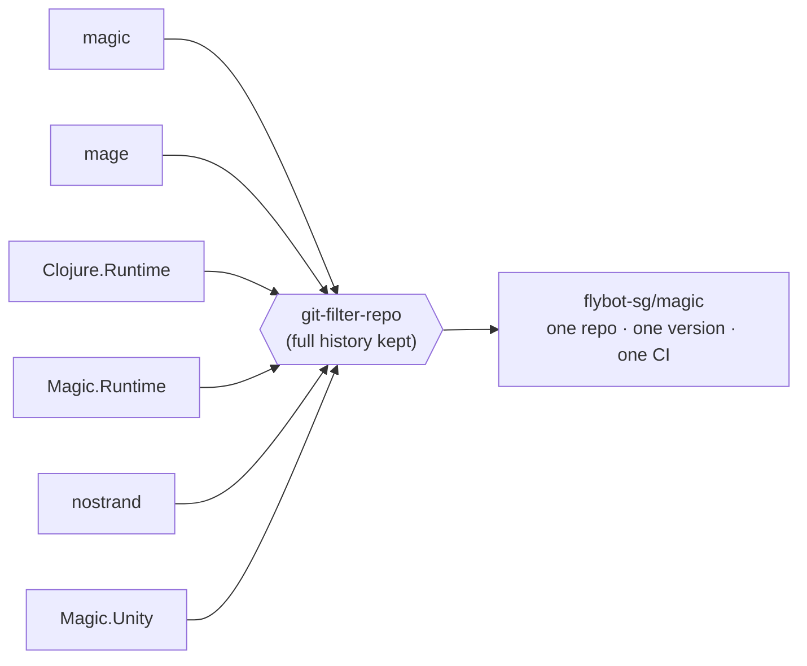
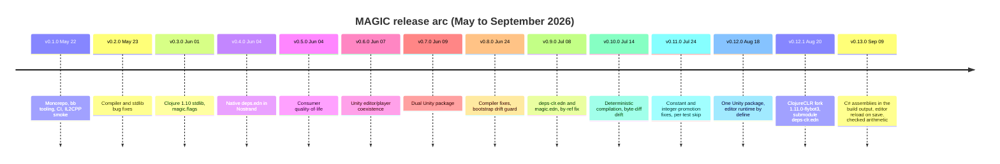
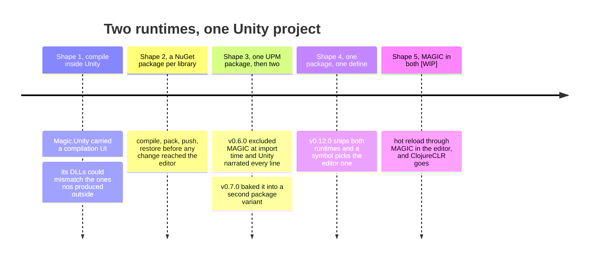

---
tags:
  - clojure
  - dotnet
  - clr
  - unity
  - compiler
  - devops
  - magic
date: 2026-09-09
repos:
  - [magic, "https://github.com/flybot-sg/magic"]
  - [magic-conformance, "https://github.com/flybot-sg/magic-conformance"]
  - [ci-clj-clr, "https://github.com/flybot-sg/ci-clj-clr"]
  - [clojure-clr, "https://github.com/flybot-sg/clojure-clr"]
  - [rct-clr, "https://github.com/flybot-sg/rct-clr"]
rss-feeds:
  - all
  - clojure
---
## TLDR

MAGIC (Morgan And Grand Iron Clojure) compiles Clojure to .NET so we can run it in Unity, including on iOS. When its creator [Ramsey Nasser](https://nas.sr/about/) no longer had time to maintain it, I consolidated his six repositories into one monorepo under our [Flybot](https://github.com/flybot-sg) org. I then improved the tooling around the compiler, which helped me fix bugs faster, and improved the integration in Unity, which was the whole point of the compiler in the first place. This article is about the decisions behind all that, not how the compiler works.

## Rationale

MAGIC (Morgan And Grand Iron Clojure) compiles Clojure to .NET so we can run it in Unity, including on iOS. When its creator [Ramsey Nasser](https://nas.sr/about/) no longer had time to maintain it, I consolidated his six repositories into one monorepo under our [Flybot](https://github.com/flybot-sg) org. I then improved the tooling around the compiler, which helped me fix bugs faster, and improved the integration in Unity, which was the whole point of the compiler in the first place. This article is about the decisions behind all that, not how the compiler works. The [docs](https://github.com/flybot-sg/magic/tree/main/docs) cover the how.

## ClojureCLR vs MAGIC

The first question is always why not just use [ClojureCLR](https://github.com/clojure/clojure-clr), [David Miller](https://github.com/dmiller)'s mature Clojure-to-.NET port, which runs well on desktop. Its dynamic dispatch goes through the [DLR](https://learn.microsoft.com/en-us/dotnet/framework/reflection-and-codedom/dynamic-language-runtime-overview) (Dynamic Language Runtime), which builds each call site by emitting IL at runtime through `System.Reflection.Emit`. IL is the bytecode the .NET runtime executes, so this is a form of JIT (Just-In-Time) compilation: new executable code is produced while the program runs.

Unity's IL2CPP backend compiles everything to C++ **ahead of time**, so there is no runtime left to execute IL that was generated on the fly. And outside the desktop, IL2CPP is the only backend:

| Platform         | Backend            | Why                                                                     |
| ---------------- | ------------------ | ----------------------------------------------------------------------- |
| Desktop (PC/Mac) | Mono JIT or IL2CPP | no restriction, Mono for fast iteration                                 |
| Android          | IL2CPP             | Google Play requires 64-bit, and Unity's Mono has no ARM64 build         |
| iOS              | IL2CPP             | Apple forbids runtime JIT                                               |
| Consoles         | IL2CPP             | the console OS forbids runtime JIT, and Unity offers no other backend    |

So ClojureCLR is out for anything but a desktop build, which rules out pretty much everybody. That constraint is what pushed Ramsey to write his own compiler, one that emits all its IL at build time so the IL2CPP transpiler has everything it needs to generate its C++.

## How we use it at Flybot

At [Flybot](https://flybot.sg) we helped port the old Java game libraries of [Golden Island](https://www.80166.com/), an 18-game mobile gaming platform, to Clojure and improve composing game features. Then, because we knew MAGIC already existed, we took on the harder task of making those Clojure libraries run as .NET DLLs inside Unity. The payoff is that the same game APIs run in both the **JVM** server backend and the **CLR** Unity frontend. Naturally, I contacted [Ramsey](https://github.com/nasser) and we worked closely across two stretches, first on performance and then on stability (see [MAGIC Compiler and Nostrand Integration](https://www.loicb.dev/blog/magic-compiler-and-nostrand-integration)), until those games shipped in production. I was doing the bug reporting, he was fixing the compiler.

The compiler worked fine for the most part, but the toolchain around it was painful. Six repositories, each with its own version and no shared release. Ramsey's time for it had become limited, so bugs could sit a while. And the internals were undocumented, with no public dev workflow, so contributing meant first reverse-engineering how the compiler and its tooling work. Golden Island's frontend team actually came up with quite a few workarounds over the years. By the time I took over the compiler, their repos still carried patches just to get MAGIC to compile and integrate with Unity, both in the Clojure libs (ported to the CLR) and on the Unity side. So I set two goals: make MAGIC stable enough that I could delete the workarounds in their ported Clojure libraries, and improve the Unity integration so they could delete the ones in their Unity frontend.

## 1. Gather the six repos into one

The first step was to gather everything in one place so I could add proper project tasks, proper CI, and therefore a more convenient dev workflow.

A **monorepo** was the obvious choice here because these six repos always worked as one system. One version instead of six, one place to file bugs, and the freedom to land a compiler change, the runtime tweak it needs, and a stdlib fix in a single PR.

The diagram below shows the merge:


```mermaid
flowchart LR
    m1["magic"] --> gfr
    m2["mage"] --> gfr
    cr["Clojure.Runtime"] --> gfr
    mr["Magic.Runtime"] --> gfr
    no["nostrand"] --> gfr
    mu["Magic.Unity"] --> gfr
    gfr{{"git-filter-repo<br/>(full history kept)"}} --> mono["flybot-sg/magic<br/>one repo · one version · one CI"]
```

I used [git-filter-repo](https://github.com/newren/git-filter-repo) to merge the six trees while keeping every author and commit date, going all the way back to 2009 since the runtime carries David Miller's history from its ClojureCLR fork. So the history itself credits the extensive work of Ramsey, of David Miller, and of everyone who contributed.

It also lets anyone trace a bug back to the commit that introduced it. A human or an LLM can bisect far faster when the entire git history sits in one place.

## 2. Build tooling instead of becoming a compiler expert

I am not a compiler expert but I still had a plan. The best move was to make the compiler understandable by anyone. Everything runs as a [Babashka](https://babashka.org/) (`bb`) task. I really like Babashka and it works very well for monorepos (see [Clojure Monorepo with Babashka](https://www.loicb.dev/blog/clojure-monorepo-with-babashka)).

In order to understand a bit more what is going on when I compile something, I created two tasks:
- `bb pipeline` walks a form through macroexpansion, the AST, and the symbolic IL
- `bb prepl-eval` runs a form against a live MAGIC runtime.

Between them, that is usually enough to see where something goes wrong without reading the compiler internals.

For example, for `(+ 1 2)`, `bb pipeline` prints this:

```bash
$ bb pipeline '(+ 1 2)'

================================================================
FORM   (+ 1 2)
================================================================

================================================================
MACROEXPAND
================================================================
(. clojure.lang.Numbers (add 1 2))

================================================================
AST (skeleton)
================================================================
{:args ...
 :method #object[System.Reflection.RuntimeMethodInfo 0x6ab6fcd0 "Int64 add(Int64, Int64)"],
 :original ...
 :type System.Int64,
 :op :intrinsic,
 :il-fn #object[<magic>magic_intrinsics$add-mul-compiler__0 ...],
 :form (. clojure.lang.Numbers (add 1 2)),
 :target ...}

================================================================
TYPES (4 typed nodes)
================================================================
  :intrinsic (. clojure.lang.Numbers (add 1 2)) :: System.Int64
  :const 1 :: System.Int64
  :const 2 :: System.Int64
  :const clojure.lang.Numbers :: :class

================================================================
SYMBOLIC IL (3 instructions)
================================================================
  ldc.i8 1
  ldc.i8 2
  add.ovf
```

There is no Var lookup and no `IFn.invoke`: `+` inlines to the static `Numbers.add` call, which the compiler recognises as an **intrinsic**, a call it knows how to emit directly, so the whole form lowers to three CLR instructions. Very cool.

`bb prepl-eval` is the other half, running the same form on a live MAGIC runtime and handing back a structured reply:

```clojure
$ bb prepl-eval '(+ 1 2)'

{:tag :ret, :val "3", :ns "user", :ms 2.1492, :form "(+ 1 2)"}
```

With these two tasks, we can see both what the compiler emits, as pure data, and what it actually does, which is most of what I need to localise a bug. It also pays off with LLMs: given these two tasks, Claude Code finds the origin of a bug way faster than by digging through the compiler code.

There are quite a few other tasks, used in CI mainly, and you can find more about them in [docs/development](https://github.com/flybot-sg/magic/blob/main/docs/development.md).

## 3. Drift check the bootstrapping

MAGIC is **bootstrapped**, which means it uses a previous version of itself to compile the next one (see [docs/bootstrap](https://github.com/flybot-sg/magic/blob/main/docs/bootstrap.md)). The emitted DLLs are committed next to the Clojure source and the C# runtime, so a bug fix is two things: the source change, and the regenerated DLLs that carry it. Forget the second one and the two no longer match, with nothing erroring at the time. That is **drift**, and `bb check-drift` is the task that detects it.

Making the compilation deterministic is what turned that check into a plain byte diff, so I can see exactly which DLLs a source change touches. How I got there, and what it costs, is in [Drift Checks for a Self-Hosting Compiler](https://www.loicb.dev/blog/drift-checks-for-a-self-hosting-compiler).

## 4. Catching IL2CPP bugs

Ramsey had told me that the IL2CPP documentation is sometimes incomplete and even wrong, so a lot of the behaviour has to be inferred by testing and disassembling what it produces. As a consequence, some code runs totally fine on Mono and fails only when we build with IL2CPP.

Rather than keep rediscovering those failures inside our large game projects, I built a [standalone Unity project](https://github.com/flybot-sg/magic/tree/main/unity-examples/magic-unity-smoke) that collects a minimal repro of every IL2CPP edge case we have hit so far: eleven suites, 107 checks, all green on Mono and on a Standalone Mac IL2CPP build. Every time a fix is suspected to behave differently under IL2CPP, its repro lands in the suite. The suite is the one piece that does not run in CI, because an IL2CPP build needs a machine with Unity installed, so I run it by hand after any suspect fix.

## Foundation first, then the backlog

Only with the monorepo, tooling, CI, and IL2CPP smoke test suite in place did I start on the bugs that had been open on Ramsey's repos for years. A fix commit references the issue it closes, including the original `nasser/*` numbers. Plus, the conventions in `CONTRIBUTING.md` mean a human or an LLM can file and fix without re-asking how we work.

The releases came fast once the base held:


```mermaid
timeline
    title MAGIC release arc (May to September 2026)
    v0.1.0 May 22 : Monorepo, bb tooling, CI, IL2CPP smoke
    v0.2.0 May 23 : Compiler and stdlib bug fixes
    v0.3.0 Jun 01 : Clojure 1.10 stdlib, magic.flags
    v0.4.0 Jun 04 : Native deps.edn in Nostrand
    v0.5.0 Jun 04 : Consumer quality-of-life
    v0.6.0 Jun 07 : Unity editor/player coexistence
    v0.7.0 Jun 09 : Dual Unity package
    v0.8.0 Jun 24 : Compiler fixes, bootstrap drift guard
    v0.9.0 Jul 08 : deps-clr.edn and magic.edn, by-ref fix
    v0.10.0 Jul 14 : Deterministic compilation, byte-diff drift
    v0.11.0 Jul 24 : Constant and integer-promotion fixes, per-test skip
    v0.12.0 Aug 18 : One Unity package, editor runtime by define
    v0.12.1 Aug 20 : ClojureCLR fork 1.11.0-flybot3, submodule deps-clr.edn
    v0.13.0 Sep 09 : C# assemblies in the build output, editor reload on save, checked arithmetic
```

Versioning is one `version.edn`, and `bb tag` creates the tag that a CI job turns into a published release tarball on GitHub. One command, and a release builds and ships itself with nothing done by hand. Per-release detail is in the [CHANGELOG](https://github.com/flybot-sg/magic/blob/main/CHANGELOG.md).

I was happy to see that for the first time, I was able to use David Miller's [clr.test.check](https://github.com/clojure/clr.test.check) as is with MAGIC! Before, I had to comment out its `clojure.core` require and rewrite every `core/let` to its fully qualified form, just to dodge a MAGIC bug. After the v0.2.0 fixes, his port compiled under MAGIC with zero source patches, sooner than I expected.

> Edit as of September 2026: I was too confident there: at that point a compile could fail silently. `compile-file` treated any reader exception as end of input, so `bb build` exited 0, printed `0 Error(s)`, and wrote a truncated DLL. That was fixed in v0.12.0 ([#104](https://github.com/flybot-sg/magic/issues/104)), so "it compiles" proved less than I read into it back then.

Then, testing against our own libraries, I found that some workarounds were still necessary, because MAGIC had never been fully ported to Clojure 1.10. So v0.3.0 filled that gap and put every compiler option behind one `magic.flags` namespace.

So latent bugs were fixed and Clojure 1.10 fully ported: good progress.

## 5. Managing dependencies

MAGIC is one of these old projects that predate `deps.edn`! So Ramsey made his own resolver that reads a `project.edn`. [Nostrand](https://github.com/flybot-sg/magic/tree/main/nostrand) is the runtime environment that loads MAGIC and executes tasks (via `nos`), including the deps resolver. Since MAGIC was now more stable and on par with Clojure 1.10, it was the right time to modernise its dependency handling: get rid of the dedicated `project.edn` deps files and support `deps.edn`.

The obvious first task was to adopt David Miller's CLR port of `tools.deps` ([clr.tools.deps](https://github.com/clojure/clr.tools.deps)), but it did not load as-is on MAGIC's Clojure 1.10 base: `.cljr` files were not recognized yet, and it calls a few stdlib functions newer than 1.10. Adopting it meant maintaining a fork and re-applying the patches on every upstream sync, which was not worth it.

Our need was narrow anyway: resolve git and local coordinates transitively, skip Maven (as `cljr` does), and authenticate through the developer's own git and SSH config. So I wrote my own resolver first, then aligned it with the ClojureCLR conventions. The full porting guide is in [docs/porting-libraries-to-magic.md](https://github.com/flybot-sg/magic/blob/main/docs/porting-libraries-to-magic.md).

### From `deps.edn` to `deps-clr.edn` (v0.4.0 to v0.9.0)

I added native `deps.edn` resolution first, one file for both runtimes, with a `:clr` alias that swaps a JVM library for its CLR fork through `:override-deps`. It worked, and I liked having a single alias carry the whole JVM to CLR mapping. But it was not what the CLR community writes. David Miller's [`cljr`](https://github.com/clojure/clr.core.cli), the ClojureCLR CLI, reads a [`deps-clr.edn`](https://github.com/flybot-sg/magic/blob/main/docs/clr-dependency-files.md) in place of `deps.edn` when it is present. That is more verbose, but it carries different paths per platform, notably a precompiled-assembly loader namespace the CLR must load and the JVM must ignore. So in v0.9.0 I made `nos` follow the same convention.

Both CLIs now resolve the same file, so a library already ported for ClojureCLR builds with `nos` as is, assuming it uses no core functions above 1.10. That was the milestone that unified the porting effort. [robertluo/fun-map](https://github.com/robertluo/fun-map) is the proof: I ported it to the CLR, it carries a `deps-clr.edn`, its CI runs the tests with ClojureCLR, and it builds under MAGIC with no changes.

The CLR dependency flow is documented in [docs/clr-dependency-files](https://github.com/flybot-sg/magic/blob/main/docs/clr-dependency-files.md).

### `magic.edn`, build and test config (v0.9.0)

However, for the test runner, I could not follow the ClojureCLR way. We could not use David Miller's CLR port of Cognitect's [test-runner](https://github.com/dmiller/test-runner) because its dependency chain bottoms out in `clr.tools.reader`, which reads record literals through runtime reflection (ClojureCLR's `Reflector` class), and MAGIC's runtime does not ship `Reflector` at all.

The other MAGIC-only file was the `dotnet.clj` build helper. So `nos build` and `nos test` became built-in tasks that read an optional `magic.edn`, a small map where a project states only what differs from the defaults. A library that needs no tweaks omits the file; the hand-written `dotnet.clj` is gone.

So a lib still specifies the `io.github.dmiller/test-runner` port in its test deps to run tests with `cljr`, and adds a small `magic.edn` file at its root to run them with `nos`.

### Shipping a library's C# assembly (v0.13.0)

Some of our Clojure namespaces wrap types that live in a C# assembly the library ships. The library compiled fine, but getting that assembly into the consumer's Unity project was the consumer's problem, so people wrote a `File/Copy` in their build script and kept it up to date by hand.

`nos build` now copies those assemblies into the build output itself. A Unity project then points `:csharp-out` at a second folder, because the two kinds of file have opposite lifecycles:

|                          | `Assets/Plugins/Magic/`             | `Assets/Plugins/CSharp/`                       |
| ------------------------ | ----------------------------------- | ---------------------------------------------- |
| Set by                   | `:out`                              | `:csharp-out`                                  |
| Holds                    | your Clojure, compiled              | the C# assemblies your dependencies ship       |
| Written by               | `nos build`, compiling your sources | `nos build`, copying files `csc` built long before |
| Wiped before every build | yes, by `:clean?`                   | no                                             |
| In git                   | no, gitignore it                    | yes, `.meta` files included                    |

The last row is the one that pays off. A teammate who only opens the editor gets the C# plugin without running any build, because ClojureCLR compiles the Clojure from source there and never loads the compiled DLLs anyway.

The details are in [docs/native-assemblies.md](https://github.com/flybot-sg/magic/blob/main/docs/native-assemblies.md).

## 6. The right runtime per phase, in Unity

For legacy reasons, the magic-unity package used to allow compilation inside Unity, but it was buggy and got removed. Because there was no Unity compilation left, a Golden Island Unity engineer, [Hong](https://github.com/hongheng), got the idea to use ClojureCLR for the hot reloading feature in the Unity Editor while keeping MAGIC just for the player build stage. After I took over MAGIC and made the compiler stable, I managed to ship a package that allows the same workflow, after some trial and error. Now a colleague, [Parth](https://github.com/parth-io), is working on bringing MAGIC compilation back so we can remove ClojureCLR from the loop once and for all. Here is what happened:


```mermaid
timeline
    title Two runtimes, one Unity project
    Shape 1, compile inside Unity : Magic.Unity carried a compilation UI : its DLLs could mismatch the ones nos produced outside
    Shape 2, a NuGet package per library : compile, pack, push, restore before any change reached the editor
    Shape 3, one UPM package, then two : v0.6.0 excluded MAGIC at import time and Unity narrated every line : v0.7.0 baked it into a second package variant
    Shape 4, one package, one define : v0.12.0 ships both runtimes and a symbol picks the editor one
    Shape 5, MAGIC in both [WIP] : hot reload through MAGIC in the editor, and ClojureCLR goes
```

### Shape 1, compile inside Unity

Ramsey's. [`magic-unity`](https://github.com/flybot-sg/magic/tree/main/magic-unity) carried its own build pipeline and it drifted from Nostrand's: the two versions could differ, the compile window never emitted DLLs for transitive namespaces, and `case` baked unstable `GetHashCode` values into its jump tables, so a Nostrand-built DLL mis-dispatched once Unity loaded it.

### Shape 2, a NuGet package per library

As MAGIC was not yet stable enough and could not compile all our Clojure backend libs, I asked Ramsey to strip `magic-unity` down to a runtime only. That meant one compiler and one set of DLLs, so we would have only one thing to focus on: the compiler itself.

Hong came to the same conclusion: fix the compiler first, worry about the Unity integration later. So in November 2022, Ramsey removed the in-Unity compilation feature.

Two different things were slow here, years apart, and they are easy to run together. MAGIC's compiled code was genuinely slow in 2021, badly enough that a Monte Carlo search took tens of seconds per move, and that is what the performance work of early 2022 fixed. What was slow afterwards was the loop: with no compiler left in the editor, seeing one edit meant a full `nos build` and a domain reload. The second one is what eventually pushed Hong to ClojureCLR.

### Shape 3, one UPM package, then two

Hong still needed a quick way to reload the Clojure lib code in the Unity editor, so in March 2023 he brought ClojureCLR into the editor, and in June 2023 he picked a scripting define to switch runtimes. I never looked at his implementation; I just knew he had a sort of dual compiler setup.

Reproducing it as something we could ship took me two tries. v0.6.0 flipped MAGIC's DLLs out of the editor as Unity imported them, which worked but made Unity log an error line for each of the 46. v0.7.0 moved that exclusion into a second package variant, published next to the first.

### Shape 4, one package, one define

My colleague [Parth](https://github.com/parth-io) volunteered to take care of the single package shipping the dual compiler mode. A single scripting define symbol, `MAGIC_RUNTIME_IN_EDITOR`, decides which one the editor loads, based on Hong's work. The constraint applies to the MAGIC DLLs, the ClojureCLR DLLs, and, through a reconcile pass after each domain reload, to any ported Clojure libs under `Assets/Plugins`. I wanted to prove to Golden Island that MAGIC was now really stable and reliable in Unity, with a clean package that reproduces their workflow.

### Shape 5, MAGIC in both

Now that MAGIC is stable at version 0.13.0 and used in Golden Island's Unity platform, it is time to bring hot reload back and drop ClojureCLR once and for all. This is proven ground rather than research: MAGIC's in-memory compiler never went anywhere, and Hong reloaded against MAGIC in 2022, back when the package still compiled inside Unity. What is genuinely new is the reload layer, and it is already far better than the watcher it replaces.

The consumer setup is documented in [docs/unity-integration.md](https://github.com/flybot-sg/magic/blob/main/docs/unity-integration.md).

### The fork that came with it

Shipping ClojureCLR ourselves means we answer for its bugs too, and it has them. We found that out when Golden Island told us that removing the datafy workaround in a backend lib had broken the Unity editor. I had fixed a wrong method call in `clojure.datafy` in MAGIC and never noticed ClojureCLR carried the same bug. That kept happening. To make the dual compiler mode work in Unity we had to fix ClojureCLR too, so we forked 1.11 and fixed what diverged. That story is in [Magic Compiler tested Against 33 Real Libraries](https://www.loicb.dev/blog/magic-compiler-tested-against-33-real-libraries).

### Reloading a saved source (v0.13.0)

Saving a Clojure file should redefine your functions in the running editor, which is why Golden Island put ClojureCLR in Unity in the first place. Until v0.13.0 that job belonged to each project, as a hand-rolled `FileSystemWatcher` calling `load-string`: about 75 lines that fired two or three times per save, ran the reload off the main thread, and never matched `.cljc` at all, so a change often took several saves to land.

Parth replaced it with `Magic.Unity.ClojureReloader`, a debouncing watcher feeding a main-thread poll that retries a read it loses a race to. It ships in the package, so no project writes that code again, and it is the same machinery MAGIC will reload through once Shape 5 lands.

## 7. Test each version of MAGIC on 33 repos

My goal was to compile with MAGIC every lib Golden Island's Unity gaming platform depends on, without custom forks carrying workarounds just to make them compile. I wanted to use already ported Clojure libs from the community right away (as long as they use no features above Clojure 1.10), and to run rich comment tests on the CLR, since most of our recent internal libraries use them for unit tests. That second one became its own tool, [rct-clr](https://www.loicb.dev/blog/rich-comment-tests-on-the-clr).

The first one became a runner, and it is open source. [magic-conformance](https://github.com/flybot-sg/magic-conformance) clones each library in a manifest, rebuilds it, and reruns its tests on both CLR compilers inside our [ci-clj-clr](https://github.com/flybot-sg/ci-clj-clr) image. Point it at your own manifest and it checks your own libraries. Ours is a private repo that pins the runner by SHA and lists the 33 libraries their platform depends on, all re-checked on every MAGIC release and every release of our ClojureCLR fork. The sweep has its own write-up: [Magic Compiler tested Against 33 Real Libraries](https://www.loicb.dev/blog/magic-compiler-tested-against-33-real-libraries).

## 8. Documentation

I tried to have an LLM generate the docs for me, and it was bad. So I redid almost all of it manually first, and let the LLM fix the usual typos and generate the Mermaid diagrams, because diagrams help me understand. So the doc is written for humans and understood by LLMs.

| Document | What it covers |
|---|---|
| [`docs/`](https://github.com/flybot-sg/magic/tree/main/docs) | why MAGIC exists, porting a library, cross-platform `.cljc`, and the Unity integration |
| Component READMEs | what each piece is, with the Clojure version, runtimes, and Unity version it is tested against |
| [CHANGELOG](https://github.com/flybot-sg/magic/blob/main/CHANGELOG.md) | one entry per release, every issue it closes (including the upstream `nasser/*` numbers) |

Internally, I made a [Claude Code plugin](https://www.loicb.dev/blog/building-claude-code-plugins-for-the-team) with skills to port a lib to the CLR with both MAGIC and ClojureCLR. I have not made it public yet, because I am aware of the skepticism of some in the Clojure community about LLMs, and I am still polishing it anyway. The skills mainly refer to the docs of the magic repo, so it should be easy for anybody to write their own.

ClojureCLR is the "reference" compiler and the most up to date with upstream Clojure, so when I port an open source lib to the CLR, I use `cljr` in the CI and not `nos`. For people who want to run their Clojure lib in Unity, I advise using our [ci-clj-clr](https://github.com/flybot-sg/ci-clj-clr) image and running the tests on both compilers.

## What is next

The next real effort is dropping Mono for CoreCLR, which Unity is moving to and which Nostrand still predates. We also plan on porting Clojure 1.11.

We are also putting hot reload back into MAGIC itself, the Shape 5 above. Early numbers show no real gap against ClojureCLR, and if it lands it takes ClojureCLR out of the editor, and our fork with it.