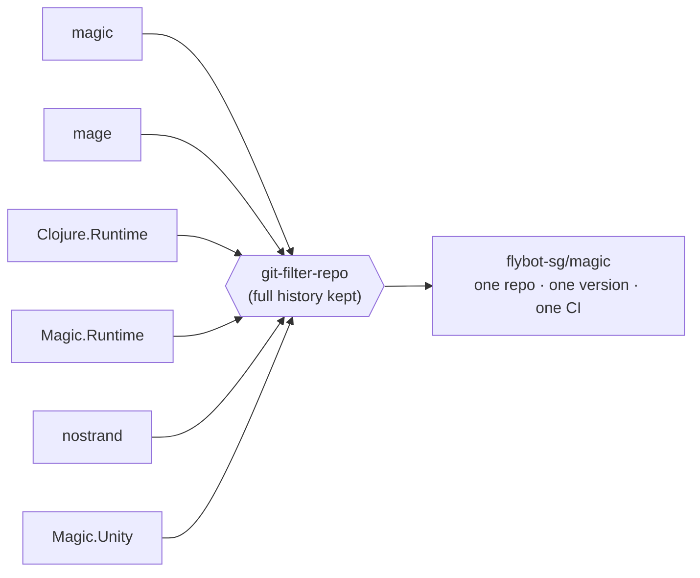
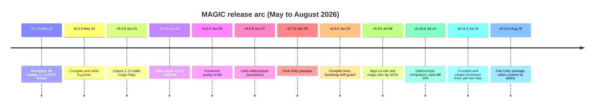
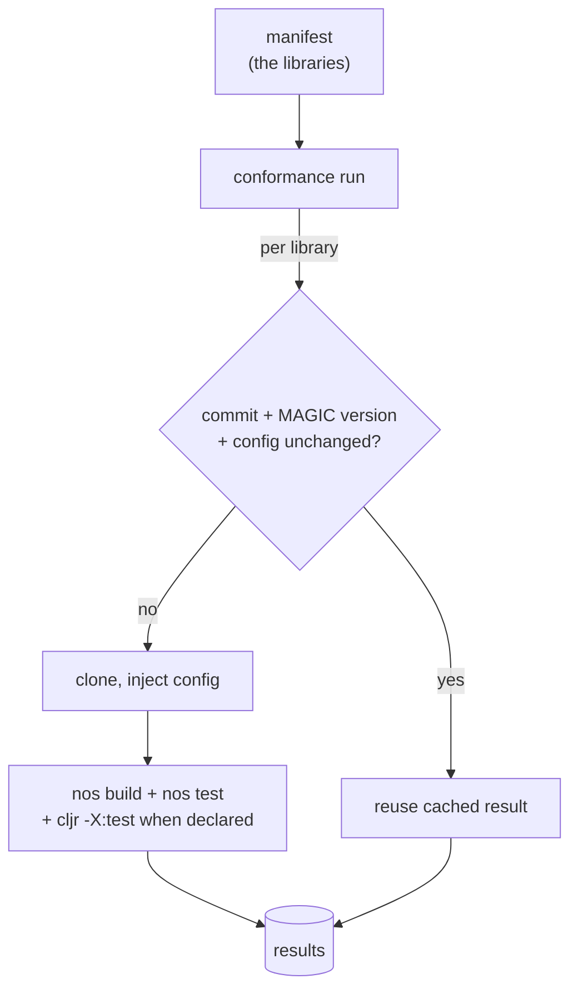

---
tags:
  - clojure
  - dotnet
  - unity
  - devops
  - magic
date: 2026-08-24
repos:
  - [magic, "https://github.com/flybot-sg/magic"]
  - [magic-conformance, "https://github.com/flybot-sg/magic-conformance"]
  - [ci-clj-clr, "https://github.com/flybot-sg/ci-clj-clr"]
  - [clojure-clr, "https://github.com/flybot-sg/clojure-clr"]
  - [rct-clr, "https://github.com/flybot-sg/rct-clr"]
rss-feeds:
  - all
  - clojure
---
## TLDR

MAGIC (Morgan And Grand Iron Clojure) compiles Clojure to .NET so we can run it in Unity, including on iOS. When its creator [Ramsey Nasser](https://nas.sr/about/) no longer had time to maintain it, I consolidated his six repositories into one monorepo under our [Flybot](https://github.com/flybot-sg) org. I then improved the tooling around the compiler, which helped me fix bugs faster, and improved the integration in Unity, which was the whole point of the compiler in the first place. This article is about the decisions behind all that, not how the compiler works.

## Rationale

MAGIC (Morgan And Grand Iron Clojure) compiles Clojure to .NET so we can run it in Unity, including on iOS. When its creator [Ramsey Nasser](https://nas.sr/about/) no longer had time to maintain it, I consolidated his six repositories into one monorepo under our [Flybot](https://github.com/flybot-sg) org. I then improved the tooling around the compiler, which helped me fix bugs faster, and improved the integration in Unity, which was the whole point of the compiler in the first place. This article is about the decisions behind all that, not how the compiler works. The [docs](https://github.com/flybot-sg/magic/tree/main/docs) cover the how.
## ClojureCLR vs MAGIC

The first question is always why not just use [ClojureCLR](https://github.com/clojure/clojure-clr), [David Miller](https://github.com/dmiller)'s mature Clojure-to-.NET port, which runs well on desktop. Its dynamic dispatch goes through the [DLR](https://learn.microsoft.com/en-us/dotnet/framework/reflection-and-codedom/dynamic-language-runtime-overview) (Dynamic Language Runtime), which builds each call site by emitting IL at runtime through `System.Reflection.Emit`. IL is the bytecode the .NET runtime executes, so this is a form of JIT (Just-In-Time) compilation: new executable code is produced while the program runs.

The problem is that Unity's IL2CPP backend compiles everything to C++ **ahead of time**, so there is no runtime left to execute IL that was generated on the fly. iOS forces IL2CPP, because Apple forbids any third-party JIT, and Android forces it too, not through a JIT ban but because Google mandates 64-bit and Unity's Mono has no ARM64 build. Consoles have the same constraints. So ClojureCLR is just not an option if you want to build your Unity app for anything other than desktop, which is pretty much everybody really. That constraint is what pushed Ramsey to create his own compiler that writes all IL at build time, so the IL2CPP transpiler has everything it needs to generate its C++.
## How we use it at Flybot

At [Flybot](https://flybot.sg) we helped port a client's old Java game libraries to Clojure. Then, because we knew MAGIC already existed, we took on the harder task of making those Clojure libraries run as .NET DLLs inside Unity. The payoff is that the same game APIs run in both the server backend and the Unity frontend, written once. I worked closely with [Ramsey](https://github.com/nasser) across two stretches, first on performance and then on stability (the [earlier story](https://www.loicb.dev/blog/magic-compiler-and-nostrand-integration)), until those games shipped in production. I was doing the bug reporting, he was fixing the compiler.

The compiler worked fine for the most part, but the toolchain around it was painful. Six repositories, each with its own version and no shared release. Ramsey's time for it had become limited, so bugs could sit a while. And the internals were undocumented, with no public dev workflow, so contributing meant first reverse-engineering how the pieces fit. Our gaming platform frontend team actually came up with quite a few workarounds over the years. By the time I took over the compiler, their repos still carried patches just to get MAGIC to compile and integrate with Unity, both in the Clojure libs (ported to the CLR) and on the Unity side. I wanted to get rid of these patches by improving MAGIC directly, so everybody could benefit from it in the future.

## 1. Gather the six repos into one
The first step was to gather everything in one place so I could add proper project tasks, proper CI, and therefore a more convenient dev workflow.

A **monorepo** was the obvious choice here because these six repos always worked as one system. One version instead of six, one place to file bugs, and the freedom to land a compiler change, the runtime tweak it needs, and a stdlib fix in a single PR, instead of coordinating three separate repos. The diagram below shows the merge:


```mermaid
flowchart LR
    m1["magic"] --> gfr
    m2["mage"] --> gfr
    cr["Clojure.Runtime"] --> gfr
    mr["Magic.Runtime"] --> gfr
    no["nostrand"] --> gfr
    mu["Magic.Unity"] --> gfr
    gfr{{"git-filter-repo<br/>(full history kept)"}} --> mono["flybot-sg/magic<br/>one repo · one version · one CI"]
```

I used [git-filter-repo](https://github.com/newren/git-filter-repo) to merge the six trees while keeping every author and commit date, going all the way back to 2009 since the runtime carries David Miller's history from its ClojureCLR fork. So the history itself credits the extensive work of Ramsey, of David Miller, and of everyone who contributed.

It also lets anyone trace a bug back to the commit that introduced it. A human or an LLM can bisect far faster when the entire history of every piece sits in one place.
## 2. Build tooling instead of becoming a compiler expert

I am not a compiler expert but I still had a plan. The best move was to make the compiler understandable by anyone. Everything runs as a [Babashka](https://babashka.org/) (`bb`) task. I really like Babashka and it works very well for monorepos (see [Clojure Monorepo with Babashka](https://www.loicb.dev/blog/clojure-monorepo-with-babashka)).

In order to understand a bit more what is going on when I compile something, I created two tasks:
- `bb pipeline` walks a form through macroexpansion, the AST, and the symbolic IL
- `bb prepl-eval` runs a form against a live MAGIC runtime.

Between them, that is usually enough to see where something goes wrong without reading the compiler internals.

For example, for `(+ 1 2)`, `bb pipeline` shows how it compiles, walking the form through macroexpansion, the AST and the type stages down to the symbolic IL the emitter produces:

```bash
$ bb pipeline '(+ 1 2)'

================================================================
FORM   (+ 1 2)
================================================================

================================================================
MACROEXPAND
================================================================
(. clojure.lang.Numbers (add 1 2))

================================================================
AST (skeleton)
================================================================
{:args ...
 :method #object[RuntimeMethodInfo 0x6ab6fcd0 "Int64 add(Int64, Int64)"],
 :original ...
 :type System.Int64,
 :op :intrinsic,
 :il-fn #object[<magic>magic_intrinsics$add-mul-compiler__0 ...],
 :form (. clojure.lang.Numbers (add 1 2)),
 :target ...}

================================================================
TYPES (4 typed nodes)
================================================================
  :intrinsic (. clojure.lang.Numbers (add 1 2)) :: System.Int64
  :const 1 :: System.Int64
  :const 2 :: System.Int64
  :const clojure.lang.Numbers :: :class

================================================================
SYMBOLIC IL (3 instructions)
================================================================
  ldc.i8 1
  ldc.i8 2
  add.ovf
```

There is no Var lookup and no `IFn.invoke`: `+` inlines to the static `Numbers.add` call, which the compiler recognises as an **intrinsic**, a call it knows how to emit directly, so the whole form lowers to three CLR instructions. Very cool.

`bb prepl-eval` is the other half, running the same form on a live MAGIC runtime and handing back a structured reply:

```clojure
$ bb prepl-eval '(+ 1 2)'

{:tag :ret, :val "3", :ns "user", :ms 2.1492, :form "(+ 1 2)"}
```

With these two tasks, we can see both what the compiler emits, as pure data, and what it actually does, which is most of what I need to localise a bug. It also pays off with LLMs: given these two tasks, Claude Code finds the origin of a bug way faster than by digging through the compiler code. It is truly impressive.

There are quite a few other tasks, used in CI among other places; you can find more about them in [docs/development](https://github.com/flybot-sg/magic/blob/main/docs/development.md).

## 3. Drift check the bootstrapping

MAGIC is [bootstrapped](https://en.wikipedia.org/wiki/Bootstrapping_%28compilers%29), which means it uses a previous version of itself to compile its next version (see [docs/bootstrap](https://github.com/flybot-sg/magic/blob/main/docs/bootstrap.md)).
MAGIC commits the emitted DLLs alongside the Clojure source code and the C# runtime, so it can build the next version from these assemblies. Committing a bug fix therefore requires two things:
- the Clojure or C# source change
- the new DLLs that contain the fix

So I have a `bb check-drift` task that checks that nothing is stale (including that the DLLs were regenerated, among other things). I just needed to be sure the new DLLs were committed alongside the source change.

However, I could not easily know which DLLs were really affected by a source change, since they all came out different on every rebuild: the compilation was not deterministic. So I worked on making it deterministic (see the repo doc [Deterministic compilation and the drift check](https://github.com/flybot-sg/magic/blob/main/docs/deterministic-compilation.md)). This allowed me to byte-diff the DLLs! This is really valuable, because it means I can see exactly which DLLs are impacted by any source change.

More details on how I made the compiler deterministic and its caveats in the article: [Drift Checks for a Self-Hosting Compiler](https://www.loicb.dev/blog/drift-checks-for-a-self-hosting-compiler).

## 4. Catching IL2CPP bugs

Ramsey had told me that the IL2CPP documentation is sometimes incomplete and even wrong, so a lot of the behavior has to be inferred by testing and disassembling what it produces. The consequence: some code runs totally fine on Mono and fails only when we build with IL2CPP.

Rather than keep rediscovering those failures inside our large game projects, I built a [standalone Unity project](https://github.com/flybot-sg/magic/tree/main/unity-examples/magic-unity-smoke) that collects a minimal repro of every IL2CPP edge case we have hit so far: nine suites, 90 checks, all green on Mono and on a Standalone Mac IL2CPP build. Every time a fix is suspected to behave differently under IL2CPP, its repro lands in the suite in the same commit.

Example of divergence: overriding `ToString` on an anonymous object like so:

```clojure
(.ToString
 (reify System.Object
   (ToString [_] "from reify")))
;; Mono: "from reify"
;; IL2CPP: the build itself dies
```

MAGIC emitted the reify class with `System.Object` listed both as its base type and in its interface list, which is invalid metadata, since `Object` is a class, not an interface. Mono loads the class without a word and runs it correctly. UnityLinker, the code stripper Unity runs during every IL2CPP build, walks that interface list to mark methods, meets the class's own base type there, and recurses until it overflows its stack. The build dies before producing a player, so no test that runs on Mono can ever see this bug: only an actual IL2CPP build surfaces it.

The suite is the one piece that does not run in CI, because the IL2CPP build needs a machine with Unity installed. So I run it by hand after any suspect fix.

## 5. Foundation first, then the backlog

Only with the monorepo, tooling, CI, and smoke suite in place did I start on the bugs that had been open on Ramsey's repos for years. Each commit references the issue it closes, including the original `nasser/*` numbers, and the conventions in `CONTRIBUTING.md` mean a human or an LLM can file and fix without re-asking how we work.

The releases came fast once the base held:


```mermaid
timeline
    title MAGIC release arc (May to August 2026)
    v0.1.0 May 22 : Monorepo, bb tooling, CI, IL2CPP smoke
    v0.2.0 May 23 : Compiler and stdlib bug fixes
    v0.3.0 Jun 01 : Clojure 1.10 stdlib, magic.flags
    v0.4.0 Jun 04 : Native deps.edn in Nostrand
    v0.5.0 Jun 04 : Consumer quality-of-life
    v0.6.0 Jun 07 : Unity editor/player coexistence
    v0.7.0 Jun 09 : Dual Unity package
    v0.8.0 Jun 24 : Compiler fixes, bootstrap drift guard
    v0.9.0 Jul 08 : deps-clr.edn and magic.edn, by-ref fix
    v0.10.0 Jul 14 : Deterministic compilation, byte-diff drift
    v0.11.0 Jul 24 : Constant and integer-promotion fixes, per-test skip
    v0.12.0 Aug 18 : One Unity package, editor runtime by define
```

Versioning is one `version.edn`, and `bb tag` creates the tag that a CI job turns into a published release tarball on GitHub. One command, and a release builds and ships itself with nothing done by hand. That predictable, hands-off release path is what the single shared repo finally makes possible. Per-release detail is in the [CHANGELOG](https://github.com/flybot-sg/magic/blob/main/CHANGELOG.md).

I was happy to see that for the first time, I was able to use David Miller's [clr.test.check](https://github.com/clojure/clr.test.check) as is with MAGIC! Before, I had to comment out its `clojure.core` require and rewrite every `core/let` to its fully qualified form, just to dodge a MAGIC bug. After the v0.2.0 fixes, his port compiled under MAGIC with zero source patches, sooner than I expected. Then, testing against our own libraries, I found that some workarounds were still necessary, because MAGIC had never been fully ported to Clojure 1.10. So v0.3.0 filled that gap and put every compiler option behind one `magic.flags` namespace.

So latent bugs were fixed and Clojure 1.10 fully ported: good progress. And yes, Claude Code clearly helped me find bug sources and suggest fixes, using the bb tasks I made it write when I took over the repo.

## 6. Managing dependencies

MAGIC is one of these old projects that predate `deps.edn`! So Ramsey made his own resolver that reads a `project.edn`. [Nostrand](https://github.com/flybot-sg/magic/tree/main/nostrand) is the runtime environment that loads MAGIC and executes tasks (via `nos`), including the deps resolver. Since MAGIC was more stable and on par with Clojure 1.10, it was the right time to modernise its dependency handling: get rid of the dedicated `project.edn` deps files and support `deps.edn`.

The obvious first task was to adopt David Miller's CLR port of `tools.deps` ([clr.tools.deps](https://github.com/clojure/clr.tools.deps)), but it did not load as-is on MAGIC's Clojure 1.10 base: `.cljr` files were not recognized yet, and it calls a few stdlib functions newer than 1.10. Adopting it meant maintaining a compat fork and re-applying the patches on every upstream sync, which was not worth it.

Our need was narrow anyway: resolve git and local coordinates transitively, skip Maven, and authenticate through the developer's own git and SSH config. So I wrote my own resolver first, then aligned it with the ClojureCLR conventions.

### A native `deps.edn` resolver (v0.4.0, v0.5.0)

I added native `deps.edn` resolution, one file for both JVM and CLR runtimes, with a `:clr` alias that swaps a JVM library for its CLR fork via `:override-deps`. It worked well, and I found it quite clean to have a dedicated alias carry the JVM-only / CLR-only mapping. However, that was not how the existing ClojureCLR community did it. David Miller's convention is a dedicated `deps-clr.edn` file that is read in place of `deps.edn`. It is a bit more verbose, but it is convenient for loading different paths per platform, notably a precompiled-assembly loader namespace that the CLR must load and the JVM must ignore.

### `deps-clr.edn`, the file the CLR community already writes (v0.9.0)

David Miller's [`cljr`](https://github.com/clojure/clr.core.cli), the ClojureCLR CLI, reads a [`deps-clr.edn`](https://github.com/flybot-sg/magic/blob/main/docs/clr-dependency-files.md) in place of `deps.edn` when it is present, and that is where the CLR community already writes its CLR-specific dependencies. So I made `nos` prefer it the same way. Now both the `cljr` and `nos` CLIs resolve `deps-clr.edn`, so a library already ported to the CLR for ClojureCLR builds the same with `nos` (assuming no core functions above 1.10). This was a necessary milestone to unify the effort of porting libraries to the CLR. I recently ported [robertluo/fun-map](https://github.com/robertluo/fun-map) to the CLR: it carries a `deps-clr.edn` and its CI runs the tests with ClojureCLR, matching the existing convention. And `fun-map` also builds with MAGIC as is, which is really nice.

The CLR dependency flow is documented in [docs/clr-dependency-files](https://github.com/flybot-sg/magic/blob/main/docs/clr-dependency-files.md).

### `magic.edn`, build and test config (v0.9.0)

However, for the test runner, I could not follow the ClojureCLR way. We could not use David Miller's CLR port of Cognitect's [test-runner](https://github.com/dmiller/test-runner) because its dependency chain bottoms out in `clr.tools.reader`, which reads record literals through runtime reflection (ClojureCLR's `Reflector` class), and MAGIC deliberately ships no runtime reflection since that is exactly what IL2CPP forbids.

The other MAGIC-only file was the `dotnet.clj` build helper. So `nos build` and `nos test` became built-in tasks that read an optional `magic.edn`, a small map where a project states only what differs from the defaults. A library that needs no tweaks omits the file; the hand-written `dotnet.clj` is gone.

So a lib still specifies the `io.github.dmiller/test-runner` port in its test deps to run tests with `cljr`, and adds a small `magic.edn` file at its root to run them with `nos`.

The full guide is in [docs/porting-libraries-to-magic.md](https://github.com/flybot-sg/magic/blob/main/docs/porting-libraries-to-magic.md).

## 7. The right runtime per phase, in Unity

With consumers able to build and depend on CLR libraries cleanly, the last piece left was the one we actually ship into. The right arrangement was not my idea: [Hong](https://github.com/hongheng), an engineer on our client's Unity team, had arrived at it out of necessity:
Run **ClojureCLR in the editor**, where it compiles Clojure from source in memory so hot reload works, and run **MAGIC only in the player build**, where its static IL is what IL2CPP needs. I wanted this setup in a UPM package that ships both runtimes with the proper `defineConstraints` in their `.meta` files, to avoid conflicts in the Unity editor.

This took some time and was actually only available in version 0.12.0. My first draft was one package that ships MAGIC only, meant to be used in both the editor and the player build. The downside of course was that it was slow, because changing a Clojure source file required a full AOT compilation and reset the scene on every change.

So then, since the Unity team was using a fork of ClojureCLR 1.11 in the editor, I generated a second package variant whose MAGIC DLLs carry a `!UNITY_EDITOR` constraint, so the editor never loads them and their ClojureCLR DLLs work as usual.

This was not ideal of course, so a colleague of mine looked into packaging both runtimes while letting the Unity consumer project choose which one the editor loads. The solution was a single scripting define symbol, `MAGIC_RUNTIME_IN_EDITOR`, whose constraint applies to the MAGIC DLLs, the ClojureCLR DLLs, and, through a reconcile pass after each domain reload, to any ported Clojure libs present under `Assets/Plugins`.

We actually had to fork ClojureCLR to fix a few bugs, for reasons I detail further down this article.

The consumer setup is documented in [docs/unity-integration.md](https://github.com/flybot-sg/magic/blob/main/docs/unity-integration.md).

## 8. Test each version of MAGIC on 30+ repos

My goal was to be able to compile with MAGIC all the libs our Unity gaming platform depends on, without custom forks carrying workarounds just to make them compile. I wanted to be able to use David Miller's CLR ports right away (as long as they use no features above Clojure 1.10), and to run rich comment tests (RCT) on the CLR, since most of our recent internal libraries use them for unit tests.

### rct-clr: rich comment tests on the CLR

[rich-comment-tests](https://github.com/robertluo/rich-comment-tests) puts a function's example calls and their expected results in a `(comment ...)` block and runs them as assertions, keeping the documentation and the tests as one thing. The problem is that the library relies heavily on the JVM, so it is not easy to port with just interop. So my colleague [Parth](https://github.com/parth-io) had the idea to extract the assertions on the JVM and emit a plain `.cljc` file of ordinary `deftest`s, which `nostrand` can run. That became [rct-clr](https://github.com/flybot-sg/rct-clr): the `(comment ...)` blocks stay the single source of truth, and the CLR runs the very same assertions as the JVM, just in a generated file of `deftest`s instead of via the RCT runner.

### magic-conformance: does it still build under MAGIC?

While working on MAGIC, I want to be sure that all the libs our gaming platform depends on compile and test OK on the latest MAGIC release. So I wanted an easy way to rebuild and re-run the tests of each of our libs in these two scenarios:
- the MAGIC version got bumped: I want to be sure there is no regression
- a lib SHA moved: I want to be sure it still compiles with MAGIC

[magic-conformance](https://github.com/flybot-sg/magic-conformance) is a runner that reads a manifest of libraries and, for each, clones it and runs its `nos build` and `nos test` on the [ci-clj-clr](https://github.com/flybot-sg/ci-clj-clr) image, which carries the JVM, MAGIC, and ClojureCLR toolchains. A manifest entry can also carry an inline `magic.edn` or `deps-clr.edn`, which the runner writes into the clone when the library ships none of its own.


```mermaid
flowchart TD
    L["manifest<br/>(the libraries)"] --> R["conformance run"]
    R -->|per library| S{"commit + MAGIC version<br/>+ config unchanged?"}
    S -->|yes| K["reuse cached result"]
    S -->|no| A["clone, inject config"] --> B["nos build + nos test<br/>+ cljr -X:test when declared"]
    B --> W[("results")]
    K --> W
```

The public repo ships the runner with a small green example manifest, a few public libraries such as [fun-map](https://github.com/robertluo/fun-map) that build under MAGIC straight from upstream. Internally, we run magic-conformance on around 30 repos to be sure they compile with both MAGIC and our fork of ClojureCLR 1.11.

It is not every open source library being recompiled, like Rust does with its [Crater](https://rustc-dev-guide.rust-lang.org/tests/crater.html), but that is a good start!

### Our fork of clojure-clr
To recap our setup, we actually need three compilers:
- JVM Clojure on the server
- `ClojureCLR` in the Unity **editor**
- `MAGIC` in the Unity **player** build

In one MAGIC release, I shipped a fix for a bug where datafied class names came out in their short form (`String`) where the JVM uses the fully qualified name (`System.String`). JVM and MAGIC tests were green, so a consumer lib deleted its own datafy workaround. Then a Unity dev reported that their editor broke: ClojureCLR has the same datafy bug, and ClojureCLR is what runs in the editor, so the editor hit the bug the workaround had been hiding, while player builds stayed green. That is when I realised that for this dual CLR compile workflow to work in Unity, I needed to guarantee similar behaviour from both compilers.

So I forked ClojureCLR 1.11 (the version the client was using) into [flybot-sg/clojure-clr](https://github.com/flybot-sg/clojure-clr), and with my colleague we added a few things:

- the post-1.11 backports the `cljr` CLI needs to run
- later fixes David Miller shipped upstream, backported to 1.11
- our own fixes (including the `datafy` fix mentioned above), found while running ClojureCLR next to MAGIC

I also added ClojureCLR to our [ci-clj-clr](https://github.com/flybot-sg/ci-clj-clr) image, so clients can run their backend libs with `cljr` and my conformance check can run all our libs with `cljr` as well.

## 9. Documentation

I tried to have an LLM generate the docs for me, and it was bad. So I did almost all of it manually first, and let the LLM fix the usual typos and generate the Mermaid diagrams, because diagrams help me understand. So the doc is written for humans and understood by LLMs.

| Document | What it covers |
|---|---|
| [`docs/`](https://github.com/flybot-sg/magic/tree/main/docs) | why MAGIC exists, porting a library, cross-platform `.cljc`, and the Unity integration |
| Component READMEs | what each piece is, with the Clojure version, runtimes, and Unity version it is tested against |
| [CHANGELOG](https://github.com/flybot-sg/magic/blob/main/CHANGELOG.md) | one entry per release, every issue it closes (including the upstream `nasser/*` numbers) |

Internally, I made a Claude Code plugin with skills to port a lib to the CLR with both MAGIC and ClojureCLR. I have not made it public yet, because I am aware of the skepticism of some in the Clojure community about LLMs, and I am still polishing it anyway. The skills mainly refer to the docs of the magic repo, so it should be easy for anybody to write their own. ClojureCLR is the reference compiler and the most up to date with upstream Clojure, so when I port an open source lib to the CLR, I use `cljr` and not `nos`. For people who want to run their Clojure lib in Unity, I advise using our [ci-clj-clr](https://github.com/flybot-sg/ci-clj-clr) image and running the tests on both compilers.

## What is next

The next real effort is dropping Mono for CoreCLR, which Unity is moving to and which Nostrand still predates. We also plan on porting Clojure 1.11.