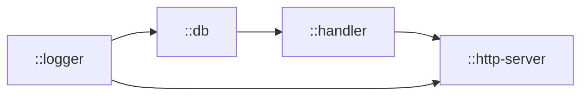
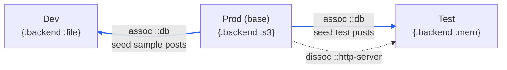
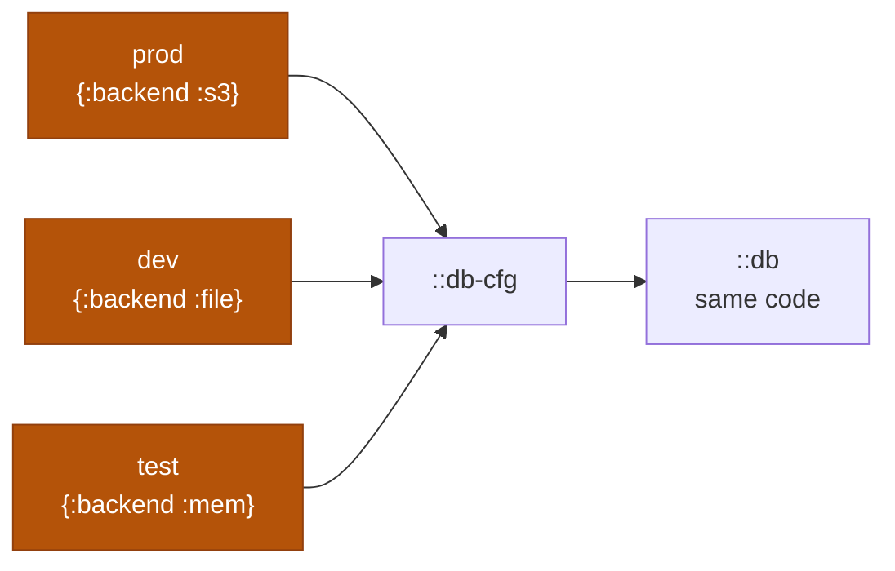
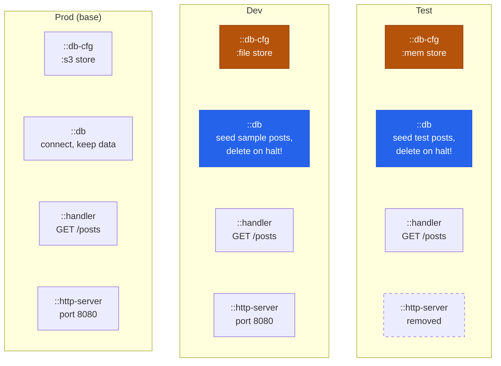

---
tags:
  - clojure
  - architecture
  - fun-map
  - web
  - lasagna-pattern
date: 2026-02-17
repos:
  - [fun-map, "https://github.com/robertluo/fun-map"]
  - [lasagna-pattern, "https://github.com/flybot-sg/lasagna-pattern"]
rss-feeds:
  - all
  - clojure
---
## TLDR

[Fun-map](https://github.com/robertluo/fun-map) turns a Clojure map into an associative dependency injection system: the system is a map, components are entries, and each runtime mode is an `assoc` (or `dissoc`) on the base map. This article grows a minimal blog API with Datahike and http-kit from hardcoded values to three modes (prod, dev, test) with no mode conditional inside any component, and draws the line between what deserves to be a component and what is just config.

## The problem

A web app never runs in just one shape. In production, the database must keep its data across restarts. During development you want the opposite: sample data seeded on startup and wiped on shutdown, so every restart gives you the same reproducible state. And in tests you want an in-memory database and no HTTP server at all, because tests call the handler directly.

The wrong answer is a `dev?` flag threaded through the code, with each component checking it: one `if` around the seeding, one around the teardown, one around the server. Every new mode multiplies the branches, and every component has to know about every mode. This is a very bad practice: the component that manages the database connection should not care which environment it runs in.

Underneath sits an older problem: those components (database connection, HTTP server, logger) are stateful, depend on each other, and must start and stop in order. Stuart Sierra framed it well in his [Components: Just Enough Structure](https://www.youtube.com/watch?v=13cmHf_kt-Q) talk: stateful resources should not live as top-level defs scattered across namespaces. They need explicit lifecycle management and dependency ordering.

The Clojure community has several answers, each with different tradeoffs:

| Library | System definition | Component definition | Overriding for dev/test |
|---------|-------------------|---------------------|--------------------------|
| [Component](https://github.com/stuartsierra/component) | `system-map` + `using` declarations | `Lifecycle` protocol, in practice defrecords | `assoc` a replacement into `system-map` (`Lifecycle` optional, no-op by default) |
| [Integrant](https://github.com/weavejester/integrant) | config map, typically EDN | `defmethod init-key` / `halt-key!` | profiles (`#ig/profile` per environment) |
| [Mount](https://github.com/tolitius/mount) | implicit (global `defstate` vars) | `defstate` with `:start`/`:stop` | `start-with` / `swap-states` substitutions |
| [Fun-map](https://github.com/robertluo/fun-map) | a regular Clojure map | plain functions (`fnk` + `closeable`) | `assoc` on the map |

Fun-map, created by [Robert Luo](https://github.com/robertluo), takes the simplest possible position: **the system is a regular Clojure map**. Values can be plain data or `fnk` functions that declare dependencies on other keys, and `life-cycle-map` adds startup and shutdown ordering. That is the entire model. I call it **associative dependency injection**: components declare what they need as map keys, the map resolves and caches them, and swapping an implementation is an `assoc`, not a framework feature.

To show it, I will build the smallest system that still has real moving parts, a posts API with persistence ([Datahike](https://github.com/replikativ/datahike)), logging ([mulog](https://github.com/BrunoBonacci/mulog)) and an HTTP server ([http-kit](https://github.com/http-kit/http-kit)), and grow it in steps: values hardcoded first, then every value as a map entry, then config at the construction step, and finally the three modes via `assoc` and `dissoc`. It is a boiled-down version of [flybot-site](https://github.com/flybot-sg/lasagna-pattern/tree/main/examples/flybot-site), our blog platform example in the lasagna-pattern repo, and I come back to the full-size system at the end.

## A system as a map

The app serves one endpoint, `GET /posts`, which returns every post in the database as EDN. In production the database should live somewhere durable: Datahike decouples the data model from the storage backend, and [datahike-s3](https://github.com/replikativ/datahike-s3) adds an `:s3` backend (requiring `datahike-s3.core` registers it), so the database lives in an S3 bucket. Here is the entire backend, every value hardcoded on purpose; the next sections fix that step by step:

```clojure
(ns blog.system
  (:require [com.brunobonacci.mulog :as mu]
            [datahike.api :as d]
            [org.httpkit.server :as http-kit]
            [robertluo.fun-map :refer [fnk life-cycle-map closeable touch halt!]]))

(def schema
  [{:db/ident :post/title   :db/valueType :db.type/string :db/cardinality :db.cardinality/one}
   {:db/ident :post/content :db/valueType :db.type/string :db/cardinality :db.cardinality/one}])

(defn all-posts [db]
  (d/q '[:find [(pull ?e [:post/title :post/content]) ...]
         :where [?e :post/title]]
       db))

(def system
  (life-cycle-map
   {;;--- Logger: started first, stopped last
    ::logger
    (fnk []
      (let [stop-fn (mu/start-publisher! {:type :console})]
        (closeable {:log (fn [event data] (mu/log event data))}
                   stop-fn)))

    ;;--- Database connection: keeps its data on halt!
    ::db
    (fnk [::logger]
      (let [db-cfg {:store {:backend :s3
                            :bucket "blog-db"
                            :region "ap-southeast-1"
                            :store-id "blog"}
                    :schema-flexibility :write}]
        (when-not (d/database-exists? db-cfg)
          (d/create-database db-cfg))
        (let [conn (d/connect db-cfg)]
          (d/transact conn schema)
          (mu/log ::db-connected :backend :s3)
          (closeable {:conn conn}
                     #(d/release conn)))))

    ;;--- Ring handler
    ::handler
    (fnk [::db]
      (fn [{:keys [request-method uri]}]
        (if (and (= :get request-method) (= "/posts" uri))
          {:status  200
           :headers {"Content-Type" "application/edn"}
           :body    (pr-str (all-posts @(:conn db)))}
          {:status 404 :headers {} :body "not found"})))

    ;;--- HTTP server
    ::http-server
    (fnk [::handler ::logger]
      (let [stop-fn (http-kit/run-server handler {:port 8080})]
        (mu/log ::server-started :port 8080)
        (closeable {:port 8080}
                   stop-fn)))}))
```

Three fun-map primitives do all the work:

- **`fnk`**: a function that destructures its dependencies from the map. `(fnk [::db] ...)` declares that this component needs `::db`, and its result is cached (recomputed only if the dependencies' values change).
- **`closeable`**: wraps a value with a teardown function. Values are deref'd automatically on lookup, so callers never see the wrapper.
- **`life-cycle-map`**: makes the map lazy and ordered. Accessing a key starts its transitive dependencies, `touch` forces every entry, and `halt!` tears down every started `closeable` in reverse creation order, and only the ones that actually started.

One dependency deserves a comment: `::logger`. mulog buffers events in memory (a 1000-slot ring buffer), so a publisher started late still delivers them; but a publisher that never starts delivers nothing, and in a lazy map nothing starts unless something depends on it. So every component that calls `mu/log` in its body declares `::logger`, here `::db` and `::http-server`; `::handler` does not log, so it does not declare it. None of them read the logger value. An fnk argument expresses two things at once, a value to inject and a happens-before constraint, and this is a case where you only want the second. Call it an **ordering-only dependency**: the key is declared for its setup, not its value. Technically `::db` already drags the logger in before the server starts, but that transitive guarantee is one `assoc` away from breaking: replace `::db` with an implementation that skips the dependency and the lazy map may never start the publisher at all. Declare what you use. Teardown needs no such care: the logger is created first, so `halt!` stops it last.



Running it takes one expression per direction:

```clojure
;; Access a key to start it and its transitive dependencies
(::http-server system)
;=> {:port 8080}

(slurp "http://localhost:8080/posts")
;=> "[]"

;; Stop everything that was started, in reverse order
(halt! system)
;=> nil
```

The laziness is real: `(::handler system)` would start the logger and the database but never bind a port. And the response is an empty vector because production starts with whatever is in the bucket, here nothing yet.

One gotcha before moving on: fun-map derefs any `IDeref` value on lookup, which is what makes `closeable` transparent. But a Datahike connection is itself deref-able, so putting it directly in a `closeable` would hand components the database value instead of the connection. That is why `::db` wraps it in a plain map, `{:conn conn}`. It bit us once; now you know.

## Everything as an entry?

The hardcoded values are the itch: the port, the store, the log publisher are frozen into their components. Since the system is a map, the uniform move is obvious: promote every value to an entry, and let components declare them like any other dependency:

```clojure
(def system
  (life-cycle-map
   {;;--- Every value promoted to an entry
    ::port          8080
    ::db-store      {:backend :s3 :bucket "blog-db"
                     :region "ap-southeast-1" :store-id "blog"}
    ::log-publisher {:type :console}

    ::logger
    (fnk [::log-publisher]
      (let [stop-fn (mu/start-publisher! log-publisher)]
        ...))

    ::db
    (fnk [::db-store ::logger]
      (let [db-cfg {:store db-store :schema-flexibility :write}]
        ...))

    ::handler
    (fnk [::db]
      ...)

    ::http-server
    (fnk [::handler ::port ::logger]
      (let [stop-fn (http-kit/run-server handler {:port port})]
        ...))}))
```

To be fair, this works, and at this scale it is even pleasant: the whole system is inspectable, `(::port system)` answers from the REPL, and any entry can be overridden with `assoc`. If the example stopped here, so could the article.

It stops working when the system grows, for two reasons. First, the fnk argument vector is the best documentation the system has: `(fnk [::db ::logger] ...)` reads as "downstream of the database and the logger". Promote every constant and that signal drowns. flybot-site's `::ring-app` has a handful of real dependencies; with every constant promoted, its fnk would declare a dozen keys and the dependency graph would disappear into the noise. Second, every entry is part of the system's **override surface**: anything in the map can be `assoc`'d over by a variant system and depended on by other components. Did anyone design `::log-publisher` as an extension point, or did it just land there? And notice there is no stopping rule: why not the route path, the content type, the 404 body? Every literal in the code is a candidate, and uniformity gives you no place to draw the line.

## Config at the door

The fix is to give plain values their own door. The constructor takes a config map, and a value survives as an entry only if another component or a variant system will read or replace it. Everything else becomes a plain local, a private constant of its component:

```clojure
(defn make-base-system
  [{:keys [port db-store]
    :or   {port 8080}}]
  (life-cycle-map
   {;;--- Entries: only what is shared or overridable
    ::port   port
    ::db-cfg {:store db-store :schema-flexibility :write}

    ::logger
    (fnk []
      (let [stop-fn (mu/start-publisher! {:type :console})]
        ...))

    ::db
    (fnk [::db-cfg ::logger]
      (when-not (d/database-exists? db-cfg)
        (d/create-database db-cfg))
      ...)

    ::handler
    (fnk [::db]
      ...)

    ::http-server
    (fnk [::handler ::port ::logger]
      ...)}))

(def prod-config
  {:db-store {:backend :s3
              :bucket "blog-db"
              :region "ap-southeast-1"
              :store-id "blog"}})

(def sys (make-base-system prod-config))
```

The log publisher went back inside its component: one consumer, never overridden, noise in the graph. `::db-cfg` stays an entry and earns its place in the next section, when a second implementation of `::db` needs to read the same store config. And `::port` I keep as an entry frankly out of convenience: `(::port sys)` is the first question I ask a running system in the REPL, and a plain data entry costs nothing.

The deeper point is the distinction this door creates. A **component** is an entry with a lifecycle: it starts, holds a resource, and tears down, so it earns an `fnk` and a place in the graph. **Config** is inert data that parameterizes those components. The constructor is also where derivation happens (the full Datahike config is assembled from the raw `:db-store` value), and where validation belongs: flybot-site runs its config map through a [Malli](https://github.com/metosin/malli) schema right there. To be honest, validation alone does not force this design; you could just as well validate a config map before assoc'ing its values onto a base system. The decisive arguments are the two from the previous section: a readable dependency graph, and an override surface someone actually designed.

## Modes via assoc and dissoc

Now the payoff. `make-base-system` produces prod, and since the result is a map, another mode is map manipulation: `assoc` replaces a component, `dissoc` removes one.

For development we want sample posts seeded on startup and the whole database wiped on shutdown, so every restart is reproducible. That is not a different **config** value, it is different **behavior**: different startup effects, different teardown. So it is a component, and we swap it:

```clojure
(def sample-posts
  [{:post/title "Hello fun-map" :post/content "The system is a map."}
   {:post/title "Modes via assoc" :post/content "Dev is prod with one entry swapped."}])

(defn make-seeded-db
  "On touch: recreate the db and seed it. On halt!: delete it."
  [posts]
  (fnk [::db-cfg ::logger]
    (when (d/database-exists? db-cfg)
      (d/delete-database db-cfg))
    (d/create-database db-cfg)
    (let [conn (d/connect db-cfg)]
      (d/transact conn schema)
      (d/transact conn posts)
      (mu/log ::db-seeded :posts (count posts))
      (closeable {:conn conn}
                 #(do (d/release conn)
                      (d/delete-database db-cfg))))))

(defn make-dev-system [config]
  (-> (make-base-system config)
      (assoc ::db (make-seeded-db sample-posts))))
```

That is the whole mode. The override is a real component: it declares its own dependencies (`::db-cfg`, `::logger`) and its own teardown, and since `::handler` only knows it needs a `::db`, nothing downstream changes. This is also where `::db-cfg` pays for its entry: the seeded implementation reads the same store config from the map, no re-plumbing. On a laptop, a local `:file` store replaces the bucket, and that swap is config, not code:

```clojure
(def dev-sys (make-dev-system {:db-store {:backend :file :path "blog-db-dev"}}))

(::http-server dev-sys)
;=> {:port 8080}

(slurp "http://localhost:8080/posts")
;=> "[{:post/title \"Modes via assoc\", ...} {:post/title \"Hello fun-map\", ...}]"

(halt! dev-sys)   ; server stopped, database deleted
```

Note what did not happen: `make-base-system` was not touched, and no component checks a `dev?` flag. The base `::db` keeps its data because that is what production needs; the dev `::db` wipes because that is what development needs. Each behavior lives in exactly one place.

Tests want the same reproducible seeding with their own fixture data, an isolated in-memory database, and no HTTP server, since tests call the handler directly. `make-seeded-db` is already parameterized, so the test system seeds its own posts, and the server entry is simply removed:

```clojure
(def test-posts
  [{:post/title "Fixture post" :post/content "Isolated in memory."}
   {:post/title "Another one" :post/content "Wiped after each test."}])

(defn make-test-system []
  (-> (make-base-system {:db-store {:backend :mem :id "blog-test"}})
      (assoc ::db (make-seeded-db test-posts))
      (dissoc ::http-server)))
```

A mode can not only replace entries, it can remove them. With `::http-server` gone, no port is ever bound, and nothing downstream complains because nothing depended on it. The derivation picture is now complete, and the diagram below shows it: each mode sits one expression away from the base, blue arrows for `assoc`, a dashed arrow for `dissoc`, and each system's store config under its name:



Notice what is not an arrow: the `{:backend :mem}` in the test constructor. It replaces no component, it is config flowing through the door from the previous section. Both mechanisms are now in play, so let's compare the three systems properly.

## Prod vs dev vs test

Prod vs dev is two differences of two different kinds. The store config differs (`:s3` vs `:file`): config data through the constructor. And `::db` differs in behavior (keep data vs seed and wipe): a component swap. Prod vs test goes one step further on each axis: `:mem` store config, its own seeded `::db`, and one entry fewer.

The config axis deserves its own diagram, because it is easy to under-appreciate: three environments, one entry, and whichever `::db` implementation is in place runs the exact same code against it:



The component axis shows up at test time as the fixture trick. The system is a value, so the fixture builds a fresh one per test: `touch` forces every remaining entry (logger, database, handler), and `halt!` tears down in reverse order. The handler is just a function, so a test calls it with a request map:

```clojure
(ns blog.system-test
  (:require [blog.system :as sys]
            [clojure.edn :as edn]
            [clojure.test :refer [deftest is use-fixtures]]
            [robertluo.fun-map :refer [touch halt!]]))

(def ^:dynamic *sys* nil)

(defn with-system [f]
  (let [sys (sys/make-test-system)]
    (try
      (touch sys)
      (binding [*sys* sys] (f))
      (finally (halt! sys)))))

(use-fixtures :each with-system)

(deftest posts-endpoint-test
  (let [handler  (::sys/handler *sys*)
        response (handler {:request-method :get :uri "/posts"})]
    (is (= 200 (:status response)))
    (is (= 2 (count (edn/read-string (:body response)))))))
```

No test framework glue, no special test double. The system is a value: `touch` starts it, `halt!` stops it, and the `:mem` backend isolates each run. Since nothing is global, several systems can coexist in the same JVM, which is what parallel tests need.

The rule of thumb: if you are tempted to write `if dev?` inside a component, the override should be an `assoc`. If the `if` would only pick between two harmless values, it is config. Security-sensitive values deserve a promotion from config to override: in flybot-site, the `:secure` cookie flag is deliberately absent from the config schema, so no environment variable can weaken production cookies. The only way to get insecure cookies is to construct a dev system.

The recap diagram below puts the three systems side by side with both mechanisms in play. Every entry shows its value in that mode: blue entries are components replaced via `assoc`, amber entries are config value changes, and the dashed entry is removed via `dissoc`. Everything unhighlighted is the same map, and every highlighted entry traces back to exactly one line in a constructor:



## Why not the alternatives

**vs. [Component](https://github.com/stuartsierra/component)**: components implement the `Lifecycle` protocol, in practice as defrecords (metadata extension exists since 0.4.0, but records remain the documented convention). Defining a record type just to hold a database connection is ceremony fun-map does not ask for: a `fnk` returning a `closeable` is a plain function.

**vs. [Integrant](https://github.com/weavejester/integrant)**: the system is split between a config map (typically EDN) and `init-key`/`halt-key!` multimethods in other namespaces. With fun-map the system definition is the implementation: dependency graph, startup logic, and teardown all in one place.

**vs. [Mount](https://github.com/tolitius/mount)**: state lives in global `defstate` vars, so two systems cannot coexist in one JVM with mount alone (its docs point to a companion library, [Yurt](https://github.com/tolitius/yurt), for that). A fun-map system is a local value, so a fresh system per test fixture comes for free.

The deeper win is the `assoc` composition. The production `::db` never checks `if dev?`; the dev system replaces it entirely. Each component does one thing, and modes are defined in exactly one place, the system constructors.

## A real-world example

The real [flybot-site](https://github.com/flybot-sg/lasagna-pattern/tree/main/examples/flybot-site) system is this article's map with more entries: session config with secure cookies, Google OAuth middleware, an S3 upload handler, asset versioning. Its modes are prod, dev (auto-login user, insecure cookies) and dev-with-oauth2 (real login, insecure cookies), and each one is still a constructor with one or two `assoc` calls on the same base.
## Conclusion

- **A system is a map**: readable, inspectable in the REPL, and dependency injection is just map lookup
- **Components and config are different things**: a component has a lifecycle and effects and is swapped via `assoc`; a different value with the same behavior enters as config through the constructor
- **Entries are the override surface**: keep as entries only what is shared or overridable, close over the private constants
- **Three modes, no conditionals**: prod is the base, dev is one `assoc` away, test one `assoc` and one `dissoc`
- **No framework buy-in**: components are plain functions and `closeable` wrappers, not protocol implementations
- **Lazy startup**: access one key and only its transitive dependencies start; `halt!` stops only what started

Adding a mode is one constructor and one `assoc`. No component changes. That is the whole point.