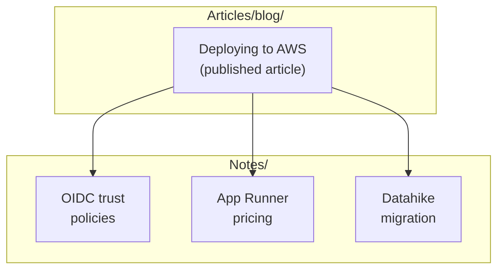
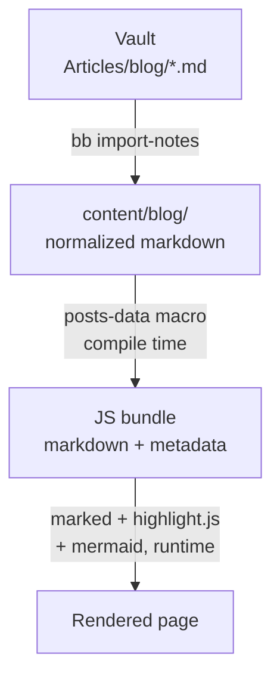

---
tags:
  - obsidian
  - web
  - portfolio
date: 2026-02-19
repos:
  - [me, "https://github.com/skydread1/me"]
rss-feeds:
  - all
---
## TLDR

My Obsidian vault is the single source of truth for my blog [loicb.dev](https://www.loicb.dev): articles live next to the working notes that informed them, and the website ([open source](https://github.com/skydread1/me)) is just a renderer. Frontmatter is the schema, the TLDR section becomes the home page preview and the RSS description, and mermaid diagrams render in Obsidian while writing and on the site theme-aware. Markdown files are the contract.

## Context

Most blog setups separate the content from the knowledge that produced it. You research in one tool, draft in another, publish through a third, and the published post ends up floating in isolation, disconnected from the investigation notes, design sketches, and code experiments that made it possible.

Every article on [loicb.dev](https://www.loicb.dev) started as notes: debugging sessions, architecture decisions, project retrospectives. The article is the polished output, but the notes are the working knowledge, and I wanted both in the same place, linked to each other, visible in the same graph. The website ([github.com/skydread1/me](https://github.com/skydread1/me)) should consume the markdown and render it. Nothing more.

In this article I will show how the vault is organized for publishing, how frontmatter and the TLDR section drive the website build, and how mermaid lets one diagram source render everywhere.

## Vault structure

Two vault directories matter for this article, one published, one private:

```
dev-notes/
├── Articles/
│   ├── blog/          # Published article sources
│   └── media/         # Images organized by article topic
├── Notes/             # Technical notes and learnings (never deployed)
└── CLAUDE.md          # Vault conventions
```

This tree is only a slice of the vault. The full vault holds much more (company docs, private work notes, dev logs), and [Claude Code and Obsidian for Note-Taking](https://www.loicb.dev/blog/claude-code-and-obsidian-for-note-taking) covers how the whole thing is organized and maintained.

`Articles/blog/` contains the markdown files that become blog posts. They are public-facing, so I review them for sensitive content before publication: no internal URLs, no credentials, no client-specific details. `Notes/` holds the working knowledge: quick references, gotchas, investigation results. Notes are never deployed.

Articles and notes are both plain markdown files in the same vault, so they share the same graph view, the same search, the same backlinks panel. The only difference is the directory, which decides whether a file gets published.

One convention keeps the two worlds aligned: **the filename is the title**. Obsidian displays the filename as the note title (so notes carry no H1 heading), and the website derives both the post title and its URL slug from that same filename. `Deploying a Clojure App to AWS with App Runner.md` becomes `/blog/deploying-a-clojure-app-to-aws-with-app-runner`. There is no `title` field to keep in sync because there is nothing to sync.

## Articles as connected notes

Every article ends with an `## Internal refs` section, wiki links to the vault notes that informed it:

```markdown
## Internal refs

- [[Lasagna Pattern Flybot Website]]
- [[Flybot Domain and Redirect Setup]]
```

In Obsidian, these links create edges in the graph view, so published articles and private notes show up as one connected graph instead of two separate collections. The diagram below shows the shape for an article about an AWS deployment:



The whole `Internal refs` section is stripped at import time, so the published post never exposes private notes. But the trail stays in the vault: when I open an article in Obsidian, the backlinks panel shows the raw research behind it and every other note that references it. Articles are not isolated documents; they are nodes in the same knowledge graph as everything else.

A wiki link in the article body behaves differently: it survives import, converted into a regular web link to the target's blog page. So body links must point to other published articles, while `Internal refs` can point anywhere in the vault.

### From note to article

Several articles started as vault notes that grew into something publishable. I take notes during development sessions, some accumulate enough substance, and the publishable version moves to `Articles/blog/` with a TLDR, proper structure, and polished prose. The original notes stay in `Notes/`, and the new article links back to them through `Internal refs`. The article is the curated version; the notes are the raw material.

## Frontmatter as schema

Every article carries YAML frontmatter that doubles as the schema for the website build:

```yaml
---
tags:
  - clojure
  - aws
date: 2026-02-17
repos:
  - [lasagna-pattern, "https://github.com/flybot-sg/lasagna-pattern"]
rss-feeds:
  - clojure
  - all
---
```

| Field | In the vault | On the website |
|-------|--------------|----------------|
| `tags` | Obsidian search, filtering | Tag filter on the home page |
| `date` | Chronological context | Sort order, display date |
| `repos` | Quick reference to related code | GitHub links on the article page |
| `rss-feeds` | Publication metadata only | Which RSS feeds include the post |

The site validates this at compile time with a [Malli](https://github.com/metosin/malli) schema. A missing or malformed field fails the build with an error naming the file, so a broken post can never reach production.

Tags follow a taxonomy documented in the vault's `CLAUDE.md` (languages, platforms, concepts, tools), and the same taxonomy applies to articles and notes. One vocabulary covers the whole vault, which also keeps the Obsidian graph coherent across all types of notes.

## TLDR extraction

Every article opens with a `## TLDR` section, one to three sentences summarizing it. The build extracts that section and reuses it in two places:

- the **vignettes** on the home page, the preview shown under each post title
- the description of each item in the RSS feeds

The extraction is a single regex: everything between the `## TLDR` heading and the next `##` becomes the post summary; the rest becomes the body. I write the summary once, in the article itself, and the build fans it out. No CMS field, no database column, no separate description file. The article is self-contained: frontmatter for structured data, TLDR for the summary, body for the content.

## Mermaid as the diagram format

For a long time my article diagrams were PNG exports from a drawing tool. That is the wrong format for a text-based pipeline: the source lives in some other tool, the export goes stale the moment the article changes, and the image ignores the reader's light or dark theme.

[Mermaid](https://mermaid.js.org/) fixes all three, because it is a text format that markdown tools have broadly standardized on. The diagram is a fenced code block inside the article, so it versions with the prose, and the same block renders everywhere:

- **Obsidian** renders it in preview while I write
- **the website** renders it with a self-hosted mermaid v11, loaded lazily only on pages that contain a diagram, and re-rendered live when the reader toggles light and dark mode
- **Notion** renders it too, which matters for the work content I publish there

The one rule the vault enforces is theme safety, no hardcoded colors, because the same source must stay legible on both light and dark backgrounds.

## From vault to page

The diagram below shows the full path from vault to rendered page (and it is itself a mermaid block that went through this exact pipeline):



The pipeline has two distinct steps:

1. **Import.** A [Babashka](https://babashka.org/) task, `bb import-notes <articles-dir>`, copies articles and media from the vault into the site repo and normalizes the Obsidian flavor away: it strips `Internal refs`, converts `[[wiki links]]` to web links, and rewrites `/assets/media/` paths to the site's asset paths. The normalization skips code blocks, so a Clojure destructuring form like `[[a b]]` in a snippet does not turn into a link.

2. **Build.** At compile time, a Clojure macro reads every markdown file, parses the frontmatter, extracts the TLDR, validates against the Malli schema, and embeds the raw markdown in the JS bundle. Rendering happens at runtime in the browser with [marked](https://github.com/markedjs/marked) and [highlight.js](https://highlightjs.org/), plus mermaid for diagram blocks.

This separation means:

- authoring happens entirely in Obsidian (or through Claude Code)
- the website has no CMS, no database, no API: it is a static SPA with all content embedded at compile time
- content and presentation are decoupled, so I can redesign the site without touching an article
- the vault is portable: if I switched to Hugo or Astro tomorrow, the markdown would work unchanged

**Markdown is the contract.** The vault owns the content; the site owns the rendering.

## The portfolio site

The site itself is a ClojureScript SPA built with [Replicant](https://github.com/cjohansen/replicant) and [shadow-cljs](https://github.com/thheller/shadow-cljs), hosted on Netlify, and open source: [github.com/skydread1/me](https://github.com/skydread1/me). `bb dist` produces a static `dist/` directory ready for hosting: the release JS bundle, the RSS feeds, and the media assets. Nothing runs server-side.

## Conclusion

- One vault, two purposes: working notes and published articles side by side, connected through wiki links
- `Internal refs` preserve the research trail in the vault and are stripped at import
- Frontmatter is the schema: tags, date, repos, and RSS membership, validated by Malli at compile time
- The TLDR is written once and reused for home page vignettes and RSS descriptions
- Diagrams are text: mermaid blocks version with the article and render in Obsidian, on the site, and in Notion
- Markdown is the contract: the website is a renderer, not a CMS

Publishing an article now takes three steps: write it in the vault, run `bb import-notes`, push. Netlify does the rest.