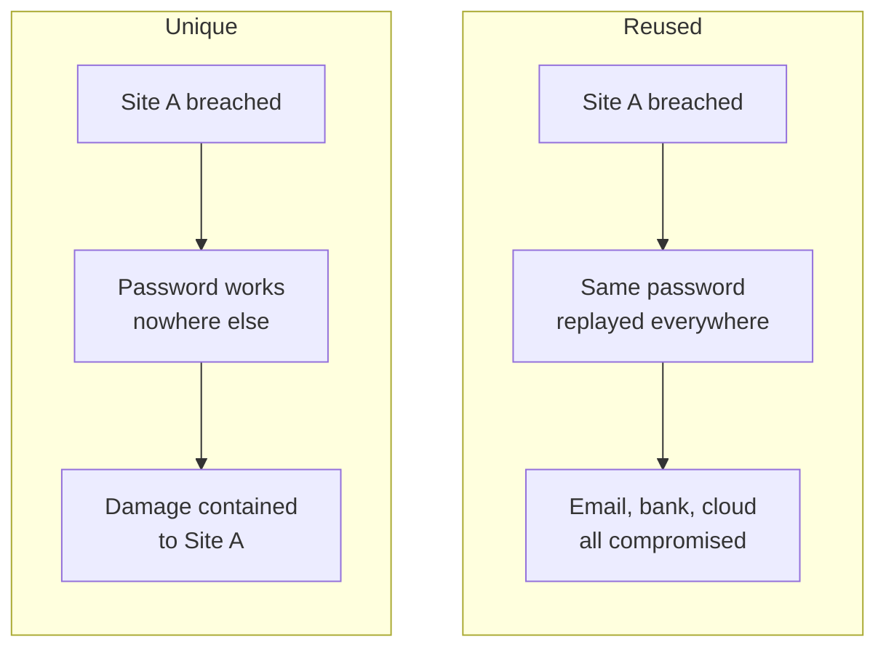
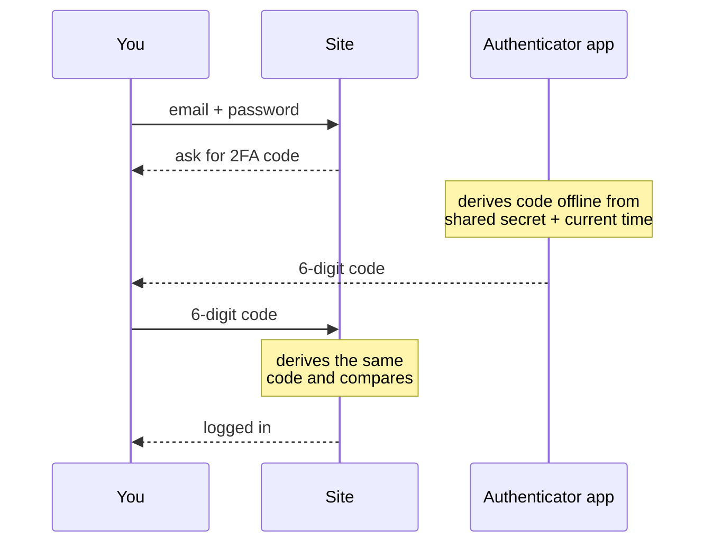
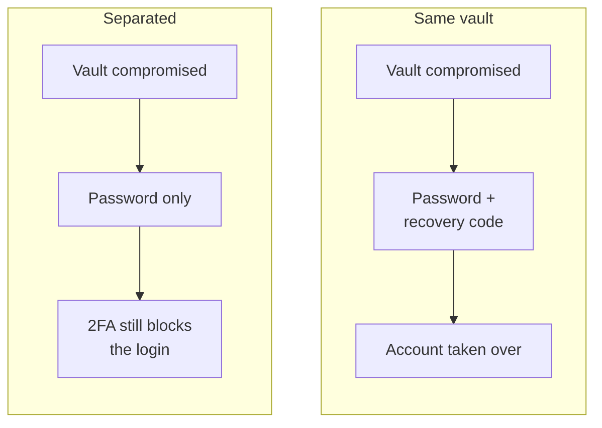

---
tags:
  - security
  - privacy
date: 2025-06-27
rss-feeds:
  - all
---
## TLDR

My password and authentication setup: Bitwarden generates and stores a unique password per account, Ente Auth holds the 2FA codes with end-to-end encrypted backups, and printed recovery codes stay offline at home. The whole stack is free, works on every platform, and once set up, logging in is faster than typing a password from memory.

## Why bother

Most people reuse the same two or three passwords everywhere. When one site gets breached (and sites get breached constantly), the leaked email and password pairs end up in public dumps, and attackers replay them against every other service. This is called **credential stuffing**, and it is automated, cheap, and effective. Your bank login is only as strong as the weakest forum you signed up to in 2012.

The diagram below shows the difference a unique password per account makes:

A password manager removes the problem at the root: it generates a random password per account and remembers it for you, so a breach on one site is useless everywhere else. Two-factor authentication (2FA) then covers the remaining case: even if someone gets a password, they still cannot log in without a code from your phone.

In this article I will go through my setup: [Bitwarden](https://bitwarden.com/) for passwords, [Ente Auth](https://ente.com/auth/) for 2FA codes, and printed recovery codes stored offline.

## Bitwarden

I use Bitwarden because it is open source, works on every platform, and has been around long enough to have a track record. The free tier covers everything in this article.

### How it works

Bitwarden stores your credentials in an encrypted **vault** protected by a single **master password**. This is the only password you need to remember. Everything else (website logins, credit card details, secure notes) lives in the vault behind that one key.

The vault supports different entry types for different kinds of credentials:

### Generating passwords

The real value is not storing passwords but **generating** them. When I register for a new site, I generate a random password (30+ characters) directly in Bitwarden. I never come up with passwords myself, so no two accounts share the same one.

### The browser extension

Bitwarden's browser extension is what makes daily use frictionless. When you visit a site where you have a saved login, the extension icon shows a badge:

This badge is also a **phishing** defense. The extension matches logins by URL, so if you navigate to what looks like `reddit.com` but the badge is missing, something is off. The URL might be `redit.com`, or the more subtle `ɾeddit.com` (a homoglyph, a different "r" character that looks like the real one). I always check the badge before entering credentials.

When registering for a new site, clicking `+` in the extension pre-fills the URL and lets you generate a password and save the login in one step:

After that, returning to the site is just auto-fill. The "too much work" objection is backwards: once set up, logging in is faster than typing a password from memory.

### Protecting the master password

The master password is the single point of failure. If someone gets it, they get everything. Two rules:

1. **Make it strong and memorable.** A long passphrase works well. It is acceptable to write it on paper and store it somewhere safe at home. Never store it digitally.
2. **Enable 2FA on the vault itself.** This is the most critical account you have. Even if someone learns your master password, they still need the second factor.

## Ente Auth for 2FA

Two-factor authentication means logging in requires both your password (something you know) and a code from your phone (something you have). The standard mechanism is **TOTP** (time-based one-time password): when you enable 2FA on a site, it shows a QR code containing a shared secret. Your authenticator app stores that secret and derives a 6-digit code from it and the current time; the site derives the same code and compares. The diagram below shows a login. Notice that nothing is ever sent to your phone:

That is also why an authenticator app beats SMS. SMS codes travel over the phone network, and attackers can hijack your number through **SIM swapping** (convincing your carrier to move your number to their SIM card) and receive the codes themselves. A TOTP code is derived offline, so there is nothing to intercept. Setup is just as easy (scan a QR code once), thus if a site offers both SMS and an authenticator app, always pick the app.

I use [Ente Auth](https://ente.com/auth/) as my authenticator: it is free, open source, externally audited (by Cure53, Symbolic Software, and Fallible), and runs on Android, iOS, desktop, and the web. Most importantly, it backs up your 2FA secrets across devices with end-to-end encryption. The backup matters: if you lose your phone, you restore your codes on a new device instead of re-enrolling every account one by one.

I ruled out the two obvious alternatives. [Authy](https://www.twilio.com/en-us/user-authentication-identity/authy) is closed source, owned by Twilio, and in 2024 an unauthenticated API endpoint let anyone check whether a phone number had an Authy account; attackers compiled 33 million of them. [Google Authenticator](https://support.google.com/accounts/answer/1066447) syncs your secrets to your Google account without end-to-end encryption, and it chains your 2FA to that account: if Google locks you out, your codes go with it.

### Where to enable 2FA

A good rule of thumb: enable 2FA on any account where a breach would cause real damage. At minimum:

- **Password manager** (Bitwarden): the most critical, since it guards everything else
- **Email**: email is the recovery path for most accounts, so compromising it cascades
- **Banking and government services**
- **Cloud storage** if it contains sensitive files

Some services enforce their own 2FA systems instead of supporting standard authenticator apps. Steam uses Steam Guard, brokers like IBKR require approval through their own mobile app, and most banks have a proprietary app that can only be activated on one phone at a time. These are all forms of 2FA, they just do not use your authenticator app, so do not be surprised if the setup differs from site to site.

### Recovery codes: the one mistake to avoid

When you enable 2FA on a site, it gives you **recovery codes**, one-time-use codes for when your phone is unavailable. The mistake I see people make is storing those recovery codes inside the same Bitwarden vault as their passwords.

This defeats the entire point of 2FA. A recovery code substitutes for the second factor, so a vault that holds both the password and the recovery code has collapsed your two factors into one, as the diagram below shows:

Where to store recovery codes instead:

- **Print them** and store them at home, labelled by service
- **A separate vault** dedicated only to recovery codes, with a different master password

## Emails and OAuth

For the email side of the setup (dedicated addresses per context, alias services, encrypted mailboxes), see [Email Privacy with Custom Domains and Aliases](https://www.loicb.dev/blog/email-privacy-with-custom-domains-and-aliases). That article covers how I use Proton + SimpleLogin + custom domains to isolate spam and avoid vendor lock-in.

One related decision: I avoid "Sign in with Google/Facebook" (OAuth) wherever possible. It is convenient, but it ties your access to a third party. If your Google account gets locked or your Facebook gets banned, you lose access to everything linked to it. Email + password + 2FA keeps you in control, and if you later switch email providers, updating a login is straightforward.

If you do keep OAuth logins, that Google or Facebook account is no longer just a social account: it is the key to every service behind it, exactly like the email account is the recovery path for everything else. Treat both accordingly: a generated password and 2FA on the account you sign in with, whether that is your mailbox or your Google account.

## The full setup

Putting it together, my daily security stack:

| Layer | Tool | Purpose |
|-------|------|---------|
| Passwords | [Bitwarden](https://bitwarden.com/) | Generate and store unique passwords per account |
| 2FA codes | [Ente Auth](https://ente.com/auth/) | TOTP codes, end-to-end encrypted backup across devices |
| Recovery codes | Printed, stored at home | Offline fallback if the phone is lost |
| Email | Proton + SimpleLogin | Encrypted mailbox, one alias per service |

The first three layers are free; the email layer requires Proton Unlimited (which bundles SimpleLogin Premium) and is covered in [Email Privacy with Custom Domains and Aliases](https://www.loicb.dev/blog/email-privacy-with-custom-domains-and-aliases).

The payoff is simple. Every account has a password that exists nowhere else, a leaked database cannot touch the rest, and a stolen password alone cannot log in anywhere that matters. Day to day, it is all auto-fill: less typing than the two passwords you used to reuse.