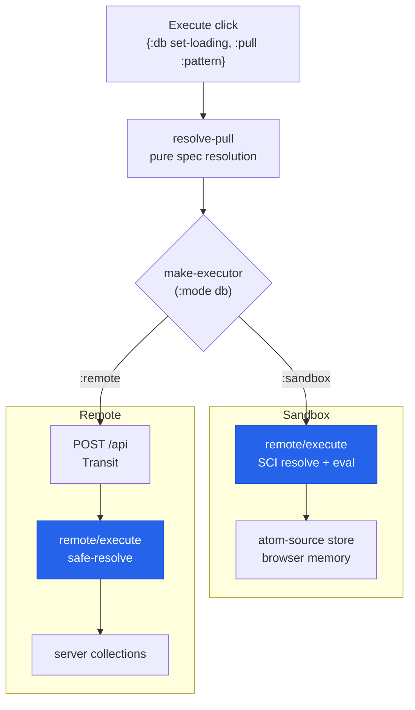
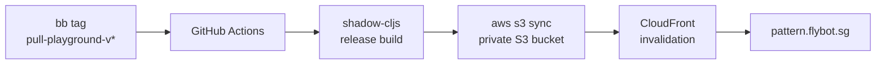

---
tags:
  - clojure
  - clojurescript
  - sci
  - web
  - aws
  - lasagna-pattern
date: 2026-02-17
repos:
  - [lasagna-pattern, "https://github.com/flybot-sg/lasagna-pattern"]
rss-feeds:
  - all
  - clojure
---
## TLDR

[Pull Playground](https://pattern.flybot.sg) is an interactive SPA for learning the [lasagna-pattern](https://github.com/flybot-sg/lasagna-pattern) pull DSL. Sandbox mode evaluates patterns entirely in the browser with SCI against an in-memory store, and remote mode sends the same Transit-encoded patterns to a live server. One UI, one pull engine, two transports.

## Learning a DSL from documentation is slow

The [lasagna-pattern](https://github.com/flybot-sg/lasagna-pattern) DSL is central to how we build APIs at Flybot: the client sends an EDN pattern shaped like the data it wants, and the same syntax covers reads and writes (see [Building a Pure Data API with Lasagna Pattern](https://www.loicb.dev/blog/building-a-pure-data-api-with-lasagna-pattern)). Documentation gets you the concepts, but trying a pattern used to mean cloning the repo, starting a REPL, and loading sample data: too much to ask of someone who just wants to see what the syntax feels like. So I built the [Pull Playground](https://pattern.flybot.sg) as a companion to [flybot.sg](https://www.flybot.sg): open a URL and you are experimenting immediately, no repo, no REPL, no database.

## Two modes, one UI

Routing is path-based, `/sandbox` and `/remote`, with `pushState` navigation:

| Mode | Patterns execute | Backend needed? |
|------|------------------|-----------------|
| Sandbox (default) | in the browser via SCI, against an in-memory store | No |
| Remote | on a live server, via HTTP POST | Yes |

**[Sandbox](https://pattern.flybot.sg/sandbox)** ships with 20 progressive examples in six groups, from binding a value to deleting an entity:

| Group | Example pattern | What it teaches |
|-------|-----------------|-----------------|
| Basics | `{:config {:features ?f}}` | bind values out of nested maps |
| Collections | `{:users {{:id 2} ?user}}` | list a collection, indexed lookup, select fields |
| Modifiers | `{:config {:debug (?d :default false)}}` | wildcard `?_`, defaults, `:when` constraints |
| Sequences | `{:posts {{:id 2} {:tags [?first ?rest*]}}}` | positional vector matching: `[a b]`, `[a b*]`, `[a+]`, `[a b?]` |
| Composition | `{:users {{:id 1} {:name ?u}} :posts {{:id 1} {:title ?t}}}` | several collections and features in one pattern |
| Mutations | `{:users {nil {:name "Dave"}}}` | create (`nil` key), update (map value), delete (`nil` value) |

Clicking an example pre-fills the editor, and after a mutation the data panel refreshes so you see the write land.

**[Remote](https://pattern.flybot.sg/remote)** sends the same [Transit](https://github.com/cognitect/transit-cljs)-encoded patterns that the flybot.sg frontend sends to its own backend. The default server URL is `https://www.flybot.sg/api`, which accepts guest reads only, and the 13 remote examples exercise what a live server adds: role-scoped patterns like `{:guest {:posts ?all}}`, partial success where data comes back alongside `:errors`, and schema validation failures.

In both modes the editor is schema-aware: hover tooltips and autocomplete are driven by the server's [Malli](https://github.com/metosin/malli) schema. Sandbox pulls the schema out of its in-memory store, while remote fetches it from `GET /api/_schema` when you connect.

The UI never branches on the mode. The Execute button dispatches the effect map `{:db db/set-loading :pull :pattern}` (the dispatch machinery is the subject of [Building a ClojureScript SPA with Replicant and dispatch-of](https://www.loicb.dev/blog/building-a-clojurescript-spa-with-replicant-and-dispatch-of)), `resolve-pull` turns the keyword into a data spec, and `make-executor` picks the transport from `(:mode db)`. It is the only mode-specific function in the app. The diagram below shows the two paths:



The symmetry is the point: **the same `remote/execute` engine runs the pattern on both ends**. In sandbox it runs in-process against browser memory; in remote it runs on the server against real collections. The sandbox executor even defers its callbacks with `queueMicrotask` so results arrive asynchronously, exactly like an HTTP response, and nothing downstream can tell the difference.

## Why SCI

Pull patterns support `:when` constraints with predicate functions:

```clojure
{:posts {{:id 1} {:title (?t :when string?)}}}
```

Somebody has to resolve `string?` to an actual function, and in the browser there is no Clojure runtime to do it. [SCI](https://github.com/babashka/sci) (Small Clojure Interpreter) fills the gap: a sandboxed Clojure evaluator that runs in ClojureScript.

The sandbox initializes SCI with a whitelist of about two dozen predicates (`pos?`, `string?`, `count`, `=` etc), which covers what people actually write in `:when` constraints. Both hooks, defined in the playground's [sandbox.cljc](https://github.com/flybot-sg/lasagna-pattern/blob/main/examples/pull-playground/src/sg/flybot/playground/ui/core/sandbox.cljc), are one-liners over that restricted context, so a symbol outside the whitelist simply does not exist: no `eval`, no IO, no host interop.

```clojure
(def sci-ctx
  (sci/init {:namespaces {'clojure.core {'string? string? 'pos? pos?
                                         'count count '= = ...}}}))

(defn sci-resolve [sym]  (sci/eval-form sci-ctx sym))
(defn sci-eval    [form] (sci/eval-form sci-ctx form))
```

The engine makes this pluggable, and `execute!`, in the same `sandbox.cljc`, shows just how little the modes differ. The whole difference is one reader conditional in an options map:

```clojure
(defn execute!
  [store schema pattern]
  (let [opts   #?(:clj  {}  ;; JVM: library defaults, same as a real server
                  :cljs {:resolve sci-resolve :eval-fn sci-eval})
        api-fn (fn [_ctx] {:data store :schema schema})]
    (remote/execute api-fn pattern opts)))
```

With empty options, `remote/execute` falls back to the defaults the `remote` library ships in [http.cljc](https://github.com/flybot-sg/lasagna-pattern/blob/main/remote/src/sg/flybot/pullable/remote/http.cljc), the same ones a real server runs with, and they are stricter still: `safe-resolve` is a plain lookup in a hard-coded predicate map (no interpreter at all), `safe-eval` refuses everything, and a pattern depth limit of 100 guards against DoS.

```clojure
(defn safe-resolve [sym]
  (or (get safe-predicates sym)   ;; {'string? string?, 'pos? pos?, ...}
      (throw (ex-info "Predicate not allowed in remote patterns" {:symbol sym}))))

(defn safe-eval [form]
  (throw (ex-info "Code evaluation not allowed in remote patterns" {:form form})))
```

So there are two independent sandboxes, one per runtime, and both are closed by default. Arbitrary code in a pattern does not run anywhere.

The `:clj` branch is not dead code either: it is what lets the sandbox's Rich Comment Tests run on the JVM, exercising the exact `execute!` the browser ships.

## Same engine, in-memory data

The sandbox still needs something that behaves like a database. The `collection` library ships `atom-source`, an in-memory `DataSource` backed by an atom, with the same CRUD interface a real backend implements (the protocol stack is covered in [Building a Pure Data API with Lasagna Pattern](https://www.loicb.dev/blog/building-a-pure-data-api-with-lasagna-pattern)). The store the sandbox pulls from is a plain map, built by `make-store` in the same `sandbox.cljc`:

```clojure
(make-store (make-sources data/default-data))
;; => {:users  ...   ;; atom-source collection, mutable
;;     :posts  ...   ;; atom-source collection, mutable
;;     :config {...} ;; plain map, read-only
;;     :schema {...} ;; plain data, pull it like anything else
;;     :seed   ...}  ;; Mutable: mutating it resets the store
```

Only `:users` and `:posts` are mutable collections. `:config` is a plain map sitting in the same store, which works because the pattern engine reads everything through `ILookup` and does not care what implements it. Two entries push the idea further:

**The schema is pull-able data.** Instead of a dedicated endpoint, the schema lives in the store next to the domain collections, so `{:schema ?s}` returns it through the same pull mechanism as `{:users ?all}`. The playground uses pull for everything, including introspecting its own API.

**Reset is a pull mutation.** `{:seed {nil true}}` is a standard create-shaped mutation whose target reifies `Mutable`: mutating it resets each atom-source's atom and ID counter back to the sample data, original IDs included. The Reset button just dispatches `{:pull :seed}`. No special reset endpoint, no page reload.

The demo backend in `server/main.clj` mirrors this exactly: same sample data namespace, same schema-and-seed-as-data store, exposed through the standard remote Ring handler. Sandbox and server are not two implementations that happen to agree; they are one design instantiated twice.

## Deployment

Because the sandbox runs entirely in the browser, the playground deploys as static files: a private S3 bucket behind CloudFront at `pattern.flybot.sg`.

Releases are tag-driven. `bb tag examples/pull-playground` reads the component's `resources/version.edn` and pushes a `pull-playground-v*` tag, which triggers the GitHub Actions pipeline below:



The workflow stamps the version into `index.html`, builds the release bundle with [shadow-cljs](https://github.com/thheller/shadow-cljs), syncs `resources/public` to S3, and invalidates the CloudFront cache so the new version is live immediately. The full source is in [lasagna-pattern/examples/pull-playground](https://github.com/flybot-sg/lasagna-pattern/tree/main/examples/pull-playground).

## What you get

Open [pattern.flybot.sg](https://pattern.flybot.sg) and you are writing pull patterns in seconds. Twenty examples take you from binding a value to deleting an entity, reset is one click, and nothing you break stays broken. And switch to remote mode to run patterns against flybot.sg directly and pull real-world data (only its public, guest-readable endpoints are available without proper auth).