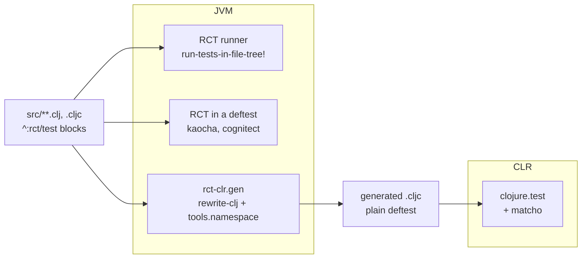

---
tags:
  - clojure
  - testing
  - dotnet
  - clr
  - magic
date: 2026-09-16
repos:
  - [rct-clr, "https://github.com/flybot-sg/rct-clr"]
  - [rich-comment-tests, "https://github.com/robertluo/rich-comment-tests"]
  - [magic, "https://github.com/flybot-sg/magic"]
rss-feeds:
  - all
  - clojure
---
## TLDR

Rich Comment Tests keep a function's examples and its tests in the same `(comment ...)` block, but the library is JVM-only, so a cross-platform library loses those assertions on the CLR. [rct-clr](https://github.com/flybot-sg/rct-clr) extracts them on the JVM and writes a plain `.cljc` test file the CLR runs. Nine of our libraries use it. Getting there meant settling what a `;=>` expectation means, a breaking change measured across 4532 assertions and now merged upstream.

## The problem: half the suite does not cross over

Our Clojure libraries run on two platforms, the JVM and the CLR, and CI runs the suite on both. The `deftest` suites cross over fine. The rich comment tests do not, and in our recent libraries that is where most of the unit tests live.

[rich-comment-tests](https://github.com/matthewdowney/rich-comment-tests) (RCT) turns a `(comment ...)` block into assertions. You write the example call and its expected result, and the same block serves as documentation and as a test:

```clojure
(defn add [a b] (+ a b))

^:rct/test
(comment
  (add 1 2) ;=> 3
  (add 1 2) ;=>> pos?
  )
```

The problem is how it gets there. RCT reads your source with [rewrite-clj](https://github.com/clj-commons/rewrite-clj) and walks your namespaces with [tools.namespace](https://github.com/clojure/tools.namespace). Nobody has ported rewrite-clj to the CLR. David Miller ported tools.namespace, and MAGIC still cannot load it.

I use [Robert Luo's fork](https://github.com/robertluo/rich-comment-tests) rather than Downey's original. It adds a `throws=>>` operator for expected exceptions, swaps the argument order of `=>` to match the `(is (= expected actual))` reading, resolves namespaced keywords correctly, and makes the standalone runner exit 1 when a test fails.

The fork keeps the original `com.mjdowney` namespace, so the coordinate is the only thing telling the two apart. Pin the fork, not the original. The fork also decides what `;=>` means. That choice needed work of its own, and it has a section below.

## Generate the tests, do not port the runner

The naive route is to port RCT, which means dealing with the two libraries it stands on. The cost does not sit where it looks.

- **tools.namespace** finds the namespaces. David Miller ported it as `clr.tools.namespace`, and ClojureCLR runs it today. `cljr -X:test` drives a test runner that depends on it. MAGIC is the one that cannot load it, and the break sits one level lower. `clr.tools.reader` imports `clojure.lang.Reflector`, and MAGIC's runtime drops that class on purpose: resolving calls at run time is what IL2CPP forbids, and removing it is why MAGIC exists.
- **rewrite-clj** reads the source, and nobody has ported it. It targets Clojure and ClojureScript only: 112 `:clj` reader branches, 93 `:cljs`, not one `:cljr`, and just 63 conditionals with a `:default`. On the CLR the branches without one read as nothing at all, so the code disappears instead of failing. `z/of-file` sits behind one of them, so the call RCT opens a source file with is not even defined there.

So the port is possible, and it costs a permanent fork of an 8000-line library that still ships releases. On MAGIC it costs that fork plus a second one, over a library Miller maintains. All of it to arrive at assertions `clojure.test` can already express.

My colleague [Parth](https://github.com/parth-io) called it: the CLR never needs RCT at all. Extract on the JVM, emit a plain test file, let the CLR run that. He wrote the first version, and it became [rct-clr](https://github.com/flybot-sg/rct-clr).

That makes a third way to run the same blocks. On the JVM you either call RCT's runner directly, or wrap it in a `deftest` so [Kaocha](https://github.com/lambdaisland/kaocha) or the [Cognitect runner](https://github.com/cognitect-labs/test-runner) drives it as part of the normal suite. The diagram below adds the CLR path to those two:



The generator scans your source directories, loads each namespace, finds every `^:rct/test` block, and writes the assertions into one `.cljc` file:

```bash
clojure -M:dev -m rct-clr.gen \
  -o test/my_project/rct_generated_test.cljc \
  -n my-project.rct-generated-test
```

That file depends on `clojure.test` and [matcho](https://github.com/healthsamurai/matcho) and nothing else, which is why it runs anywhere. The `(comment ...)` blocks stay the single source of truth, and the CLR runs the same assertions as the JVM.

Three platform details come with that.

- **Reader conditionals** work as usual, and the generator extracts only the `:cljr` branch. So `(platform) ;=> #?(:clj :jvm :cljr :clr)` compares against `:jvm` on the JVM and `:clr` on the CLR.
- **A `throws=>>` block** emits `catch System.Exception`. A generated helper hands you `:error/class`, `:error/message` and `:error/data` to match on.
- **A `#?` in the test expression itself** breaks the JVM runner. rewrite-clj turns it into `(read-string "#?(...)")`, and evaluating that throws `Conditional read not allowed`. Take `#?(:clj (.getMessage e) :cljr (.Message e))`: it resolves for the generator and fails on the JVM. Do not write that one. Put the interop inside the function, behind its own reader conditional, and call the function from the block.

## Settling what `;=>` means

I preferred the fork's philosophy here: the expression after `;=>` is **code** to evaluate, not **data** to compare literally the way upstream does. It matches how you would write the same assertion by hand, in a `deftest` run under Kaocha, and it reads more naturally to me. The problem was the fallback. The fork evaluated the expectation, then caught the throw and compared the raw datum instead, trying to satisfy both readings at once, and that is where the bugs I hit while building `rct-clr` came from.

Consider two expectations of the same shape:

```clojure
(list :a)   ;=> (:a)
(list :a 1) ;=> (:a 1)
```

Upstream compares the expectation as **data**. Robert's fork instead evaluated it as **code**, with a `catch` that **fell back to the datum when the eval threw**.

That is the part that causes issues. `(:a)` throws on arity, so it stays data and the first line passes. `(:a 1)` is a valid keyword lookup returning `nil`, so it becomes code and the second line fails. Same shape, opposite results, and nothing in the source tells you which one you are getting. A silent fallback deciding your semantics by whether an exception happened to fire is not a design, it is an accident.

I opened [#11](https://github.com/robertluo/rich-comment-tests/issues/11) on that and sent [the PR](https://github.com/robertluo/rich-comment-tests/pull/13) Robert merged. The fix is the simple half of the choice: **`;=>` always evaluates**, and the quote is how you ask for data.

```clojure
(list :a)   ;=> '(:a)
(list :a)   ;=> [:a]
(list :a 1) ;=> '(:a 1)
(list :a 1) ;=> [:a 1]
(map inc [1 2]) ;=> (list 2 3)
(map inc [1 2]) ;=> [2 3]
```

Two things came along with the change. The expectation now evaluates **after** the form it describes, so `(def m {:a 1}) ;=> #'m` works, and an expectation that throws or fails to compile reports at its own line instead of taking the rest of the block down with it.

It shipped in [v1.1.82](https://github.com/robertluo/rich-comment-tests/releases/tag/v1.1.82).

This is a breaking change. A consumer writing an unquoted list as an expected result has to swap the parentheses for brackets, or quote the list, to get the suite green again. That is a small price for an expectation that means one thing.

### Measuring the break before asking for it

An argument was not enough for that. I scanned every `^:rct/test` block in my workspaces with RCT's own parser rather than a regex, which counts what RCT actually runs, multiline expectations included: 4752 files, 4532 `=>` assertions.

| expectation | count | under the change |
| --- | --- | --- |
| seq with a callable head, `(assoc state :a 1)` | 209 | works, and only works because the expectation evaluates |
| bare symbol naming a def, `;=> pass-bid` | 14 | works |
| seq that throws, `(nil 4 3 2 1)` | 20 | errors, one edit each |
| everything else | the rest | unchanged |

0.44% of the corpus needs an edit, and a quote or a pair of brackets fixes each one. A revert to upstream's data semantics would have broken 223 assertions in the same corpus, ten times as many. That count is what the issue led with.

The scan also killed my own first design. I wanted a fourth arrow, `data=>`, for an expectation that is never evaluated, because changing one operator migrates a whole block with no edit to the expressions. Then the numbers came in: 20 sites out of 4532 would ever use it, against the cost of a fourth arrow in the README, in every editor plugin, and in rct-clr's generator. Three arrows, and `'` for data.

## The one dependency that had to cross over

A `;=>>` expectation is a matcho pattern rather than an equality check, so the generator cannot lower it to `clojure.test/is`. It emits a matcho call:

```clojure
;; source
(api-response {:users []}) ;=>> {:status 200 :body {:users []}}

;; generated
(matcho.core/assert {:status 200, :body {:users []}} (api-response {:users []}))
```

On the JVM this never comes up, because RCT declares matcho itself. On the CLR there is no RCT, by design, so nothing pulls it in and you declare it yourself.

Upstream matcho is JVM-only. Its `matcho/core.clj` reaches straight for `java.util.regex.Pattern`, with no reader conditional and no `.cljc` in sight. The CLR reads the file, then fails to resolve the type.

So I ported it. The fork renames `core.clj` to `matcho/core.cljc`, puts the platform types behind a reader conditional, and adds the `deps-clr.edn` that `cljr` needs to resolve it:

```clojure
;; matcho/core.cljc, in the fork
(and (string? x) (instance? #?(:clj  java.util.regex.Pattern
                               :cljr System.Text.RegularExpressions.Regex) p))
```

The port is [an issue](https://github.com/HealthSamurai/matcho/issues/10) and [a PR](https://github.com/HealthSamurai/matcho/pull/11) on upstream matcho, neither merged yet. Until one lands, every CLR consumer pins that fork, on the `clr-support` branch.

## Nine libraries, one generated file each

Nine of the libraries we run through our MAGIC conformance sweep depend on it, and their generated suites are part of the same CI that checks whether those libraries still compile. Three of them run over 700 CLR assertions each that exist only as comment blocks in the source, the largest 1638.

That sweep is the subject of [its own write-up](https://www.loicb.dev/blog/magic-compiler-tested-against-33-real-libraries), and it is how rct-clr dropped its own fallback once v1.1.82 shipped: regenerate every consumer, run the CLR suites, compare the assertion counts against the JVM run. Seven of the nine need no source change at all. The other two hold thirteen sites between them, each a data seq written with parentheses, and parentheses to brackets fixes every one.

The rerun found a second thing. One expectation that fails to compile used to throw out of its block and skip every assertion after it, which on the two largest consumers was hiding 64 assertions that never ran. The generated file now wraps each form in a catch that reports against its own line and runs the next one.

## One block, two platforms

On the consumer side, a Babashka task regenerates the file before the CLR tests run. Today the CLR side means two compilers, so there are two of those tasks, `nos test` and `cljr -X:test`. `nos` is [Nostrand](https://github.com/flybot-sg/magic/blob/main/docs/nos-cli.md), the CLI that hosts [MAGIC](https://github.com/flybot-sg/magic), and `cljr` is [David Miller's ClojureCLR CLI](https://github.com/clojure/clr.core.cli). Both read a [`deps-clr.edn`](https://github.com/flybot-sg/magic/blob/main/docs/clr-dependency-files.md) in place of `deps.edn`, so the CLR coordinates for matcho and the test runner live in one file the JVM ignores, and `magic.edn` carries what `nos` needs on top. Our CI image [ci-clj-clr](https://github.com/flybot-sg/ci-clj-clr) carries every toolchain, so one pipeline runs the same assertions everywhere. None of that reaches the generated file, which only ever sees `clojure.test` and matcho. The [README](https://github.com/flybot-sg/rct-clr#using-it-for-your-repository) has the exact files.

rct-clr is on Clojars as [`sg.flybot/rct-clr`](https://clojars.org/sg.flybot/rct-clr).

That is the payoff. You write the example once, in the comment block next to the function. It documents the function, it tests it on the JVM, and it tests it on the CLR. Nothing is duplicated, and nothing silently goes untested when a library crosses platforms.