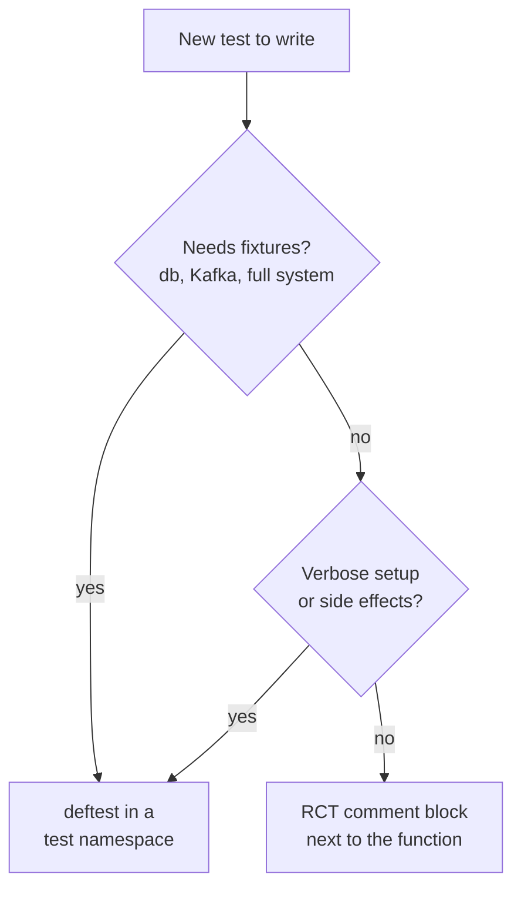
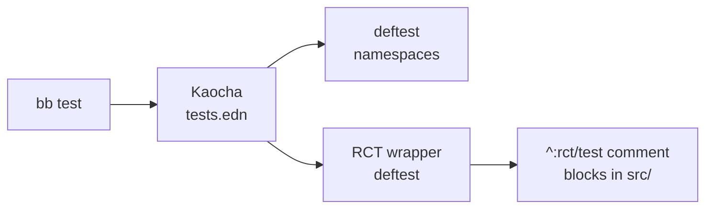
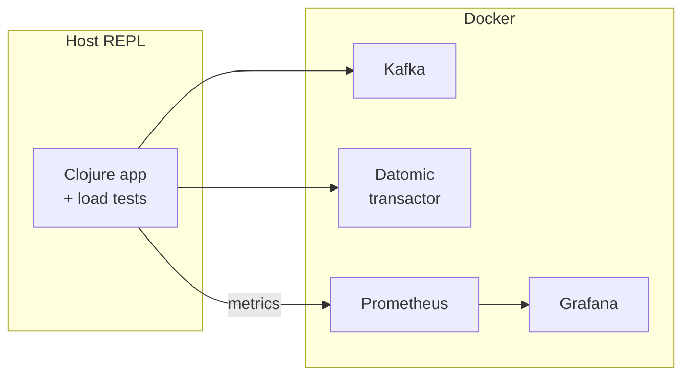

---
tags:
  - clojure
  - testing
  - babashka
date: 2024-08-10
rss-feeds:
  - all
  - clojure
---
## TLDR

How I structure testing across Clojure projects: Rich Comment Tests for internal functions, `deftest` for system boundaries, Kaocha to run both, Malli validation at entry points only, embedded services for integration tests, and containerized services for load tests. All wrapped behind `bb test` and `bb rct` so nobody needs to remember runner flags.

## Start with pure functions

Most testing pain does not come from the test framework, it comes from the code under test. A function that reads config from a file, connects to a database, or checks an environment variable needs mocks, fixtures, and defensive setup before you can assert anything. A **pure function** (same input, same output) needs none of that.

```clojure
;; Impure: reads from file, result depends on file content
(defn fib [variable]
  (when-let [n (-> (slurp "config/env.edn") edn/read-string (get variable) :length)]
    (->> (iterate (fn [[a b]] [b (+' a b)]) [0 1])
         (map first)
         (take n))))

;; Pure: same input always yields the same output
(defn fib [n]
  (->> (iterate (fn [[a b]] [b (+' a b)]) [0 1])
       (map first)
       (take n)))
```

The pure version is testable with no setup. The impure version needs a file on disk with the right format, and the test breaks the day someone renames a key in it. So the rule comes before any tool: isolate IO at the edges, keep the core logic pure. Everything else in this article builds on it.

## Rich Comment Tests for internal functions

Most Clojure developers already use `comment` blocks for REPL-driven exploration: you write a few calls next to the function, evaluate them, look at the results, and move on. [Rich Comment Tests](https://github.com/matthewdowney/rich-comment-tests) (RCT) turns these blocks into executable tests. Add `^:rct/test` metadata, and the values after `;=>` become assertions:

```clojure
(defn fib [n]
  (->> (iterate (fn [[a b]] [b (+' a b)]) [0 1])
       (map first)
       (take n)))

^:rct/test
(comment
  (fib 10) ;=> [0 1 1 2 3 5 8 13 21 34]
  (fib 0)  ;=> []
  )
```

The `comment` block is documentation and test suite at once. No separate test file, no `deftest` boilerplate, and anyone reading the code sees worked examples right under the implementation.

Our projects depend on [robertluo's fork](https://github.com/robertluo/rich-comment-tests) of RCT (`io.github.robertluo/rich-comment-tests`), which keeps the upstream behavior and adds an assertion for exceptions. That gives three assertion styles:

- `;=>` exact match: the result must equal the expected value
- `;=>>` [matcho](https://github.com/HealthSamurai/matcho) match: the expected value is a pattern. Maps only need to contain the keys you name, regexes match against strings, and predicates are called on the result
- `;throws=>>` (fork only): the expression must throw, and the exception is matched as a map of its class, message, and ex-data

```clojure
^:rct/test
(comment
  ;; Exact match
  (validate-cfg valid-cfg)   ;=> valid-cfg

  ;; Matcho: only check that :error is present with a string value
  (validate-cfg invalid-cfg) ;=>> {:error string?}

  ;; Exception: match the message and the ex-data
  (validate-cfg nil) ;throws=>> #:error{:message #"invalid config" :data {:cfg nil}}
  )
```

The matcho style is the one I reach for most: functions often return rich maps where only a few keys matter, and error cases where the shape matters but the exact message does not.

I use RCT for internal functions, meaning pure logic that is not part of the public API. For some projects RCT alone is enough and no test runner is needed at all. The [lasagna-pattern](https://github.com/flybot-sg/lasagna-pattern) `collection` and `pattern` components, for instance, have no Kaocha dependency: their `bb test` task just runs `clojure -X:dev:rct`.

## deftest for system boundaries

RCT does not suit every case. My rule of thumb: a test belongs in a dedicated test namespace with `deftest` when it needs at least one of:

- **Fixtures**: starting and tearing down resources (database, Kafka, the entire system)
- **Verbose setup**: configs, logging, service initialization
- **Side effects**: exercising the full system, load tests, stress tests

Everything else gets RCT. The diagram below is the whole decision:



A system test, for example, boots the whole app from a config and checks the observable result:

```clojure
(deftest ^:system system-test
  (testing "The system returns the Fib sequence given a valid config."
    (is (= [0 1 1 2 3 5 8 13 21 34]
           (sut/system #:cfg{:app #:app{:name "app" :version "1.0.0"}
                             :fib #:fib{:length 10}})))))
```

The `^:system` metadata is not decoration, it is what lets the runner include or skip these slow tests, as we will see next.

## Kaocha as test runner

[Kaocha](https://github.com/lambdaisland/kaocha) runs everything. It only knows about `deftest`, so the RCT tests are wrapped in a single `deftest` that scans the source tree:

```clojure
(deftest ^:rct rich-comment-tests
  (testing "Rich comment tests."
    (rct-runner/run-tests-in-file-tree! :dirs #{"src"})))
```

Kaocha's `tests.edn` config then groups tests by that metadata, so I can run all tests, only RCT, or only unit tests:

```clojure
#kaocha/v1
{:tests [{:id :rct  :focus-meta [:rct]}
         {:id :unit :skip-meta  [:rct]}]}
```

Slow system tests get the same treatment: tag them `^:system` and give them their own group, and the default run can skip them.

Note that this config is deliberately lean, because it is the one the development loop hits constantly. A second config, `tests_with_plugins.edn`, adds the profiling and [cloverage](https://github.com/lambdaisland/kaocha-cloverage) plugins for CI, where you want timings and a coverage report and do not care about terminal noise:

```clojure
#kaocha/v1
{:tests   [{:id :rct  :focus-meta [:rct]}
           {:id :unit :skip-meta  [:rct]}]
 :plugins [:kaocha.plugin/profiling
           :kaocha.plugin/cloverage]}
```

## Babashka tasks over raw commands

The raw command to run only the RCT tests is not something anyone should have to remember:

```bash
# Nobody wants to type this
clj -M:dev:test --focus :rct
```

Every project gets [Babashka](https://github.com/babashka/babashka) tasks that wrap the runner invocations:

```bash
bb test           # run all tests
bb rct            # run only RCT tests
bb test --watch   # kaocha watch mode, via :watch? true
```

The diagram below shows the full chain, from the one command a developer types down to the comment blocks in the source:



In a monorepo like [lasagna-pattern](https://github.com/flybot-sg/lasagna-pattern), the root `bb test` runs each component's own `test` task, so the same command works at the root or in any subproject. This is the point: the developer does not need to know that one component is RCT-only while another runs Kaocha with different aliases. `bb test` is the interface, the flags are an implementation detail.

## Malli at entry points only

[Malli](https://github.com/metosin/malli) handles data validation, generation, and function instrumentation. The temptation is to add schemas everywhere. I do the opposite: schemas go on **entry point functions only**.

```clojure
(defn system
  {:malli/schema
   [:=> [:cat cfg/cfg-sch] [:sequential :int]]}
  [cfg]
  (let [length (-> cfg :cfg/fib :fib/length)]
    (fib/fib length)))
```

Clojure's dynamic nature is what makes testing cheap: you can mock inputs, pass partial data, and iterate quickly. Schema every internal function and you reintroduce the rigidity of static typing without the compile-time guarantees. That is the worst trade of both worlds. Schema the boundaries, keep the internals flexible.

One distinction worth spelling out: **instrumentation** (`malli.dev/start!`) is a development tool that checks function arguments and return values at runtime, and it should not run in production. **Data validation** (`m/validate`, `m/explain`) is production code that checks external input such as configs and API requests. Both use the same schemas but serve different purposes.

## Integration tests: embedded services

For apps that depend on external services (Kafka, Datomic, HTTP APIs), integration tests use **embedded** versions: fixtures start and stop [embedded Kafka](https://github.com/embeddedkafka/embedded-kafka) brokers and an in-memory Datomic (`datomic:mem`), and HTTP calls to remote services are redefined with `with-redefs` to return valid but controlled data.

Some people argue you should never mock. For a service that consumes from several Kafka topics, reads and writes Datomic, and calls a few remote APIs, running every real dependency in a test environment is not practical, and chasing that purity mostly buys you flaky CI. The goal of an integration test is verifying that components work together, and embedded services with controlled inputs achieve that while staying deterministic and fast enough to run on every push.

## Load and stress tests: containerized services

Embedded services are limited in throughput and parallelism, so load tests run against real services in containers: a Datomic transactor, Kafka via Confluent's [cp-all-in-one](https://github.com/confluentinc/cp-all-in-one), Prometheus, Grafana and whatever other services. A `docker-compose.yml` in the repo means any developer starts the whole stack with `docker-compose up -d`.

The Clojure app itself stays outside Docker. I run it from the REPL as usual and point it at the containerized services, so a load test uses the exact same workflow as a unit test: write it, run it from the REPL or `bb test`. The only difference is the infrastructure humming in the background, as shown below:



## Conclusion

Keep your code as pure as possible and testing stays simple: most of it can be done with RCT, the tests double as documentation, and some libraries never need anything more. Once fixtures or unavoidable side effects enter the picture, it is time for regular `deftest` namespaces with proper test fixtures.

As the library matures, you will want data validation, and eventually generative testing and instrumentation. That is extra load on the code, so scope it deliberately: I recommend the entry namespaces only.

Finally, some projects call for deeper integration tests or load and stress tests. For those, I advise running the real services in containers orchestrated by Docker Compose, so the whole setup is reproducible on any machine. If you just need the extra service inside a unit test, use its embedded version instead.